# NoiseModelling-Propagation Attenuation Algorithms

- [NoiseModelling-Propagation Attenuation Algorithms](#noisemodelling-propagation-attenuation-algorithms)
  - [Concepts \& Overview](#concepts--overview)
  - [AttenuationVisitor — Lightweight Attenuation Processor](#attenuationvisitor--lightweight-attenuation-processor)
    - [AttenuationVisitor — Overview](#attenuationvisitor--overview)
    - [Key Features](#key-features)
    - [Processing Flow](#processing-flow)
  - [AttenuationComputeOutput — Multi-threaded Coordinator](#attenuationcomputeoutput--multi-threaded-coordinator)
    - [AttenuationComputeOutput — Overview](#attenuationcomputeoutput--overview)
    - [Thread-Safe Data Collection](#thread-safe-data-collection)
    - [Typical Workflow](#typical-workflow)
  - [AttenuationCnossos — CNOSSOS-EU Computation Engine](#attenuationcnossos--cnossos-eu-computation-engine)
    - [AttenuationCnossos — Overview](#attenuationcnossos--overview)
    - [Method Relationships and Call Hierarchy](#method-relationships-and-call-hierarchy)
      - [computeCnossosAttenuation() - Direct Method Calls](#computecnossosattenuation---direct-method-calls)
      - [evaluate() - Direct Method Calls](#evaluate---direct-method-calls)
    - [Favorable vs. Homogeneous Conditions](#favorable-vs-homogeneous-conditions)
    - [Attenuation Components](#attenuation-components)
      - [Geometric Divergence (ADiv)](#geometric-divergence-adiv)
        - [Overview](#overview)
        - [Structure](#structure)
        - [Computation Logic](#computation-logic)
      - [Atmospheric Absorption (AAtm)](#atmospheric-absorption-aatm)
        - [Overview](#overview-1)
        - [Structure](#structure-1)
        - [Computation Logic](#computation-logic-1)
      - [Reflection (ARef)](#reflection-aref)
        - [Overview](#overview-2)
        - [Structure](#structure-2)
        - [Computation Logic](#computation-logic-2)
      - [Boundary Effects (ABoundary)](#boundary-effects-aboundary)
        - [Overview](#overview-3)
        - [Structure](#structure-3)
        - [Computation Logic](#computation-logic-3)
      - [Boundary Effects (Legacy)](#boundary-effects-legacy)
      - [Ground Effect (AGround)](#ground-effect-aground)
        - [Overview](#overview-4)
        - [Structure](#structure-4)
        - [Computation Logic](#computation-logic-4)
      - [Diffraction (ADif)](#diffraction-adif)
        - [Overview](#overview-5)
        - [Structure](#structure-5)
        - [Computation Logic](#computation-logic-5)
      - [Retro-diffraction (ΔRetrodif)](#retro-diffraction-δretrodif)
        - [Overview](#overview-6)
        - [Structure](#structure-6)
        - [Computation Logic](#computation-logic-6)
  - [Tests \& Examples](#tests--examples)

## Concepts & Overview

The NoiseModelling-Propagation module implements acoustic attenuation computation following the CNOSSOS-EU.
The module processes vertical cut profiles produced by the PathFinder module and computes per-frequency attenuation values based on geometric divergence, atmospheric absorption, ground effects, diffraction, and reflection.

The module provides two main processing approaches:

1. **Lightweight approach** (`AttenuationVisitor` + `AttenuationComputeOutput`) — Suitable for standalone applications, tests, and tutorials. No database dependencies. Computes attenuation values only.

2. **Database-integrated approach** (`AttenuationOutputSingleThread` + `AttenuationOutputMultiThread`) — Used in production noise mapping workflows (e.g., WPS services). Integrates with JDBC, combines attenuation with emission data, manages result caching, and implements optimization strategies like MaxError DB processing.

The core acoustic computation logic is centralized in the `AttenuationCnossos` class, which implements the CNOSSOS-EU standard algorithms.

## AttenuationVisitor — Lightweight Attenuation Processor

`AttenuationVisitor` is a single-threaded visitor that processes vertical cut profiles and computes per-frequency attenuation values. It implements the `CutPlaneVisitor` interface and is designed to work without database dependencies.

### AttenuationVisitor — Overview

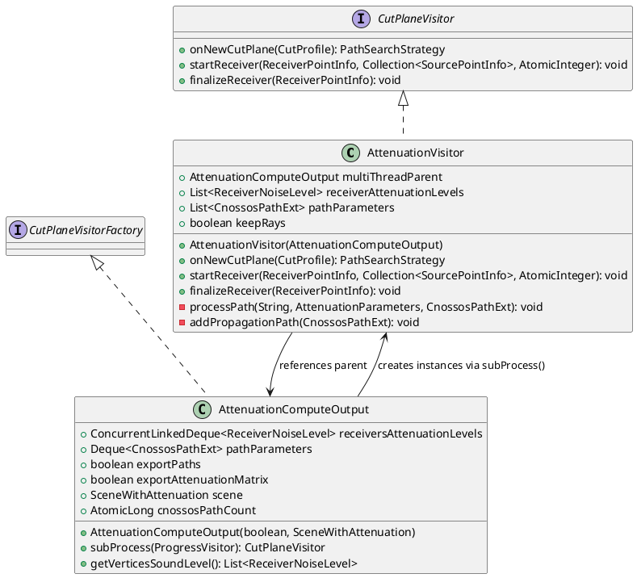

### Key Features

- **JDBC-free implementation** — No database dependencies, suitable for standalone applications and unit tests
- **Per-period processing** — Supports multiple time periods (Day, Evening, Night) via `cnossosParametersPerPeriod`
- **Source line merging** — Combines attenuation levels from line source segments for the same receiver
- **Ray export support** — Optionally exports propagation paths (`CnossosPathExt`) for visualization or debugging
- **Simple data flow** — Accumulates results in memory lists, no queue management required


### Processing Flow

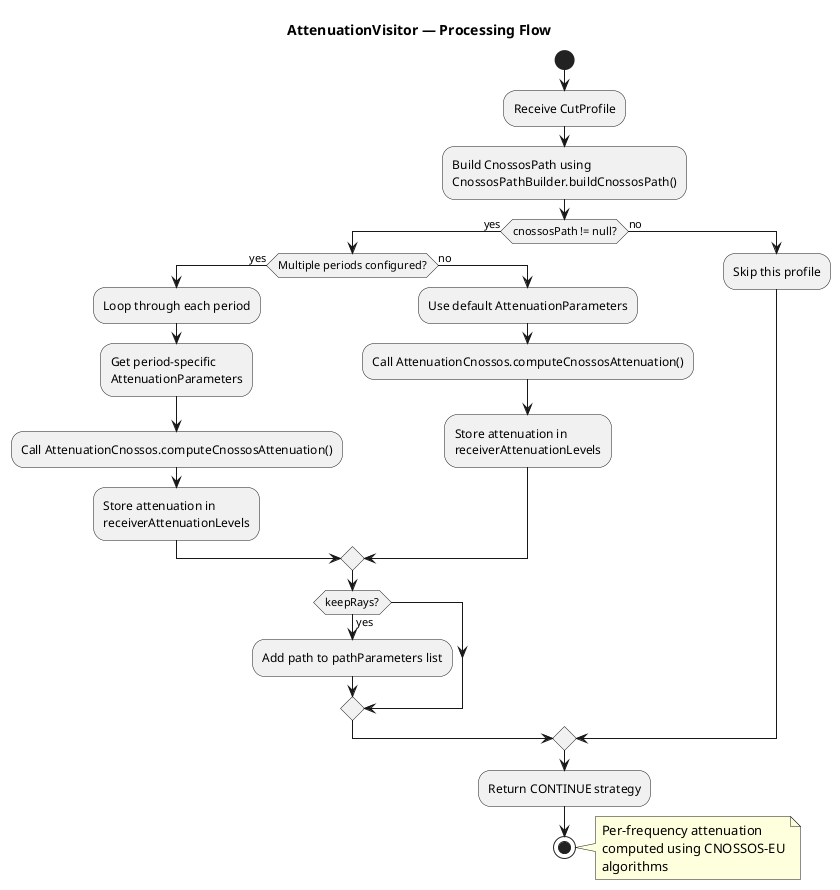

When `finalizeReceiver()` is called:
1. Export ray paths to parent (if `keepRays` is true)
2. Merge attenuation levels from line source segments
3. Push merged results to parent's `receiversAttenuationLevels`
4. Clear local caches

## AttenuationComputeOutput — Multi-threaded Coordinator

`AttenuationComputeOutput` is the factory and coordinator for multi-threaded attenuation computation. It implements `CutPlaneVisitorFactory` and creates `AttenuationVisitor` instances for each processing thread.

### AttenuationComputeOutput — Overview

**Purpose**: 
- Thread-safe container for collecting attenuation results from multiple worker threads
- Factory for creating `AttenuationVisitor` instances
- Maintains shared statistics (path counts, computation metrics)

**Key Fields**:
- `receiversAttenuationLevels: ConcurrentLinkedDeque<ReceiverNoiseLevel>` — Thread-safe queue for attenuation results
- `pathParameters: Deque<CnossosPathExt>` — Ray path storage for visualization/export
- `scene: SceneWithAttenuation` — Reference to scene containing geometry and acoustic parameters
- `cnossosPathCount: AtomicLong` — Counter for total CNOSSOS paths processed
- Statistics counters: `nb_couple_receiver_src`, `nb_obstr_test`, `nb_image_receiver`, etc.

### Thread-Safe Data Collection

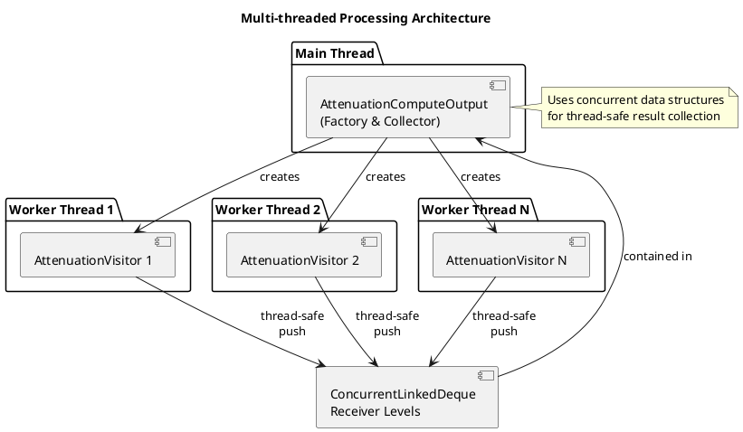

### Typical Workflow

1. Create `AttenuationComputeOutput` with scene configuration
2. PathFinder calls `subProcess()` to create worker-thread visitors
3. Each worker processes its receiver range independently
4. Results are accumulated in shared concurrent collections
5. After all workers complete, retrieve results via `getVerticesSoundLevel()`

## AttenuationCnossos — CNOSSOS-EU Computation Engine

`AttenuationCnossos` is a utility class providing static methods for computing acoustic attenuation according to the CNOSSOS-EU.
All attenuation computation logic is centralized here.

### AttenuationCnossos — Overview

**Core Responsibility**: Implement CNOSSOS-EU attenuation algorithms for outdoor sound propagation

**Key Methods**:
- `computeCnossosAttenuation()` — Main entry point for complete attenuation calculation
- `aDiv()` — Geometric divergence
- `aAtm()` — Atmospheric absorption
- `aBoundary()` — Ground effect + diffraction (combined boundary attenuation)
- `aGroundH()` / `aGroundF()` — Ground effect for homogeneous/favorable conditions
- `aDif()` — Diffraction attenuation
- `evaluateAref()` — Reflection attenuation
- `deltaRetrodif()` — Retro-diffraction correction

### Method Relationships and Call Hierarchy

The methods in `AttenuationCnossos` work together in a hierarchical structure. Below are the direct method call relationships for the two main entry points: `computeCnossosAttenuation()` is the current algorithm used in production, while `evaluate()` represents the legacy algorithm.

#### computeCnossosAttenuation() - Direct Method Calls

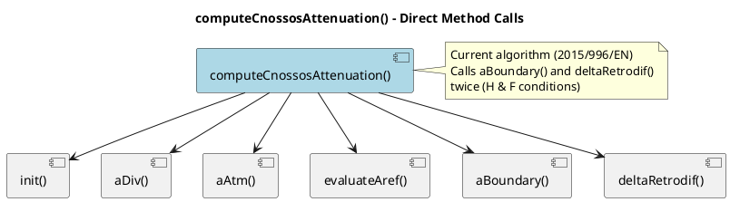

#### evaluate() - Direct Method Calls

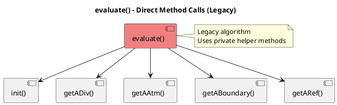

### Favorable vs. Homogeneous Conditions

CNOSSOS-EU distinguishes between two meteorological propagation conditions:

**Homogeneous (H)**: 
- Neutral atmospheric conditions
- No significant wind or temperature gradients
- Sound rays propagate in straight lines

**Favorable (F)**: 
- Downwind propagation or temperature inversion
- Sound rays curve downward (increased ground interaction)
- Enhanced propagation distance

**Wind Rose Integration**:

The final attenuation is a weighted average based on wind direction probability:

```
A_final(freq) = p·A_favorable(freq) + (1-p)·A_homogeneous(freq)
```

Where `p` is the probability of favorable conditions in the source-receiver direction (from wind rose data).

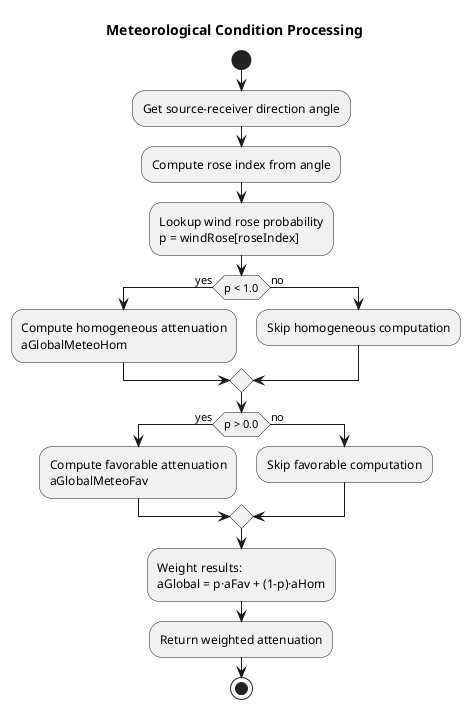

### Attenuation Components

#### Geometric Divergence (ADiv)

##### Overview

Geometric divergence accounts for the spherical spreading of sound waves as they propagate away from the source. This is a frequency-independent attenuation that increases with distance.

**Physical Principle**: As sound spreads spherically from a point source, the sound energy is distributed over an increasingly larger surface area, resulting in a decrease in sound intensity.

##### Structure

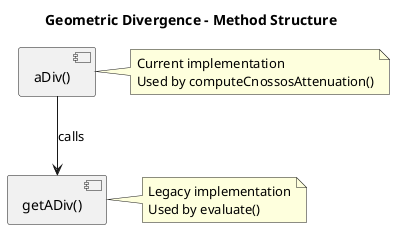

##### Computation Logic

**Formula**: `ADiv = 20·log₁₀(distance) + 11` dB

**Parameters**:
- `distance`: Propagation distance in meters (minimum 1m)
- For paths with vertical diffraction (DIFV): uses `dc` (curved path distance)
- Otherwise: uses `d` (direct distance)

**Implementation Notes**:
- The constant `11` accounts for reference distance normalization
- Minimum distance is enforced to avoid logarithm of zero
- Distance selection depends on presence of vertical diffraction points

#### Atmospheric Absorption (AAtm)

##### Overview

Atmospheric absorption accounts for the frequency-dependent attenuation of sound energy as it travels through air. Higher frequencies are absorbed more than lower frequencies due to molecular relaxation processes in atmospheric gases.

**Physical Principle**: Sound energy is converted to heat through molecular vibration and relaxation processes in oxygen and nitrogen molecules. The absorption is strongly frequency-dependent and also affected by temperature, humidity, and atmospheric pressure.

##### Structure

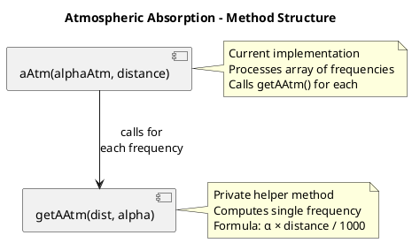

##### Computation Logic

**Formula**: `AAtm = α·distance / 1000` dB

**Parameters**:
- `α`: Frequency-dependent atmospheric absorption coefficient (dB/km)
- `distance`: Propagation distance in meters
- Division by 1000 converts distance from meters to kilometers

**Frequency Dependency**:
- Absorption coefficients are pre-computed based on:
  - Air temperature
  - Relative humidity
  - Atmospheric pressure
  - Frequency (Hz)
- Typically increases with frequency (higher frequencies attenuate more)

**Implementation Notes**:
- Absorption coefficients are stored in `data.getAlpha_atmo()` array
- One coefficient per frequency band
- Distance used is the same as for geometric divergence

#### Reflection (ARef)

##### Overview

Reflection attenuation accounts for sound energy loss when sound waves reflect off surfaces such as building facades, walls, or other obstacles. Each reflection reduces sound energy based on the absorption properties of the reflecting surface.

**Physical Principle**: When sound encounters a surface, part of the energy is absorbed by the material and converted to heat, while the remainder is reflected. The absorption coefficient determines the fraction of energy absorbed.

##### Structure

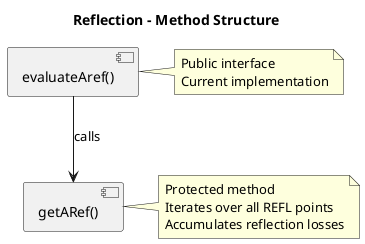

##### Computation Logic

**Formula**: `ARef = Σ 10·log₁₀(1 - α)` dB (for all reflection points)

**Parameters**:
- `α`: Frequency-dependent absorption coefficient of the reflecting surface (0 to 1)
- Multiple reflections are summed (in dB domain)

**Processing Steps**:
1. Iterate through all points in the propagation path
2. Identify points with type `REFL` (reflection points)
3. For each reflection point and each frequency:
   - Retrieve absorption coefficient `α` from `pointPath.alphaWall`
   - Compute reflection loss: `10·log₁₀(1 - α)`
   - Accumulate to total reflection attenuation
4. Return array of reflection attenuation per frequency

**Implementation Notes**:
- If no reflection points exist, `ARef = 0` for all frequencies
- If `alphaWall` is null or empty, reflection is skipped
- The formula `10·log₁₀(1 - α)` is negative (attenuation increases sound level reduction)
- Multiple reflections result in cumulative energy loss


#### Boundary Effects (ABoundary)

##### Overview

Boundary effects combine ground effect and diffraction into a single unified attenuation term. This is the most complex component of the CNOSSOS-EU algorithm, as it handles the interaction between sound waves, the ground surface, and obstacles.

**Physical Principle**: Sound propagation near boundaries involves multiple phenomena:
- **Ground effect**: Interference between direct and ground-reflected sound waves
- **Diffraction**: Bending of sound waves around obstacle edges
- **Interaction**: When diffraction occurs, the ground effect on each segment (source-to-obstacle and obstacle-to-receiver) must be considered separately

##### Structure

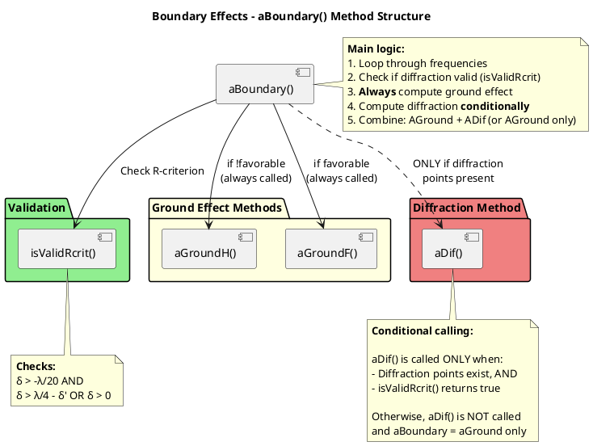

##### Computation Logic

**Processing Steps**:

1. Compute ground effect (`aGround`) for the full SR segment (always called)
2. Check for diffraction points:
   - If none exist, set `aDif = 0` and return `ABoundary = aGround`
   - If they exist, find the first valid diffraction point and check `isValidRcrit()`
3. Compute diffraction attenuation (`aDif`) using the identified diffraction type
4. Apply type-specific rules:
   - For `DIFH` or `DIFH_RCRIT` (top edge) with valid R-criterion: set `aGround = 0` (ground effect included in `aDif`)
   - For `DIFV` (lateral edge) or `DIFB` (bottom edge): keep `aGround` as computed (ground effect not included in `aDif`)
5. Combine components: `ABoundary = aGround + aDif`


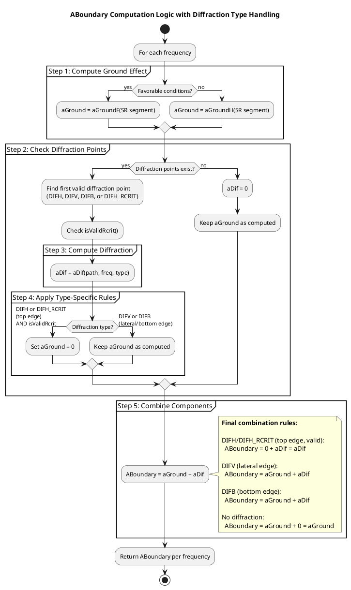

**Type-Specific Handling Summary**:

| Diffraction Type | aGround | aDif | ABoundary | Reason |
|-----------------|---------|------|-----------|---------|
| **DIFH** (top edge, valid R-criterion) | **Set to 0** | Computed | aDif only | Ground effect already included in aDif |
| **DIFH_RCRIT** (top edge, valid R-criterion) | **Set to 0** | Computed | aDif only | Ground effect already included in aDif |
| **DIFV** (vertical/lateral edge) | Kept | Computed | aGround + aDif | Lateral diffraction excludes ground effect |
| **DIFB** (bottom edge) | Kept | Computed | aGround + aDif | Bottom edge diffraction excludes ground effect |
| **No diffraction** | Kept | **Set to 0** | aGround only | Pure ground effect propagation |

**Diffraction Point Types**:
- **DIFH**: Diffraction over the **top edge** of an obstacle (horizontal diffraction)
- **DIFH_RCRIT**: Diffraction over the top edge with R-criterion validation
- **DIFV**: Diffraction around **vertical/lateral edges** (side diffraction)
- **DIFB**: Diffraction under the **bottom edge** of an obstacle (bilateral/bottom diffraction)


#### Boundary Effects (Legacy)

`getABoundary()` is the core method called by the legacy `evaluate()` function.

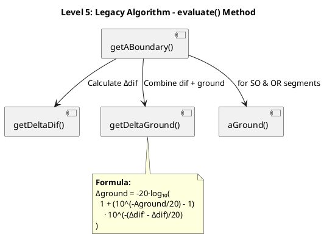

#### Ground Effect (AGround)

##### Overview

Ground effect accounts for the interference between direct sound waves and sound waves reflected from the ground surface. This interference creates a frequency-dependent attenuation pattern that depends on the acoustic impedance of the ground surface and the geometry of the propagation path.

**Physical Principle**: When sound propagates near the ground, the direct wave from source to receiver interferes with the ground-reflected wave. Depending on the path length difference and phase relationship, this interference can be constructive or destructive. The ground's acoustic impedance determines how much sound energy is absorbed versus reflected.

**Meteorological Dependency**: Ground effect is computed separately for:
- **Homogeneous (H)** conditions: Neutral atmospheric profile
- **Favorable (F)** conditions: Downward-refracting atmosphere

##### Structure

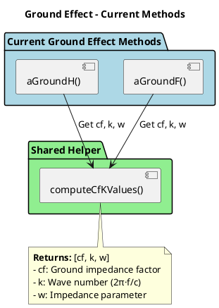

**Legacy Implementation**:

`aGround()` is a method called by the legacy `getABoundary()`. It delegates the core computation to `getAGroundCore()`, which handles both homogeneous and favorable conditions in a single method based on the `isFavorable()` flag.

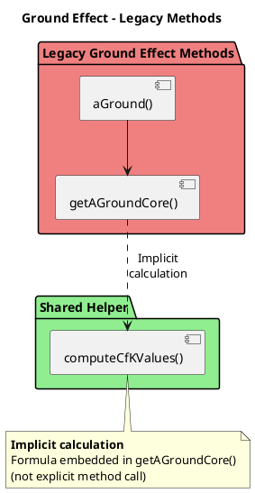

##### Computation Logic

**Key Parameters**:
- `gPath` / `gPathPrime` — Ground absorption coefficient (0 to 1, frequency-dependent)
- `dp` — Mean plane height (average ground height along path)
- `zs`, `zr` — Source and receiver heights above mean plane
  - For homogeneous: `zsH`, `zrH`
  - For favorable: `zsF`, `zrF`
- `cf` — Ground impedance factor (computed from frequency and ground properties)
- `k` — Wave number = 2π·f/c
- `w` — Impedance parameter (depends on frequency and ground absorption)

**Formula** (Homogeneous conditions):
```
AGroundH = -10·log₁₀(4·k²/dp² · 
           (zs² - √(2·cf/k)·zs + cf/k) · 
           (zr² - √(2·cf/k)·zr + cf/k))
```

Subject to minimum constraint: `AGroundH >= -3(1 - gm)`

**Formula** (Favorable conditions):
Similar to homogeneous but uses favorable heights (`zsF`, `zrF`) and includes additional test form factor for minimum bound.

**Special Cases**:
- If `gPath = 0` (perfectly reflective): `AGround = -3` dB (homogeneous) or computed minimum (favorable)
- If `gPath = 1` (perfectly absorptive): Full formula applies without reflection component

#### Diffraction (ADif)

##### Overview

Diffraction attenuation accounts for the reduction in sound level when sound waves bend around obstacles. The `aDif()` method computes the complete diffraction attenuation including ground effect corrections for both source-to-obstacle (SO) and obstacle-to-receiver (OR) segments.

**Physical Principle**: When sound encounters an obstacle edge, it diffracts (bends) around the edge rather than being completely blocked. The amount of diffraction depends on:
- Wavelength (frequency): Lower frequencies diffract more easily
- Path length difference: Difference between diffracted path and direct path
- Edge geometry: Top edge, bottom edge, or lateral edge

**Diffraction Types**:
- **DIFH** (top edge): Most common, includes ground effect in calculation
- **DIFB** (bottom edge): Under suspended obstacles, excludes ground effect
- **DIFV** (lateral edge): Around vertical sides, excludes ground effect

##### Structure

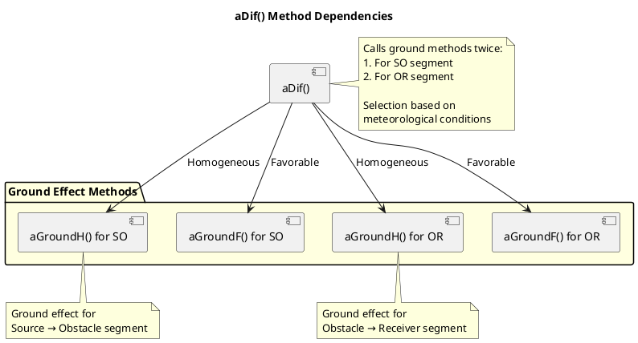

##### Computation Logic

**Formula Components**:
- `δ` — Path length difference
- `λ` — Wavelength (340/f)
- `Ch` — Correction factor (typically 1)
- `C"` — Second correction factor (depends on path geometry)

**Processing Steps**:

`aDif()` combines pure diffraction attenuation with ground effect corrections through a multi-step process:

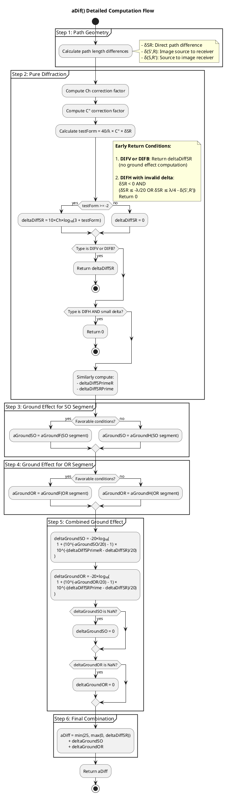

**Key Formulas**:

- **Pure Diffraction**: `ΔDiff = 10×Ch×log₁₀(3 + 40/λ × C" × δ)`
- **Ground Correction**: `ΔGround = -20×log₁₀(1 + (10^(-AGround/20) - 1) × 10^(-(Δdif'-Δdif)/20))`
- **Final Result**: `ADif = min(25, max(0, ΔDiff)) + ΔGroundSO + ΔGroundOR`

**Special Handling**:
- **Early returns**: When certain conditions are met: (1) DIFV/DIFB types, (2) small delta for DIFH, (3) invalid R-criterion for DIFH
- **DIFV/DIFB**: Returns `deltaDiffSR` only (no ground effect)
- **Small delta condition**: Returns 0 if `δSR < 0` and meets specific criteria
- **NaN handling**: Sets ground corrections to 0 if calculation produces NaN
- **25 dB cap**: Pure diffraction term capped at 25 dB per CNOSSOS-EU

#### Retro-diffraction (ΔRetrodif)

##### Overview

Retro-diffraction accounts for the additional attenuation that occurs when sound reflects off a vertical surface and then diffracts over an obstacle on its return path. This phenomenon is illustrated in CNOSSOS-EU Figure 2.5.36.

**Physical Principle**: When a reflected sound path encounters a diffraction obstacle, the diffracted path length is longer than the direct reflected path. This additional path length difference causes extra attenuation that must be accounted for separately from the primary diffraction calculation.

**Application Scope**: 
- Applied **only** to reflection paths (containing REFL point types)
- Requires both reflection points and diffraction obstacles in the path
- Computed separately for homogeneous (H) and favorable (F) conditions
- Typically results in small correction (few dB) but important for accuracy

##### Structure

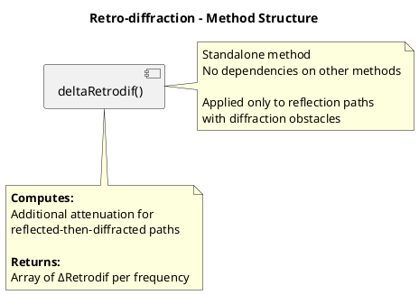

##### Computation Logic

**Processing Steps**:

1. **Path Analysis**:
   - Iterate through all points in the propagation path
   - Identify REFL (reflection) points
   - For each reflection, find associated diffraction points (DIFH)
   - Track source position (updated at each diffraction point)

2. **Geometry Calculation**:
   - Locate obstacle top point: `P = (reflection.x, obstacleZ)`
   - Calculate distances:
     - `SP`: Source to obstacle top
     - `PR`: Obstacle top to receiver
     - `SR`: Direct source to receiver

3. **Path Difference Computation**:
   - **Homogeneous**: `δ' = SR - SP - PR` (simple geometric difference)
   - **Favorable**: Account for curved ray paths using arc-sine approximation
     - `γ = 2 × max(1000, 8×SR)` (curvature radius)
     - `δ' = -(γ·asin(SP/γ) + γ·asin(PR/γ) - γ·asin(SR/γ))`

4. **Retro-diffraction Attenuation**:
   - Compute test form: `testForm = 40/λ × C" × δ'`
   - If `testForm >= -2`: `ΔRetrodif = 10×Ch×log₁₀(3 + testForm)`
   - Otherwise: `ΔRetrodif = 0`

**Integration in Total Attenuation**:

Retro-diffraction is computed twice per reflection path and integrated as follows:

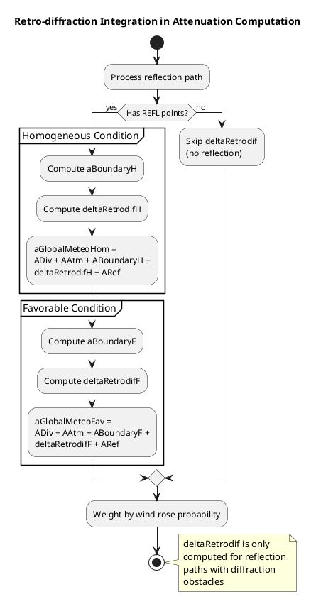

**Key Characteristics**:
- Always positive value (increases total attenuation)
- Frequency-dependent (higher frequencies attenuate more)
- Depends on obstacle height and reflection surface position
- Sensitive to meteorological conditions (favorable vs. homogeneous)
- Accounts for `e` parameter (obstacle length) when `e >= 0.3`

## Tests & Examples

**Test Files**:
- `AttenuationComputeOutputCnossosTest.java` — Unit tests for attenuation computation
  - Tests individual attenuation components (ADiv, AAtm, AGround, ADif)
  - Validates CNOSSOS-EU algorithm implementation
  - Verifies favorable vs. homogeneous condition handling

**Tutorial Files**:
- `noisemodelling-tutorial-01/GenerateReferenceDeviation.java` — Example usage
  - Demonstrates `AttenuationVisitor` in standalone application
  - Shows how to create scene, process profiles, and retrieve results
  - No database dependencies required
