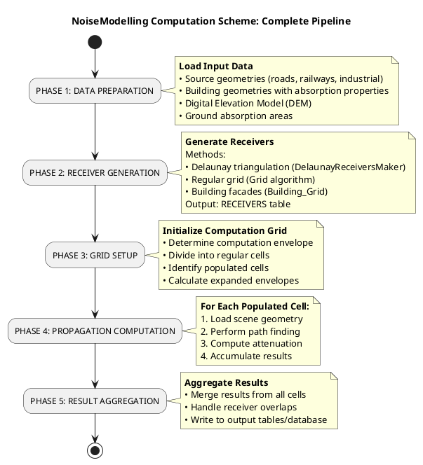
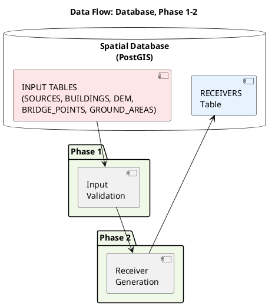
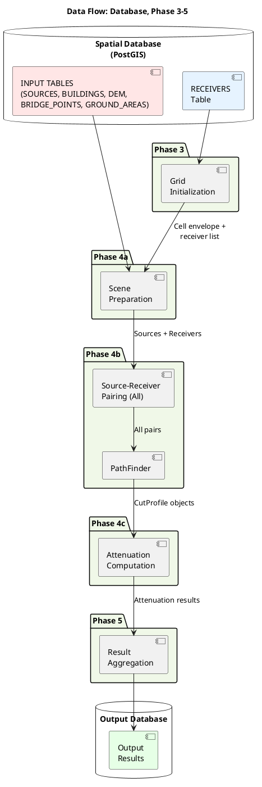

# NoiseModelling Computation Scheme — Overall Framework

- [NoiseModelling Computation Scheme — Overall Framework](#noisemodelling-computation-scheme--overall-framework)
  - [Overview](#overview)
  - [Computation Pipeline](#computation-pipeline)
  - [Phase 1: Data Preparation](#phase-1-data-preparation)
  - [Phase 2: Receiver Generation](#phase-2-receiver-generation)
  - [Phase 3: Grid Setup](#phase-3-grid-setup)
  - [Phase 4: Cell-Based Propagation Computation](#phase-4-cell-based-propagation-computation)
    - [4.1: Scene Preparation](#41-scene-preparation)
    - [4.2: Path Finding](#42-path-finding)
    - [4.3: Attenuation Computation](#43-attenuation-computation)
  - [Phase 5: Result Aggregation](#phase-5-result-aggregation)
  - [Data Flow](#data-flow)
    - [Data Flow (Phase 1-2)](#data-flow-phase-1-2)
    - [Data Flow (Phase 3-5)](#data-flow-phase-3-5)
  - [Orchestration by NoiseMapByReceiverMaker](#orchestration-by-noisemapbyreceivermaker)

## Overview

NoiseModelling implements a comprehensive noise mapping computation scheme that transforms acoustic source data, building geometries, and terrain information into spatially-distributed noise level predictions at specified receiver points. The computation is orchestrated by the `NoiseMapByReceiverMaker` class, which coordinates multiple specialized components working together in a structured pipeline.

**Key Characteristics**:

- **Cell-Based Spatial Decomposition**: Divides the computation domain into manageable cells to optimize memory usage and enable parallel processing
- **Database-Driven**: All input geometries and output results are managed through spatial database integration (typically PostGIS)
- **Multi-Phase Architecture**: Separates data preparation, receiver generation, scene setup, and acoustic computation into distinct phases
- **Propagation-Aware**: Integrates path finding and CNOSSOS-EU attenuation algorithms to compute realistic sound propagation

## Computation Pipeline

## Phase 1: Data Preparation

**Purpose**: Load and validate all input acoustic and geographic data from the spatial database.

**Input Data Categories**:

- **Sources**: Acoustic source geometries with emission spectra (roads, railways, industrial facilities, airports)
- **Buildings**: Building polygons with acoustic absorption/reflection properties
- **Bridge Points**: Point geometries representing bridge structures for obstruction and noise modeling
- **Terrain (DEM)**: Digital elevation model for ground elevation queries
- **Ground Areas**: Soil/ground absorption characteristics for sound propagation
- **Computational Parameters**: Propagation distances, diffraction orders, physical constants

**Detailed Schema Reference**: See [input_data_schema.md](input_data_schema.md) for complete specifications of each table including required columns, value ranges, and validation requirements.

**Data Preparation Approaches**:

*Approach 1: File-Based Loading to H2GIS*

- Geometries initially provided as single files (GeoJSON, Shapefile, GML, etc.)
- Groovy scripts provided in WPS framework to load geometry files into H2GIS database
- These preparation scripts read file-based geometries and populate H2GIS tables
- Once loaded, H2GIS database functions identically to PostGIS for computation
- Useful for lightweight deployments or development scenarios

*Approach 2: Direct PostGIS Database*

- All geometries stored in spatial database (e.g., PostGIS) with proper spatial indexing
- Coordinate reference system consistent across all tables
- Projected coordinates (not geographic/lat-lon) required for accurate distance calculations
- Direct SQL queries used to load data during computation

*Approach 3: Direct Value Input for Testing*

- Geometry and parameter values specified directly in computation code or configuration files
- Suitable for testing, validation, and proof-of-concept demonstrations
- Eliminates database dependency for small-scale computations
- Useful for algorithm development and parameter sensitivity analysis
- Supports manual specification of test cases with known results

All three approaches produce equivalent database schemas and computational results; the choice depends on deployment context, data source, and operational requirements.

## Phase 2: Receiver Generation

**Purpose**: Create receiver points where noise levels will be computed. This is the foundational step that creates the `RECEIVERS` table used throughout the rest of the pipeline.

**Available Algorithms**:

1. **DelaunayReceiversMaker**: Constrained Delaunay triangulation for adaptive mesh generation
   - Respects building and source boundaries
   - Produces spatially-optimized receiver distribution
   - Class-based implementation in `noisemodelling-jdbc`

2. **Regular Grid**: Uniform grid with constant spacing
   - Simple, predictable receiver distribution
   - WPS script-based implementation (`Grid.groovy`)
   - Suitable for large-scale mapping with memory constraints

3. **Building Grid (Building_Grid)**: Facade-based receiver placement
   - Places receivers around building perimeters
   - Useful for detailed facade noise assessment
   - WPS script-based implementation (`Building_Grid.groovy`)

**Output**:

- **RECEIVERS Table**: Standardized schema with columns:
  - `PK` (primary key)
  - `THE_GEOM` (Point with Z coordinate)
  - `HEIGHT_TYPE` (VARCHAR, either 'RELATIVE' for height above ground or 'ABSOLUTE' for elevation in coordinate system)

**Details**: See [receiver_generation_algorithms.md](receiver_generation_algorithms.md) for comprehensive coverage of generation algorithms, including mathematical foundations and implementation architecture.

## Phase 3: Grid Setup

**Purpose**: Organize the computation domain into cells for efficient, memory-bounded processing.

**Grid Initialization Process**:
1. **Envelope Determination**: Calculate bounding box covering all receiver locations
2. **Grid Dimensioning**: Compute cell counts (`gridDim`) based on cell width/height
3. **Cell Enumeration**: Organize cells in regular 2D grid pattern
4. **Populated Cell Identification**: Filter to cells actually containing receivers (optimization for sparse distributions)

**Cell Envelope Calculation**:
- **Base Envelope**: Cell's geographic boundaries
- **Expanded Envelope**: Extended by `(maximumPropagationDistance + 2 × maximumReflectionDistance)` to ensure all relevant geometry is loaded

**Grid Parameters**:
- **Cell Width/Height**: Derived from propagation parameters to balance memory and accuracy
- **Total Cells**: `gridDim × gridDim`, but only populated cells are processed
- **Progressive Processing**: Cells processed sequentially or in parallel, each independently

**Details**: Refer to the "Grid Initialization" section in [noisemapbyreceivermaker_algorithms.md](noisemapbyreceivermaker_algorithms.md).

## Phase 4: Cell-Based Propagation Computation

**Purpose**: Compute sound propagation from sources to receivers for each cell in the grid.

This phase consists of three coordinated sub-steps performed for each populated cell:

### 4.1: Scene Preparation

**Process**: Create a complete `SceneWithEmission` object containing all necessary geometry for the current cell.

For the `Scene` responsibilities and API details, see [Docs-dev/scene.md](scene.md).

**Data Components**:
- **Sources**: Load acoustic sources with emission levels
- **Receivers**: Load receivers within cell envelope
- **Parameters**: Propagation settings, diffraction orders, material properties
- **ProfileBuilder**: Cell-loaded obstacles and terrain, finalized via `finishFeeding()`.
  - **Buildings**: Load building polygons within expanded cell envelope (for obstruction/reflection)
  - **Terrain**: Load DEM within cell bounds (for ground interaction)
  - **Ground Areas**: Load ground absorption properties
  - **Bridges**: Load bridge points and virtual source metadata
  - **Parameters**: Propagation settings, diffraction orders, material properties

**Receiver Processing Integration**:
After loading receivers from the database, the following receiver processing pipeline is executed:
- Zone of Influence (ZOI) conversion from RELATIVE to ABSOLUTE elevation using DEM data
- Scene registration of receiver coordinates
- Z-coordinate standardization for propagation computation

For detailed receiver processing steps, see [receiver_algorithms.md](receiver_algorithms.md) which describes:
- RECEIVERS table schema
- Geometry loading from database
- Z-coordinate conversion (RELATIVE ↔ ABSOLUTE)
- ReceiverPointInfo creation

**Source Processing Integration**:
This step also performs source-specific processing (e.g., loading emission spectra, preparing source metadata, and aligning source geometry with the current cell).
For detailed source processing steps, see [source_algorithms.md](source_algorithms.md).

**Details**: See the "Scene Preparation" section in [noisemapbyreceivermaker_algorithms.md](noisemapbyreceivermaker_algorithms.md).

### 4.2: Path Finding

Overview: This step computes propagation paths (direct sound, diffraction, reflection) between all sources and receivers within the cell. For detailed algorithms (ray geometry, obstacle detection, diffraction identification, multi-bounce reflections, and `CutProfile` generation) see [Docs-dev/pathfinder_algorithms.md](Docs-dev/pathfinder_algorithms.md).

Implementation notes:
- Processing is performed per receiver and may be parallelized (thread count depends on runtime configuration).
- `PathFinder.run()` assumes receiver absolute heights have been established beforehand; call `ensureAbsoluteReceiverHeights()` prior to running path finding.
- Output consists of `CutProfile` objects, which are passed to the attenuation computation phase.

### 4.3: Attenuation Computation

**Process**: Apply CNOSSOS-EU acoustic attenuation algorithms to compute sound levels at each receiver.

**Attenuation Components**:
- **Geometric Divergence (ADiv)**: Distance-based spreading loss
- **Atmospheric Absorption (AAtm)**: Sound absorption in air
- **Ground Effects (ABoundary)**: Reflection and absorption from ground surfaces
- **Diffraction (ADiff)**: Sound bending around obstacles
- **Reflection Losses (ARef)**: Losses at reflection surfaces

**Visitor Pattern**: Results are computed through the `AttenuationVisitor` pattern, allowing incremental processing of each source-receiver-path combination.

**Output**: Aggregated sound levels (typically in dB) at each receiver for multiple frequency bands.

**Details**: See [attenuation_algorithms.md](attenuation_algorithms.md) for CNOSSOS-EU algorithm implementation, including:
- Attenuation component formulas
- Frequency-dependent behavior
- Source type variations (road, railway, industrial)
- Combination of multiple propagation paths

**Details**: See [noisemapbyreceivermaker_algorithms.md](noisemapbyreceivermaker_algorithms.md) for cell-based processing orchestration and attenuation integration.

## Phase 5: Result Aggregation

**Purpose**: Combine results from all processed cells into final output.

**Tasks**:
1. **Merge Per-Cell Results**: Combine attenuation results from all cells
2. **Handle Overlaps**: Manage receivers appearing in multiple cells (skip duplicates)
3. **Database Writing**: Store final noise levels in output tables
4. **Statistics**: Generate computation metrics (paths processed, obstacles tested, execution time)

**Output Types**:
- **Receiver Noise Levels**: Sound levels at each receiver point (per band or overall)
- **Optional Noise Maps**: Can generate raster maps from receiver points using interpolation
- **Metadata**: Computation statistics and quality metrics

**Details**: See the "Result Aggregation" section in [noisemapbyreceivermaker_algorithms.md](noisemapbyreceivermaker_algorithms.md) for output mechanism details.

## Data Flow

### Data Flow (Phase 1-2)

### Data Flow (Phase 3-5)

**Data Storage Pattern**:
- **Persistent**: All input and intermediate geometry stored in spatial database
- **In-Memory**: Only cell-specific data loaded into memory for processing (memory efficiency)
- **Transient**: PathFinding and attenuation computation results held temporarily per cell
- **Persistent Output**: Final results written to database tables or files

**Coordinate System Consistency**:
- All geometries must use same projected CRS throughout
- Z-coordinates standardized to absolute elevation after receiver processing
- Distances calculated using projected coordinates (meters, not degrees)

## Orchestration by NoiseMapByReceiverMaker

The `NoiseMapByReceiverMaker` class serves as the orchestrator coordinating all five phases:

1. **Extends GridMapMaker**: Inherits grid-based processing framework
2. **Manages Receiver Table**: Tracks receiver primary keys and locations
3. **Controls Cell Loop**: Iterates through populated cells, calling `evaluateCell()` for each
4. **Integrates PathFinder**: Creates PathFinder instances with prepared scenes
5. **Manages AttenuationComputeOutput**: Coordinates visitor-pattern result collection
6. **Coordinates Threading**: Manages multi-threaded path finding and result aggregation
7. **Splits Loader Contexts**: Exposes one-time `LoaderInitContext` and per-cell `CellSceneContext` to `TableLoader`
8. **Stabilizes Input Settings**: `DefaultTableLoader.initialize(...)` takes `EmissionInputSettings`, resolves `INPUT_MODE_GUESS` once, and reuses the resolved mode for all subsequent `createScene(...)` calls

For detailed NoiseMapByReceiverMaker architecture and orchestration patterns, see [noisemapbyreceivermaker_algorithms.md](noisemapbyreceivermaker_algorithms.md).
