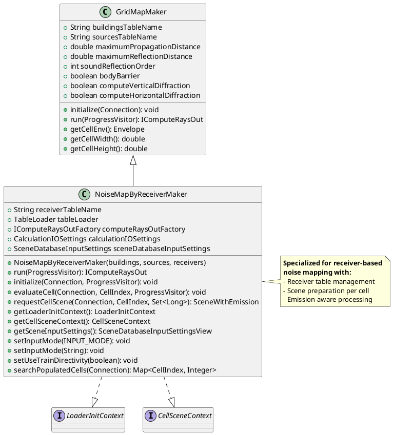
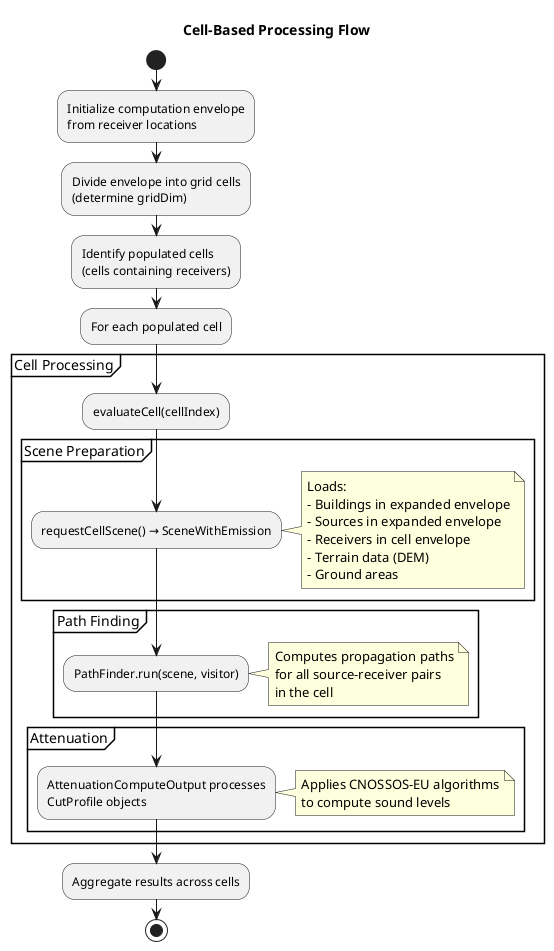
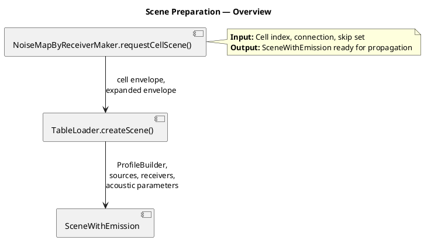
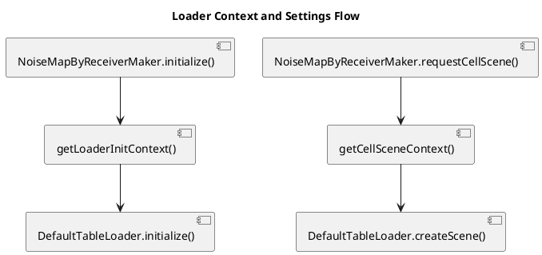
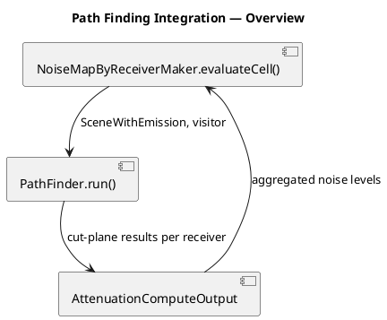
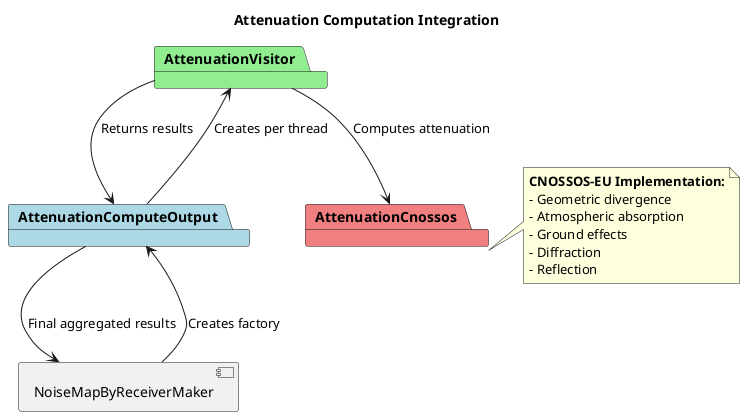
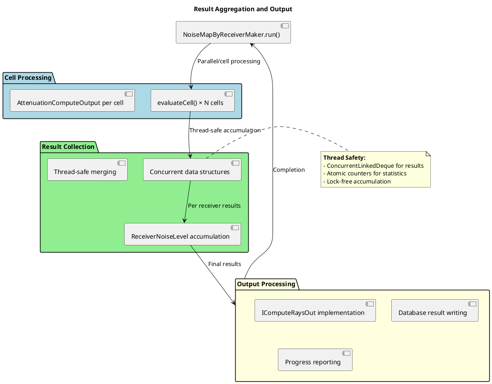

# NoiseMapByReceiverMaker Algorithms

- [NoiseMapByReceiverMaker Algorithms](#noisemapbyreceivermaker-algorithms)
  - [Concepts \& Overview](#concepts--overview)
  - [GridMapMaker — Base Architecture](#gridmapmaker--base-architecture)
  - [Receiver Generation Algorithms](#receiver-generation-algorithms)
  - [Cell-Based Processing](#cell-based-processing)
  - [Grid Initialization](#grid-initialization)
  - [Scene Preparation](#scene-preparation)
    - [Overview](#overview)
    - [Key Responsibilities](#key-responsibilities)
    - [Scene Contents](#scene-contents)
  - [Loader Context Split \& Settings Lifecycle](#loader-context-split--settings-lifecycle)
    - [Overview](#overview-1)
    - [DefaultTableLoader Initialization Behavior](#defaulttableloader-initialization-behavior)
  - [Path Finding Integration](#path-finding-integration)
    - [Overview](#overview-2)
    - [Key Steps](#key-steps)
  - [Attenuation Computation](#attenuation-computation)
  - [Result Aggregation](#result-aggregation)

## Concepts & Overview

The `NoiseMapByReceiverMaker` class is the central coordinator for computing noise maps at specified receiver points. It implements a cell-based processing approach to handle large-scale noise propagation calculations efficiently, integrating geometry loading, path finding, and acoustic attenuation computation.

**Overall Context**: `NoiseMapByReceiverMaker` orchestrates all phases of the NoiseModelling computation scheme. For the complete computation pipeline context including data preparation, receiver generation, and result aggregation, see [computation_scheme.md](computation_scheme.md).

The class extends `GridMapMaker` and orchestrates the complete noise mapping workflow:

1. **Grid Division**: Divides the computation domain into manageable cells
2. **Scene Preparation**: Loads buildings, sources, receivers, and terrain for each cell
3. **Path Finding**: Computes propagation paths from sources to receivers
4. **Attenuation Calculation**: Applies CNOSSOS-EU algorithms to compute sound levels
5. **Result Aggregation**: Combines results across all cells

**Key Responsibilities**:
- Cell-based spatial decomposition for memory efficiency
- Database integration for input data loading
- Multi-threaded processing coordination
- Integration with PathFinder and AttenuationComputeOutput components
- Read-only context exposure for loader initialization and per-cell scene creation

## GridMapMaker — Base Architecture

`NoiseMapByReceiverMaker` extends `GridMapMaker`, which provides the foundational grid-based processing framework.

**Key Extensions**:
- **Receiver Management**: Handles receiver table and primary key tracking
- **Scene Preparation**: Creates `SceneWithEmission` objects with source emission data
- **Emission Integration**: Coordinates with emission calculation components

## Receiver Generation Algorithms

`NoiseMapByReceiverMaker` requires receivers to be pre-generated and stored in a database table. Multiple algorithms are available for receiver generation, each suited for different use cases:

- **DelaunayReceiversMaker**: Generates adaptive mesh using constrained Delaunay triangulation
- **Regular Grid**: Creates uniform grid with constant spacing
- **Building Grid**: Places receivers around building facades

For detailed information about receiver generation algorithms, see [receiver_generation_algorithms.md](receiver_generation_algorithms.md).

## Cell-Based Processing

The core processing follows a cell-based decomposition strategy to manage computational complexity and memory usage.

## Grid Initialization

Before processing individual cells, the system initializes the computational grid to organize the spatial domain efficiently.

**Grid Initialization Process**:
- **Computation Envelope Calculation**: Determines the overall bounding box from all receiver locations to define the computation domain
- **Grid Dimension Determination**: Calculates the optimal grid size (`gridDim`) based on cell dimensions and propagation parameters
- **Cell Placement**: Arranges cells in a regular grid pattern covering the entire computation envelope
- **Cell Indexing**: Assigns unique indices to each cell for tracking and processing

**Key Parameters**:
- **Cell Width/Height**: Determined by `getCellWidth()` and `getCellHeight()` methods from base `GridMapMaker`
- **Grid Coverage**: Ensures complete coverage of receiver locations with minimal overhead

**Cell Size and Count Determination**:
- **Cell Size Calculation**: Cell dimensions are typically set based on propagation parameters to balance memory usage and computational efficiency. For example, cell width/height may be derived from `maximumPropagationDistance` to ensure that propagation paths within a cell can be computed without excessive memory overhead.
- **Grid Dimension (gridDim)**: Calculated as the number of cells needed to cover the computation envelope in both x and y directions. This is determined by dividing the envelope width/height by the cell width/height and rounding up to ensure full coverage.
- **Total Cell Count**: Equals `gridDim × gridDim`, representing the total number of cells in the grid. Only cells containing receivers (populated cells) are processed, optimizing performance for sparse receiver distributions.

**Cell Envelope Calculation**:
- **Cell Envelope**: Bounding box of current processing cell
- **Expanded Envelope**: Cell envelope expanded by `maximumPropagationDistance + 2 × maximumReflectionDistance`
- **Purpose**: Ensures all relevant geometry is loaded for accurate propagation

## Scene Preparation

The `requestCellScene()` method creates a complete `SceneWithEmission` object containing all necessary data for propagation computation. This method acts as the bridge between database storage and the in-memory `Scene` representation, delegating the actual scene construction details to the `TableLoader` interface (typically `DefaultTableLoader`).

### Overview

### Key Responsibilities

- **Envelope Computation**: Calculate cell boundary and expanded envelope (expanded by `maximumPropagationDistance + 2 × maximumReflectionDistance`)
- **TableLoader Delegation**: Invoke `TableLoader.createScene()` to construct the complete scene
- **Context Delegation**: Pass `CellSceneContext` for per-cell geometry/physics parameters and `LoaderInitContext` for one-time loader setup
- **Receiver Deduplication**: Track receivers already processed to avoid redundant computation across cell boundaries

### Scene Contents

The returned `SceneWithEmission` contains:
- **Geometry**: Buildings, walls, bridges, terrain (via finalized `ProfileBuilder`)
- **Sources and Receivers**: Acoustic sources and receiver points for the cell
- **Acoustic Configuration**: Frequency arrays, attenuation parameters, directivity attributes, and propagation settings

## Loader Context Split & Settings Lifecycle

The current implementation explicitly splits loader dependencies into two read-only context interfaces:

- `LoaderInitContext`: values required once in `TableLoader.initialize(...)` (source/emission table names, frequency prefix, scene input settings, verbose flag)
- `CellSceneContext`: values required for each cell in `TableLoader.createScene(...)` (cell envelope, geometry factory, propagation flags, input table names)

`NoiseMapByReceiverMaker` implements both interfaces and exposes them through:

- `getLoaderInitContext()`
- `getCellSceneContext()`

### Overview

### DefaultTableLoader Initialization Behavior

`DefaultTableLoader.initialize(...)` now takes a snapshot copy of `SceneDatabaseInputSettingsView` into a mutable `SceneDatabaseInputSettings` instance. This has two important consequences:

1. **Input mode guessing is persistent**: when mode is `INPUT_MODE_GUESS`, the guessed mode is stored in the loader snapshot and reused later by `createScene(...)`.
2. **Per-cell behavior remains consistent**: every scene built by the same loader instance uses the same resolved input mode and associated settings.

This avoids a mismatch where mode inference would occur at initialization time but scene construction would still use an unresolved `INPUT_MODE_GUESS` view.

For detailed step-by-step scene construction workflow and implementation patterns, see [Typical workflow of creating Scene](scene.md#typical-workflow-of-creating-scene) in the scene documentation.

## Path Finding Integration

`NoiseMapByReceiverMaker` integrates with the PathFinder component to compute propagation paths for all source-receiver pairs within a computation cell. The `evaluateCell()` method orchestrates this integration by creating a prepared `SceneWithEmission` and passing it to `PathFinder.run()` with an attenuation visitor for result collection.

### Overview

### Key Steps

1. **Scene Creation**: `requestCellScene()` loads cell geometry, sources, and receivers into a finalized `SceneWithEmission`
2. **PathFinder Invocation**: `PathFinder.run(scene, visitor)` orchestrates per-receiver path-finding and propagation computation
3. **Result Collection**: Results from path-finding are collected by the `AttenuationComputeOutput` visitor which computes acoustic attenuation
4. **Cell Aggregation**: Per-receiver results are aggregated and contribute to final noise map

For detailed path-finding algorithms, receiver processing, and profile computation, see [Cell Evaluation Integration](pathfinder_algorithms.md#cell-evaluation-integration) and [Finding Paths](pathfinder_algorithms.md#finding-paths) in the PathFinder documentation.

## Attenuation Computation

The attenuation computation is delegated to the `AttenuationComputeOutput` component, which implements the CNOSSOS-EU algorithms.
See [AttenuationComputeOutput architecture and algorithms](attenuationcomputeoutput_algorithms.md) for detailed information.

**Attenuation Flow**:
1. **Profile Processing**: `AttenuationVisitor` receives `CutProfile` objects from PathFinder
2. **CNOSSOS-EU Application**: Each profile processed using `AttenuationCnossos.computeCnossosAttenuation()`
3. **Component Calculation**: Computes ADiv, AAtm, ABoundary, ARef, and retro-diffraction
4. **Result Accumulation**: Attenuation levels accumulated per receiver
5. **Aggregation**: Results combined across all threads and cells

## Result Aggregation

Final results are aggregated from all processed cells and threads.

**Output Components**:
- **Receiver Noise Levels**: Sound levels at each receiver point
- **Path Statistics**: Computation metrics (paths processed, obstacles tested, etc.)
- **Progress Information**: Processing status for UI feedback
- **Database Integration**: Results written to output tables
