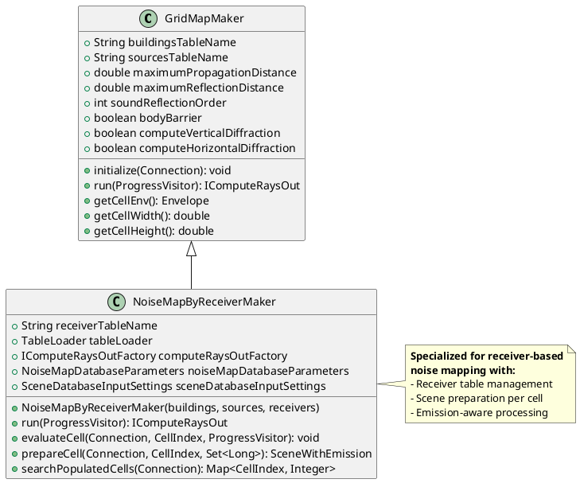
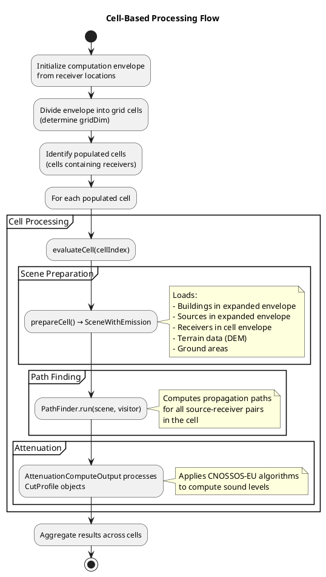
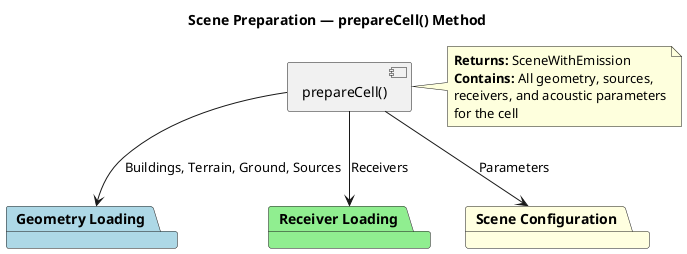
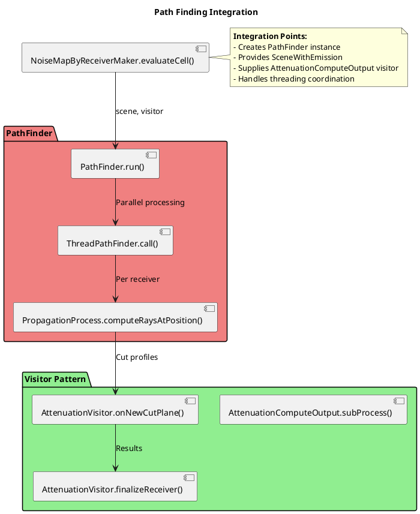
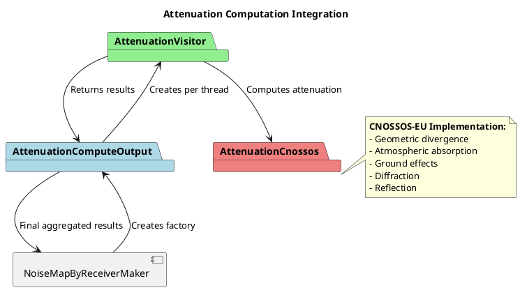
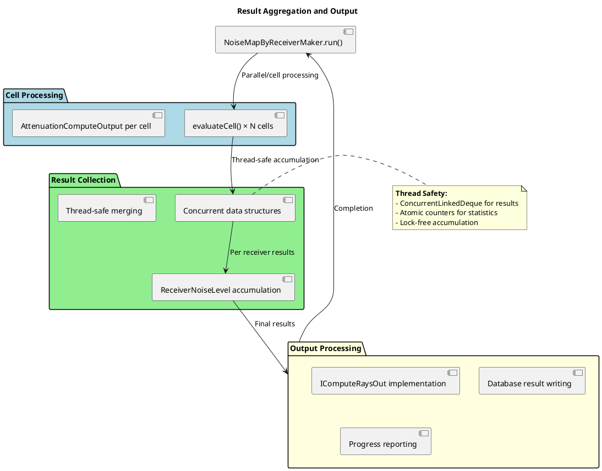

# NoiseMapByReceiverMaker Algorithms

- [NoiseMapByReceiverMaker Algorithms](#noisemapbyreceivermaker-algorithms)
  - [Concepts \& Overview](#concepts--overview)
  - [GridMapMaker — Base Architecture](#gridmapmaker--base-architecture)
  - [Cell-Based Processing](#cell-based-processing)
  - [Grid Initialization](#grid-initialization)
  - [Scene Preparation](#scene-preparation)
  - [Path Finding Integration](#path-finding-integration)
  - [Attenuation Computation](#attenuation-computation)
  - [Result Aggregation](#result-aggregation)

## Concepts & Overview

The `NoiseMapByReceiverMaker` class is the central coordinator for computing noise maps at specified receiver points. It implements a cell-based processing approach to handle large-scale noise propagation calculations efficiently, integrating geometry loading, path finding, and acoustic attenuation computation.

The class extends `GridMapMaker` and orchestrates the complete noise mapping workflow:

1. **Grid Division**: Divides the computation domain into manageable cells
2. **Scene Preparation**: Loads buildings, sources, receivers, and terrain for each cell
3. **Path Finding**: Computes propagation paths from sources to receivers
4. **Attenuation Calculation**: Applies CNOSSOS-EU algorithms to compute sound levels
5. **Result Aggregation**: Combines results across all cells

**Key Responsibilities**:
- Cell-based spatial decomposition for memory efficiency
- Database integration for input data loading
- Multi-threaded processing coordination
- Integration with PathFinder and AttenuationComputeOutput components

## GridMapMaker — Base Architecture

`NoiseMapByReceiverMaker` extends `GridMapMaker`, which provides the foundational grid-based processing framework.

**Key Extensions**:
- **Receiver Management**: Handles receiver table and primary key tracking
- **Scene Preparation**: Creates `SceneWithEmission` objects with source emission data
- **Emission Integration**: Coordinates with emission calculation components

## Receiver Generation Algorithms

`NoiseMapByReceiverMaker` requires receivers to be pre-generated and stored in a database table. Multiple algorithms are available for receiver generation, each suited for different use cases:

- **DelaunayReceiversMaker**: Generates adaptive mesh using constrained Delaunay triangulation
- **Regular Grid**: Creates uniform grid with constant spacing
- **Building Grid**: Places receivers around building facades

For detailed information about receiver generation algorithms, see [receiver_generation_algorithms.md](receiver_generation_algorithms.md).

## Cell-Based Processing

The core processing follows a cell-based decomposition strategy to manage computational complexity and memory usage.

## Grid Initialization

Before processing individual cells, the system initializes the computational grid to organize the spatial domain efficiently.

**Grid Initialization Process**:
- **Computation Envelope Calculation**: Determines the overall bounding box from all receiver locations to define the computation domain
- **Grid Dimension Determination**: Calculates the optimal grid size (`gridDim`) based on cell dimensions and propagation parameters
- **Cell Placement**: Arranges cells in a regular grid pattern covering the entire computation envelope
- **Cell Indexing**: Assigns unique indices to each cell for tracking and processing

**Key Parameters**:
- **Cell Width/Height**: Determined by `getCellWidth()` and `getCellHeight()` methods from base `GridMapMaker`
- **Grid Coverage**: Ensures complete coverage of receiver locations with minimal overhead

**Cell Size and Count Determination**:
- **Cell Size Calculation**: Cell dimensions are typically set based on propagation parameters to balance memory usage and computational efficiency. For example, cell width/height may be derived from `maximumPropagationDistance` to ensure that propagation paths within a cell can be computed without excessive memory overhead.
- **Grid Dimension (gridDim)**: Calculated as the number of cells needed to cover the computation envelope in both x and y directions. This is determined by dividing the envelope width/height by the cell width/height and rounding up to ensure full coverage.
- **Total Cell Count**: Equals `gridDim × gridDim`, representing the total number of cells in the grid. Only cells containing receivers (populated cells) are processed, optimizing performance for sparse receiver distributions.

**Cell Envelope Calculation**:
- **Cell Envelope**: Bounding box of current processing cell
- **Expanded Envelope**: Cell envelope expanded by `maximumPropagationDistance + 2 × maximumReflectionDistance`
- **Purpose**: Ensures all relevant geometry is loaded for accurate propagation

## Scene Preparation

The `prepareCell()` method creates a complete `SceneWithEmission` object containing all necessary data for propagation computation.

**Geometry Storage Before Loading**:
- **Primary Storage**: All geometry data (buildings, terrain, ground areas, sources) is stored in a spatial database (typically PostGIS) before processing
- **Table Organization**: Data is organized in dedicated tables (e.g., `buildingsTableName`, `sourcesTableName`) as specified in `GridMapMaker` parameters
- **Pre-Processing Location**: Geometry exists in the database tables; `ProfileBuilder` is not involved in geometry loading but handles propagation path profiling during path finding
- **Loading Mechanism**: `prepareCell()` queries the database using spatial envelopes to retrieve relevant geometry for each cell

**Data Loading Sequence**:
1. **Buildings**: Load buildings within expanded envelope for obstruction modeling
2. **Terrain (DEM)**: Load digital elevation model for ground profile computation
3. **Ground Areas**: Load soil/ground absorption data
4. **Sources**: Load acoustic sources with emission data
5. **Receivers**: Load receivers within cell envelope
6. **Configuration**: Apply acoustic and computational parameters

## Path Finding Integration

`NoiseMapByReceiverMaker` integrates with the PathFinder component to compute propagation paths.
See `pathfinder_algorithm.md` for detailed PathFinder architecture and algorithms. 
The `ProfileBuilder` is invoked during PathFinder execution to construct propagation profiles.

**Key Integration Aspects**:
- **Scene Provision**: Passes prepared `SceneWithEmission` to PathFinder
- **Visitor Pattern**: Uses `AttenuationComputeOutput` as the processing visitor
- **Threading**: Coordinates multi-threaded path finding execution
- **Result Flow**: Receives processed attenuation results through visitor callbacks

## Attenuation Computation

The attenuation computation is delegated to the `AttenuationComputeOutput` component, which implements the CNOSSOS-EU algorithms.
See `attenuationcomputeoutput_algorithms.md` for detailed AttenuationComputeOutput architecture and algorithms.

**Attenuation Flow**:
1. **Profile Processing**: `AttenuationVisitor` receives `CutProfile` objects from PathFinder
2. **CNOSSOS-EU Application**: Each profile processed using `AttenuationCnossos.computeCnossosAttenuation()`
3. **Component Calculation**: Computes ADiv, AAtm, ABoundary, ARef, and retro-diffraction
4. **Result Accumulation**: Attenuation levels accumulated per receiver
5. **Aggregation**: Results combined across all threads and cells

## Result Aggregation

Final results are aggregated from all processed cells and threads.

**Output Components**:
- **Receiver Noise Levels**: Sound levels at each receiver point
- **Path Statistics**: Computation metrics (paths processed, obstacles tested, etc.)
- **Progress Information**: Processing status for UI feedback
- **Database Integration**: Results written to output tables
