# NoiseModelling-PathFinder algorithms

- [NoiseModelling-PathFinder algorithms](#noisemodelling-pathfinder-algorithms)
  - [Concepts \& Overview](#concepts--overview)
  - [ProfileBuilder — Feeding Data](#profilebuilder--feeding-data)
    - [ProfileBuilder — Overview](#profilebuilder--overview)
    - [Step-by-step procedure to feed data to ProfileBuilder](#step-by-step-procedure-to-feed-data-to-profilebuilder)
  - [ProfileBuilder — Preprocessing](#profilebuilder--preprocessing)
    - [Preprocessing Pipeline](#preprocessing-pipeline)
    - [Role of Processed Walls](#role-of-processed-walls)
  - [Scene — Sources and Receivers](#scene--sources-and-receivers)
    - [Scene — Overview](#scene--overview)
    - [Scene — Subclasses \& Test Helpers](#scene--subclasses--test-helpers)
    - [Typical Workflow to Create and Populate a Scene](#typical-workflow-to-create-and-populate-a-scene)
    - [Adding Sources](#adding-sources)
    - [Adding Receivers](#adding-receivers)
  - [Finding Paths](#finding-paths)
    - [PathFinder class](#pathfinder-class)
    - [Processing flow](#processing-flow)
  - [Calculating Profiles](#calculating-profiles)
    - [Processing pipeline](#processing-pipeline)
    - [What a CutProfile is used for](#what-a-cutprofile-is-used-for)
    - [Profile with bridge](#profile-with-bridge)
      - [Propagation scenarios](#propagation-scenarios)
      - [First cut-point insertion](#first-cut-point-insertion)
      - [Bridge deck just below the profile line](#bridge-deck-just-below-the-profile-line)
      - [Downward edge diffraction for imaginary sources](#downward-edge-diffraction-for-imaginary-sources)
  - [Tests, Examples \& snippets](#tests-examples--snippets)
    - [PathFinderTest](#pathfindertest)
    - [Examples](#examples)

## Concepts & Overview

The goal of the PathFinder module is to provide geometry-aware sound propagation algorithms suitable for outdoor urban environments. The algorithms compute direct, reflected, diffracted and ground-affected sound propagation contributions from many sound sources to many receivers, using detailed 3D geometry (buildings, walls, bridges, topography) and frequency-dependent absorption parameters.

To achieve this, the module provides a set of domain classes and services to ingest raw geometry, preprocess it into spatial indexes and processed facets, then at runtime compute vertical profiles between sources and receivers. The profiles are used to evaluate visibility, obstruction, diffraction and reflection possibilities, and to compute per-frequency attenuation contributions.

The output of this module is the `CutProfile` data structure which contains an ordered list of cut points (intersections with topography and obstacle facets) along the source-receiver line, with associated ground elevations, ground absorption coefficients and obstacle metadata. The `CutProfile` is consumed by the NoiseModelling-Propagation module.

## ProfileBuilder — Feeding Data

Obstacle geometries (buildings, walls, bridges, ground effects) and topography are ingested into a `ProfileBuilder` instance using its `addBuilding(...)`, `addWall(...)`, `addBridge(...)`, `addGroundEffect(...)`, `addTopographicPoint(...)` and `addTopographicLine(...)` methods.


Figure: Example of data feeding. Neither sources nor receivers are included at this moment.

### ProfileBuilder — Overview

The `ProfileBuilder` class is the central orchestrator for geometry ingestion, preprocessing and providing domain services (buildings, walls, bridges, ground effects, topography) used by runtime profile routines.

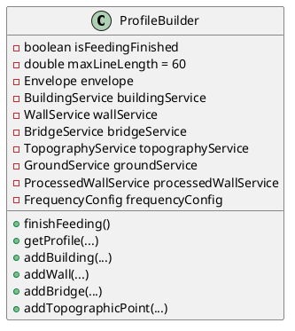

The following is a compact overview of the classes that make up `ProfileBuilder`.

- `FrequencyConfig` — Frequency-related configuration. It typically holds the (1/1 or 1/3) octave-band frequency array (in Hz) .
- `BuildingService` / `WallService` / `GroundService` / `TopographyService` — The service class that manages `Building`, `Wall`, `GroundEffect` and `Topographic` instances. It also provides query helpers used during profile construction.
- `BridgeService` — The service class that manages `Bridge` instances and provides query helpers.
- `ProcessedWallService` — Responsible for collecting exported wall/facet geometry (see the next section).
- `ProfileRetriever` — The class that implements the profile construction pipeline (see the "Calculating Profiles" section).

The `ProfileBuilder` instance is typically created once, populated with geometry and topography, then finalized by calling `finishFeeding()`. After finalization, the builder is usually treated as read-only and referenced by a `Scene` instance that holds sources and receivers.


### Step-by-step procedure to feed data to ProfileBuilder

- Create and configure a `ProfileBuilder` instance. `FrequencyConfig` is typically set at this point.
- Optionally set frequency arrays and `setZBuildings(true)` if building vertex z-values are meaningful.
- Add topography if available using `addTopographicPoint(...)` and/or `addTopographicLine(...)`. Topography is required for accurate elevation computations and for generating a TIN.
- Add buildings via `addBuilding(Geometry|Coordinate[], height?, alphas?, id?)`. Use the overloads that match your available data (polygon geometry, coordinate arrays, with or without heights and absorption coefficients).
- Add walls via `addWall(...)` and bridges via `addBridge(...)`. For walls you can provide per-frequency absorption lists and explicit heights. Bridges are treated similarly to walls for intersection purposes.
- Add ground absorption areas using `addGroundEffect(Geometry, coefficient)`.

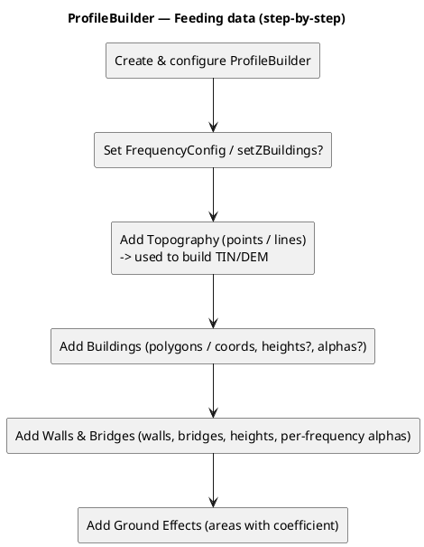

## ProfileBuilder — Preprocessing

Finalizing the `ProfileBuilder` by calling `finishFeeding()` executes a multi-step preprocessing pipeline that builds a TIN/DEM from topographic points, propagates elevations into buildings/walls/bridges, exports building and wall facets to spatial indexes, and constructs processed wall facets used for reflection and diffraction calculations.
The `ProfileBuilder` instance is effectively read-only after `finishFeeding()`.


Figure: Example of the ProfileBuilder preprocess. The processed walls (red lines) are constructed.

### Preprocessing Pipeline

1. Delaunay triangulation (TIN/DEM) is constructed from topographic points/lines.
2. Geometries (Building, wall and bridge) get z-elevations computed from the DEM when needed.
3. Facets of Building and bridge are exported as "processed wall" having spatial indexes. The processed wall include the vertical faces used for reflection and diffraction calculations.
4. R-trees are built for geometries of buildings, walls, bridges, processed walls and ground areas.
5. Acoustic parameters (such as absorption coefficients) are initialized per frequency arrays.

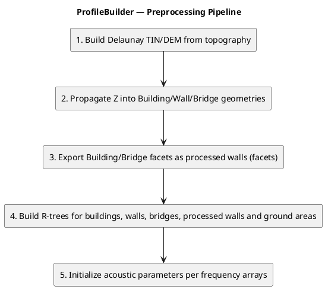

### Role of Processed Walls

- Processed walls representing vertical faces will be used by `PathFinder` and `ProfileRetriever` to detect reflections and edge diffractions.
- When computing reflections the algorithm queries the processed wall index to find candidate facets intersecting the reflection plane; for diffraction the precomputed wide-angle/diffraction points and processed wall edges are used to build diffraction planes.

## Scene — Sources and Receivers

`Scene` class is the runtime container for all geometric inputs used by propagation algorithms. It stores source geometries and metadata, receiver coordinates and optional primary keys, and a reference to a finalized `ProfileBuilder` instance.

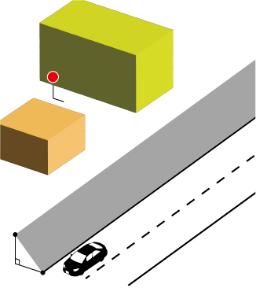

Figure: Example of the Scene. The obstacles are contained in the ProfileBuilder.

### Scene — Overview

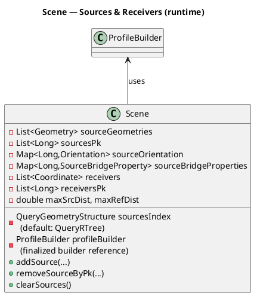

- Fields for sources
  - `sourceGeometries : List<Geometry>` — ordered list of `JTS` geometries registered as sources. Elements are usually `Point` (point sources) or `LineString` (line sources). Order matters because other arrays/maps (for example `sourcesPk`) are kept in parallel by index.
  - `sourcesPk : List<Long>` — parallel list of long primary keys used for DB correlation and as stable identifiers for per-source metadata maps. Keys must be unique within the `Scene`. When callers provide null or conflicting PKs, `UniqueKeyGenerator` will generate a non-conflicting value.
  - `sourcesIndex : QueryGeometryStructure` (default `QueryRTree`) — spatial index (R-tree wrapper). The index is updated when `addSource(...)`, `setSources(...)` or `clearSources()` is invoked; consumers (e.g., `SourceCollector`) query it to locate candidate source sample points.

- Per-source metadata maps
  - `sourceOrientation : Map<Long,Orientation>` — optional orientation/directivity metadata keyed by source PK.
  - `sourceBridgeProperties : Map<Long,SourceBridgeProperty>` — bridge/virtual-source related metadata keyed by source PK.

- Fields for receivers
  - `receivers : List<Coordinate>` — ordered list of receiver coordinates used as endpoints for profile computation and path-finding tasks.
  - `receiversPk : List<Long>` — optional parallel list of receiver primary keys for DB-backed workflows. Only the `addReceiver(long pk, Coordinate)` overload appends to this list.
  - Note: `Scene` does not provide an internal receiver spatial index. For workflows with many receivers and repeated nearest-neighbour queries, create and maintain an external `QueryRTree` keyed on receiver coordinates.

- Builder reference and processed-domain services
  - `profileBuilder : ProfileBuilder` — reference to the (usually finalized) `ProfileBuilder`.

- Numerical and configuration fields
  - `defaultGroundAttenuation` — fallback ground coefficient used when no ground information is available.
  - `maxSrcDist`, `maxRefDist` — maximum source collection distance and maximum reflection distance used by collectors and path-finders.
  - `reflexionOrder` — maximum number of reflections considered by reflection search.
  - `computeHorizontalDiffraction`, `computeVerticalDiffraction`, `bodyBarrier` — boolean flags that control diffraction/body-shadowing calculation modes.

- Operational invariants and behavior
  - Index update contract: the implementation has some important caveats you should be aware of:
    - `addSource(...)` appends the geometry to `sourceGeometries`, generates/records a PK in `sourcesPk` (and returns the actual registered PK), and calls `sourcesIndex.appendGeometry(geom, index)` to populate the source spatial index.
    - `removeSourceByPk(...)` removes the geometry and per-source metadata from the lists/maps, but it does NOT remove the corresponding entry from the underlying `sourcesIndex`. Many index implementations used here (R-tree/QueryRTree wrappers) do not support efficient single-item deletion. Therefore removing a single source does not necessarily remove it from index queries. To guarantee a consistent index after removals, use `clearSources()` and re-add remaining sources (or construct a new `Scene`).
    - `setSources(...)` iterates the supplied geometries and appends them to the existing spatial index, but it does not reinitialize `sourcesIndex` nor does it manage `sourcesPk`. In practice, call `clearSources()` before `setSources(...)` when you intend a true bulk replace, or create a fresh `Scene` and add the new sources there.
    - `clearSources()` empties source lists/maps and reinitializes `sourcesIndex` (current implementation resets it to a new `QueryRTree`). This is the safe API call to rebuild the scene sources and index from scratch.
    - Convenience: use `getSourceQuery()` to obtain the active `QueryGeometryStructure` (`QueryRTree`) for custom queries or diagnostics.
  - PK uniqueness: callers can supply explicit PKs but the `Scene` may replace them with generated unique keys if conflicts exist. `addSource(...)` returns the actual registered PK — store that value if you rely on it. Many metadata maps are keyed on PKs, so keep PKs stable while the scene is active.
  - Thread-safety: `Scene` and the referenced `ProfileBuilder` are not thread-safe. Treat them as read-only during `PathFinder.run(...)` and synchronize externally when making concurrent modifications or queries.

  - Default constructor note: calling `new Scene()` constructs a `Scene` with an internally created `ProfileBuilder` instance. If you rely on a finalized builder (TIN/processed walls/indexes), prefer creating the `ProfileBuilder` externally, calling `finishFeeding()`, and passing it into `new Scene(profileBuilder)`.

### Scene — Subclasses & Test Helpers

- `SceneWithAttenuation` extends `Scene` and adds attenuation-related maps and per-source emission/attenuation attributes (ground factor, directivity identifiers, frequency configuration).
- `SceneWithEmission` (in the JDBC module) extends `SceneWithAttenuation` and integrates emission-spectrum loading from database rows, bridge virtual-source creation, and emission registration per source PK.
- `ProfileBuilderDecorator` is a test-friendly convenience that wraps a `ProfileBuilder` into a `Scene` instance and exposes compact `addSource(x,y,z)` / `addReceiver(x,y,z)` builder-style methods. It is commonly used in unit tests to create a ready-to-query `Scene` after calling `finishFeeding()` on the underlying builder.

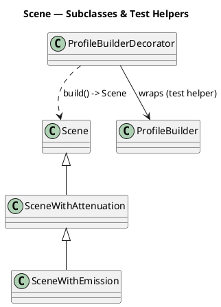

### Typical Workflow to Create and Populate a Scene

1. Build, populate and finalize a `ProfileBuilder` instance.
2. Create a `Scene` (or use `ProfileBuilderDecorator`) passing the finalized `ProfileBuilder`
3. Register sources and receivers via `addSource(...)` and `addReceiver(...)`.

### Adding Sources

Sound sources are added using the `Scene.addSource(...)` family of methods to register sources.

1. Prepare a JTS `Geometry` for the source (use `Point` for point sources and `LineString` for linear sources). If Z is missing, NaN values are normalized to 0 by the code paths that build `SourcePointInfo`.
2. Use your database primary key (PK) when available; otherwise choose a stable unique key (for example via `UniqueKeyGenerator`). `Scene` will also generate a non-conflicting key if a supplied PK collides.
3. Call an appropriate `addSource(...)` overload. Provide `Orientation` for directional sources or `SourceBridgeProperty` for bridge/virtual-source handling when needed.

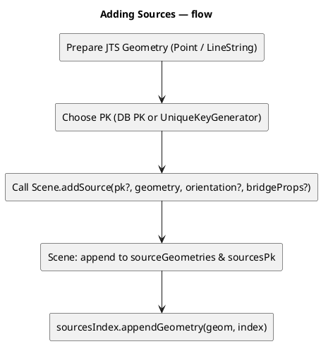

### Adding Receivers

Receivers are added using the `Scene.addReceiver(...)` family of methods to register receiver coordinates.
Note that `Scene` does not include an internal spatial index for receivers.

1. Prepare a JTS `Coordinate` for each receiver (include z when meaningful).
2. If you have a database PK use `addReceiver(pk, coordinate)`; otherwise use the convenience overloads `addReceiver(Coordinate...)` or `addReceiver(coordinate)`.
3. When mixing pk and varargs overloads, ensure your code keeps `receivers` and `receiversPk` aligned if index-based pairing is required.

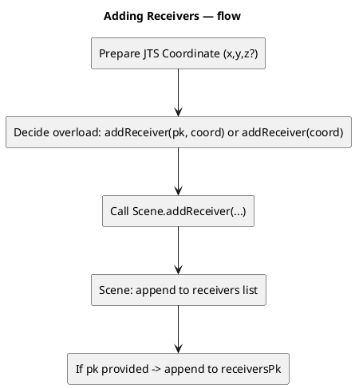

## Finding Paths

The `PathFinder` class orchestrates per-receiver propagation: it schedules parallel receiver tasks, collects candidate sources, retrieves CutProfiles, and delegates direct-path, reflection and diffraction computations to specialized components while emitting per-receiver results via a `CutPlaneVisitor`.


Figure: Example of the Sound ray in 3D view.


Figure: Example of the Sound ray in horizontal view.


Figure: Example of the Sound ray in vertical view (profile in 2D).

### PathFinder class

The following classes form the core runtime pieces that `PathFinder` (the high-level orchestrator) composes to compute propagation results. The notes below emphasize practical responsibilities and invariants that callers commonly need to know.

- `PathExecutionManager` — batching, scheduling and worker lifecycle: builds receiver work queues (per-receiver or batched), creates worker tasks, manages the thread pool and handles cancellation via the provided `ProgressVisitor`. It also aggregates per-worker metrics. Because scheduling and batching are isolated here, you can tune parallelism independently from per-receiver logic.

- `CutPlaneVisitorFactory` / `CutPlaneVisitor` — result creation and reporting: callers pass a factory to `PathFinder.run(...)` which creates a `CutPlaneVisitor` per receiver/task. The visitor receives found rays/cut-planes and is responsible for collecting, aggregating, or persisting results. This lets callers trade memory for streaming (in-memory aggregation vs write-as-you-go persistence).

- `ReceiverProcessor` — per-receiver orchestration: implements the end-to-end per-receiver flow (invoke `SourceCollector`, request profiles from `ProfileRetriever` / `ProfileBuilder`, perform fast direct-path checks, and call reflection/diffraction builders when needed). It also collects per-receiver diagnostics and emits to the `CutPlaneVisitor`.

- `MirrorReceiversCompute` — mirror bookkeeping for reflections: helper used by reflection builders to manage mirror receivers and to avoid duplicate mirror paths. It encapsulates mirror indexing and efficient lookup for mirror-based searches.

- `SourceCollector` — source sampling and `SourcePointInfo` creation: queries the `Scene` source spatial index (default `QueryRTree`) to locate candidate source geometries, subdivides long line-sources into sample points and constructs `SourcePointInfo` instances for each candidate. `SourcePointInfo` carries the sample coordinate plus lightweight metadata (origin source PK, orientation/directivity, optional bridge/virtual-source properties) used by downstream processing.

- `LineStringSplitter` / split utilities — stable sampling of line sources: used by `SourceCollector` (or `ProfileUtils.splitSegment`) to break long segments into smaller sub-segments. This keeps spatial-index query envelopes small and stable, and ensures intermediate Z values are linearly interpolated (the implementation's default `maxLineLength` is 60 meters unless overridden).

- `ProfilerThread` / profiler utilities — runtime metrics: optional background thread that aggregates timing and counters from worker tasks; useful for performance tuning and for assertions in tests.

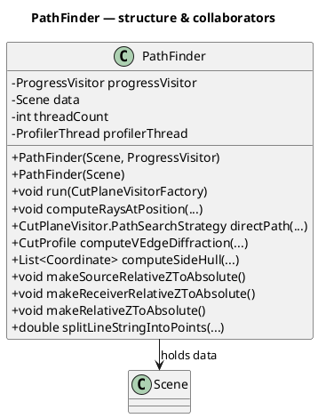

### Processing flow

1. `PathExecutionManager` builds a work queue (individual receivers or batches) and runs worker tasks in parallel using a thread pool.
2. For each receiver a `ReceiverProcessor` is created to run the per-receiver pipeline.
3. `SourceCollector` queries the `Scene` source index to discover candidate source samples. For linear sources it splits long segments into sample points (Z values on split points are linearly interpolated) and builds `SourcePointInfo` entries.
4. For each candidate `SourcePointInfo`, the `ReceiverProcessor` obtains a `CutProfile` via `ProfileRetriever` / `ProfileBuilder` (the `ProfileBuilder` must have been finalized with `finishFeeding()` so the DEM/TIN and processed-wall STRtrees are available).
5. `DirectAndDiffractionEvaluator` performs a fast direct-visibility check and prepares diffraction candidate data when appropriate. If required, `ReflectionPathBuilder` and `DiffractionPathBuilder` are invoked to search for reflected and diffracted paths.
6. Discovered ray/cut-plane contributions are reported to the caller-provided `CutPlaneVisitor` implementation. If enabled, `ProfilerThread` gathers timing and counters to help analyze hotspots.

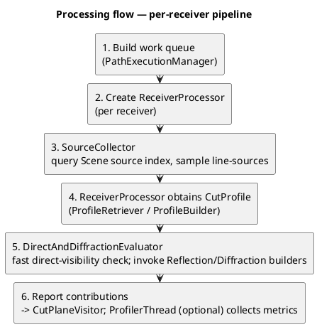

## Calculating Profiles

A vertical profile between a source and a receiver is represented by the `CutProfile` class which contains an ordered list of `CutPoint` instances (source → intermediate cut-points → receiver) with associated ground elevations, ground absorption coefficients and obstacle metadata (building/wall/bridge references and processed-wall indices).
The entry point of the profile construction pipeline is the `ProfileRetriever.getProfile(...)` method which queries the topography and processed-wall indexes to build the profile.

### Processing pipeline

1. The straight line from source to receiver is split into shorter segments (controlled by `maxLineLength`) to keep spatial-index query envelopes small and stable. The splitting routine linearly interpolates Z coordinates for intermediate split points so elevation queries work correctly on each sub-segment.
2. Query the `TopographyService` / TIN to collect topographic cut points and their ground elevations along the line.
3. Query the `ProcessedWallService` spatial index to collect processed-wall cut points along the line. These cut points represent intersections with building/bridge vertical faces used for reflection and diffraction. The process may terminate early if a fully blocking obstacle is found and no further cut points are needed.
4. Propagate ground absorption values along the profile, filling unknown coefficients and interpolating missing ground Z values when needed. The ground coefficient propagation starts from the source ground coefficient. Unknown ground coefficients on intermediate cut-points are filled using the last-known coefficient; when a `CutPointGroundEffect` is encountered the current coefficient is updated and used for following points.

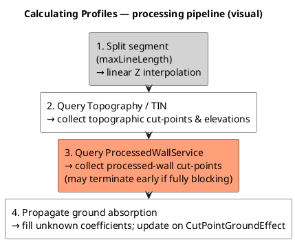

### What a CutProfile is used for

A computed `CutProfile` is the primary data structure that downstream propagation components consume. It is more than a list of 3D intersection points — it carries obstacle metadata, ground absorption coefficients, bridge/wall indices and small helpers that make conversion to the geometric inputs required by reflection/diffraction algorithms straightforward. The typical consumers and uses are:

2D Geometry for Acoustic Solvers: `CutProfile.generateCutPointCoordinates2D()` reprojects the profile cut-points into a local 2D coordinate system (the first point is mapped to x=0). This 2D sequence is used by reflection-search and diffraction geometry builders which expect planar coordinates for constructing reflection planes and diffraction edge tests.

### Profile with bridge

Bridges require a few special handling steps in the profile-construction pipelines.
The profile is modified using `BridgeService.setEffectiveBridgeCutPoint(...)`


Figure: Example of the Sound ray from the bridge in vertical view. The upper, middle and lower panels show the sound ray from an actual source on the bridge deck, from an imaginary source under the bridge deck, and from a mirror source imaginary located over the bridge deck.


#### Propagation scenarios

Bridge-related propagation scenarios are classified by `BridgeService.checkPropagationType(...)` as follows:

- `NOT_RELATED_TO_BRIDGE`: the source is not associated with any bridge; profile logic treats intersections as ordinary processed-wall facets.
- `BRIDGE_TO_OUTSIDE_RECEIVER`: propagation originates from the bridge (for example bridge-related virtual sources) and the receiver is outside the bridge footprint. The algorithm may prefer bridge-edge diffraction or treat the deck as an elevated source region.
- `ACTUAL_SOURCE_TO_UPPER_RECEIVER` / `ACTUAL_SOURCE_TO_LOWER_RECEIVER`: an actual (physical) source sits on the bridge deck and the receiver lies above or below deck level respectively. These cases influence how intersection heights are interpreted, whether the deck blocks or allows line-of-sight, and how the first-bridge cut-point is chosen.
- `IMAGINARY_SOURCE_TO_UPPER_RECEIVER` / `IMAGINARY_SOURCE_TO_LOWER_RECEIVER`: an imaginary (virtual) source placed under the bridge deck is used to model path components that originate under the deck; receiver position above/below the deck determines which mirror/relax rules apply. Mirror-relax or mirror-source bookkeeping may be required for these scenarios.
- `LOW_OUTSIDE_SOURCE_TO_RECEIVER` / `HIGH_OUTSIDE_SOURCE_TO_RECEIVER`: auxiliary classifications for sources outside the bridge footprint but at low or high elevations relative to the deck; these help the bridge handlers decide whether to consider deck-edge diffraction or to treat the deck as a blocking feature.

#### First cut-point insertion

In the cases of `ACTUAL_SOURCE_TO_LOWER_RECEIVER` and `IMAGINARY_SOURCE_TO_UPPER_RECEIVER`, the bridge deck may be treated as a blocking feature that prevents direct visibility and diffraction by the deck edges should be considered.
`BridgeService.calculateFirstBridgeCutpoint(...)` inserts a "first bridge cut point" early in the cut-point stream when needed to ensure correct ordering and stable intersection handling.

#### Bridge deck just below the profile line

At computing profiles, we should also clarify the highest bridge deck below the profile line for determining the elevation reference for diffraction calculations.

#### Downward edge diffraction for imaginary sources

The bridge that created an imaginary source often has edges that can cause downward diffraction paths to the receiver. The profile construction logic must ensure that these edges are included in the cut profile.

## Tests, Examples & snippets

### PathFinderTest

The repository contains an integration-style test class `PathFinderTest` that exercises the full stack and is the canonical verification harness for the three areas discussed above:

- Setting Geometry Propagation Scene: tests build a `ProfileBuilder`, add topography/buildings/walls/ground effects and call `finishFeeding()` to finalize indexes and processed walls.
- Finding Paths: tests construct a `Scene` (typically via `ProfileBuilderDecorator`), register sources and receivers, create a `PathFinder`, and call `run(...)` which invokes the path-finding pipeline (source collection, profile retrieval, direct/reflection/diffraction searches).
- Calculating Profiles: inside the per-receiver processing the test flow triggers profile retrieval (via `ProfileRetriever` / `ProfileBuilder.getProfile(...)`) to build `CutProfile` objects used by propagation algorithms.

Representative test cases (for example `TC01`, `TC02`, `TC04` in `PathFinderTest`) follow the pattern: prepare builder → `finishFeeding()` → build `Scene` with sources/receivers → run `PathFinder` → collect results via a `DefaultCutPlaneVisitor` and assert expected `CutProfile` contents. Use this test class as a starting point when debugging end-to-end behavior or when adding new features that touch the preprocessing, profile retrieval, or propagation logic.

### Examples

Below are two small canonical Java examples you can copy into unit tests or scripts. Prefer the first (decorator) snippet for tests and quick experimentation; use the second snippet for bulk/DB-loading workflows where you manage PKs and large numbers of sources.

1. Unit-test / quick example (recommended)

```java
// Prepare builder, populate obstacles and finalize
ProfileBuilder pb = new ProfileBuilder();
// ... add topography / buildings / walls / ground effects ...
pb.finishFeeding();

// Use the decorator for concise test setup
ProfileBuilderDecorator d = new ProfileBuilderDecorator(pb)
  .addSource(10.0, 20.0, 2.5)   // adds a point source
  .addReceiver(15.0, 25.0, 1.8) // adds a receiver
  .setGs(0.5)                   // optional ground coefficient
  .vEdgeDiff(true)
  .hEdgeDiff(true);

Scene scene = d.build();

// Obtain a CutProfile between the (first) source and the first receiver
SourcePointInfo src = scene.getSourceQuery().getSourcePointInfo(0); // helper: get the 1st source sample
Coordinate recv = scene.getReceivers().get(0);
CutProfile profile = pb.getProfile(src.getCoord(), recv, scene.getDefaultGroundAttenuation(), false);

// Inspect or assert on profile contents in tests
assert profile != null;
```

1. Bulk / DB-backed loading example

```java
// Build and finalize the ProfileBuilder once
ProfileBuilder pb = new ProfileBuilder();
// ... load topography/buildings/walls/ground from DB or files ...
pb.finishFeeding();

// Create a Scene backed by the finalized builder
Scene scene = new Scene(pb);

// Iterate DB rows and add sources with stable PKs
for(DBRow row : rows) {
  long dbPk = row.getId();
  Geometry geom = row.toGeometry(); // JTS geometry from DB
  scene.addSource(dbPk, geom);
}

// Add receivers (optionally with PKs)
scene.addReceiver(1001L, new Coordinate(12.3, 45.6, 1.7));

// For each receiver, collect candidate source points and compute profiles
for(Coordinate recv : scene.getReceivers()) {
  Collection<SourcePointInfo> candidates = scene.getSourceQuery().query(recv, scene.getMaxSrcDist());
  for(SourcePointInfo s : candidates) {
    CutProfile p = pb.getProfile(s.getCoord(), recv, scene.getDefaultGroundAttenuation(), false);
    // process p (PathFinder, attenuation, tests...)
  }
}
```
