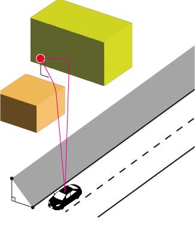
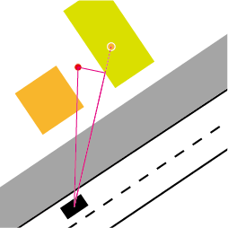
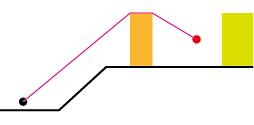
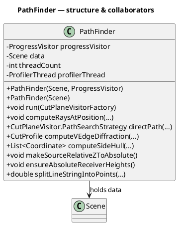
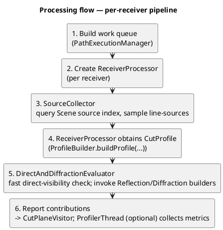
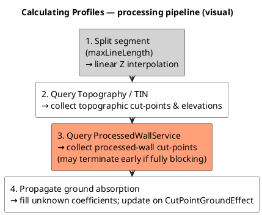
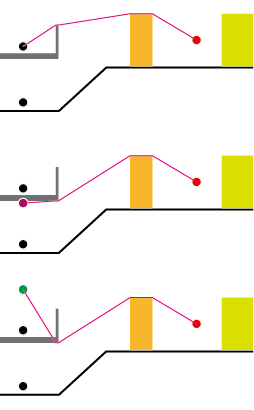
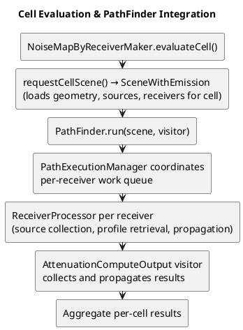

# NoiseModelling-PathFinder algorithms

- [NoiseModelling-PathFinder algorithms](#noisemodelling-pathfinder-algorithms)
  - [Concepts \& Overview](#concepts--overview)
  - [ProfileBuilder (Details)](#profilebuilder-details)
  - [Finding Paths](#finding-paths)
    - [PathFinder class](#pathfinder-class)
    - [Processing flow](#processing-flow)
  - [Calculating Profiles](#calculating-profiles)
    - [Processing pipeline](#processing-pipeline)
    - [What a CutProfile is used for](#what-a-cutprofile-is-used-for)
    - [Profile with bridge](#profile-with-bridge)
      - [Propagation scenarios](#propagation-scenarios)
      - [First cut-point insertion](#first-cut-point-insertion)
      - [Bridge deck just below the profile line](#bridge-deck-just-below-the-profile-line)
      - [Downward edge diffraction for imaginary sources](#downward-edge-diffraction-for-imaginary-sources)
  - [Cell Evaluation Integration](#cell-evaluation-integration)
    - [Cell Evaluation Flow](#cell-evaluation-flow)
    - [Integration Responsibilities](#integration-responsibilities)
  - [Tests, Examples \& snippets](#tests-examples--snippets)
    - [PathFinderTest](#pathfindertest)
    - [Algorithm-to-test mapping](#algorithm-to-test-mapping)
    - [File-based reference comparisons (important)](#file-based-reference-comparisons-important)

## Concepts & Overview

The goal of the PathFinder module is to provide geometry-aware sound propagation algorithms suitable for outdoor urban environments. The algorithms compute direct, reflected, diffracted and ground-affected sound propagation contributions from many sound sources to many receivers, using detailed 3D geometry (buildings, walls, bridges, topography) and frequency-dependent absorption parameters.

To achieve this, the module provides a set of domain classes and services to ingest raw geometry, preprocess it into spatial indexes and processed facets, then at runtime compute vertical profiles between sources and receivers. The profiles are used to evaluate visibility, obstruction, diffraction and reflection possibilities, and to compute per-frequency attenuation contributions.

The output of this module is the `CutProfile` data structure which contains an ordered list of cut points (intersections with topography and obstacle facets) along the source-receiver line, with associated ground elevations, ground absorption coefficients and obstacle metadata. The `CutProfile` is consumed by the NoiseModelling-Propagation module.

For `Scene` responsibilities and API details, see [Docs-dev/scene.md](scene.md).

## ProfileBuilder (Details)

The detailed `ProfileBuilder` data structures, feeding steps, and preprocessing pipeline are documented in [Docs-dev/scene.md](scene.md). This file focuses on the path-finding and profile usage stages.

## Finding Paths

The `PathFinder` class orchestrates per-receiver propagation: it schedules parallel receiver tasks, collects candidate sources, retrieves CutProfiles, and delegates direct-path, reflection and diffraction computations to specialized components while emitting per-receiver results via a `CutPlaneVisitor`.

Figure: Example of the Sound ray in 3D view.

Figure: Example of the Sound ray in horizontal view.

Figure: Example of the Sound ray in vertical view (profile in 2D).

### PathFinder class

The following classes form the core runtime pieces that `PathFinder` (the high-level orchestrator) composes to compute propagation results. The notes below emphasize practical responsibilities and invariants that callers commonly need to know.

- `PathExecutionManager` — batching, scheduling and worker lifecycle: builds receiver work queues (per-receiver or batched), creates worker tasks, manages the thread pool and handles cancellation via the provided `ProgressVisitor`. It also aggregates per-worker metrics. Because scheduling and batching are isolated here, you can tune parallelism independently from per-receiver logic.

- `CutPlaneVisitorFactory` / `CutPlaneVisitor` — result creation and reporting: callers pass a factory to `PathFinder.run(...)` which creates a `CutPlaneVisitor` per receiver/task. The visitor receives found rays/cut-planes and is responsible for collecting, aggregating, or persisting results. This lets callers trade memory for streaming (in-memory aggregation vs write-as-you-go persistence).

- `ReceiverProcessor` — per-receiver orchestration: implements the end-to-end per-receiver flow (invoke `SourceCollector`, request profiles from `ProfileBuilder`, perform fast direct-path checks, and call reflection/diffraction builders when needed). It also collects per-receiver diagnostics and emits to the `CutPlaneVisitor`.

- `MirrorReceiversCompute` — mirror bookkeeping for reflections: helper used by reflection builders to manage mirror receivers and to avoid duplicate mirror paths. It encapsulates mirror indexing and efficient lookup for mirror-based searches.

- `SourceCollector` — source sampling and `SourcePointInfo` creation: queries the `Scene` source spatial index (default `QueryRTree`) to locate candidate source geometries, subdivides long line-sources into sample points and constructs `SourcePointInfo` instances for each candidate. `SourcePointInfo` carries the sample coordinate plus lightweight metadata (origin source PK, orientation/directivity, optional bridge/virtual-source properties) used by downstream processing.

- `LineStringSplitter` / split utilities — stable sampling of line sources: used by `SourceCollector` (and internally by `ProfileBuilder`) to break long segments into smaller sub-segments. This keeps spatial-index query envelopes small and stable, and ensures intermediate Z values are linearly interpolated (the implementation's default `maxLineLength` is 60 meters unless overridden).

- `ProfilerThread` / profiler utilities — runtime metrics: optional background thread that aggregates timing and counters from worker tasks; useful for performance tuning and for assertions in tests.

### Processing flow

1. `PathExecutionManager` builds a work queue (individual receivers or batches) and runs worker tasks in parallel using a thread pool.
2. For each receiver a `ReceiverProcessor` is created to run the per-receiver pipeline.
3. `SourceCollector` queries the `Scene` source index to discover candidate source samples. For linear sources it splits long segments into sample points (Z values on split points are linearly interpolated) and builds `SourcePointInfo` entries.
4. For each candidate `SourcePointInfo`, the `ReceiverProcessor` obtains a `CutProfile` via `ProfileBuilder.buildProfile(...)` (the `ProfileBuilder` must have been finalized with `finishFeeding()` so the DEM/TIN and processed-wall STRtrees are available).
5. `DirectAndDiffractionEvaluator` performs a fast direct-visibility check and prepares diffraction candidate data when appropriate. If required, `ReflectionPathBuilder` and `DiffractionPathBuilder` are invoked to search for reflected and diffracted paths.
6. Discovered ray/cut-plane contributions are reported to the caller-provided `CutPlaneVisitor` implementation. If enabled, `ProfilerThread` gathers timing and counters to help analyze hotspots.

## Calculating Profiles

A vertical profile between a source and a receiver is represented by the `CutProfile` class which contains an ordered list of `CutPoint` instances (source → intermediate cut-points → receiver) with associated ground elevations, ground absorption coefficients and obstacle metadata (building/wall/bridge references and processed-wall indices).
The entry point of the profile construction pipeline is `ProfileBuilder.buildProfile(...)`, which queries topography and processed-wall indexes to build the profile.

### Processing pipeline

1. The straight line from source to receiver is split into shorter segments (controlled by `maxLineLength`) to keep spatial-index query envelopes small and stable. The splitting routine linearly interpolates Z coordinates for intermediate split points so elevation queries work correctly on each sub-segment.
2. Query the `TopographyService` / TIN to collect topographic cut points and their ground elevations along the line.
3. Query the `ProcessedWallService` spatial index to collect processed-wall cut points along the line. These cut points represent intersections with building/bridge vertical faces used for reflection and diffraction. The process may terminate early if a fully blocking obstacle is found and no further cut points are needed.
4. Propagate ground absorption values along the profile, filling unknown coefficients and interpolating missing ground Z values when needed. The ground coefficient propagation starts from the source ground coefficient. Unknown ground coefficients on intermediate cut-points are filled using the last-known coefficient; when a `CutPointGroundEffect` is encountered the current coefficient is updated and used for following points.

### What a CutProfile is used for

A computed `CutProfile` is the primary data structure that downstream propagation components consume. It is more than a list of 3D intersection points — it carries obstacle metadata, ground absorption coefficients, bridge/wall indices and small helpers that make conversion to the geometric inputs required by reflection/diffraction algorithms straightforward. The typical consumers and uses are:

2D Geometry for Acoustic Solvers: `CutProfile.generateCutPointCoordinates2D()` reprojects the profile cut-points into a local 2D coordinate system (the first point is mapped to x=0). This 2D sequence is used by reflection-search and diffraction geometry builders which expect planar coordinates for constructing reflection planes and diffraction edge tests.

### Profile with bridge

Bridges require a few special handling steps in the profile-construction pipelines.
The profile is modified using `BridgeService.setEffectiveBridgeCutPoint(...)`

Figure: Example of the Sound ray from the bridge in vertical view. The upper, middle and lower panels show the sound ray from an actual source on the bridge deck, from an imaginary source under the bridge deck, and from a mirror source imaginary located over the bridge deck.

#### Propagation scenarios

Bridge-related propagation scenarios are classified by `BridgeService.checkPropagationType(...)` as follows:

- `NOT_RELATED_TO_BRIDGE`: the source is not associated with any bridge; profile logic treats intersections as ordinary processed-wall facets.
- `BRIDGE_TO_OUTSIDE_RECEIVER`: propagation originates from the bridge (for example bridge-related virtual sources) and the receiver is outside the bridge footprint. The algorithm may prefer bridge-edge diffraction or treat the deck as an elevated source region.
- `ACTUAL_SOURCE_TO_UPPER_RECEIVER` / `ACTUAL_SOURCE_TO_LOWER_RECEIVER`: an actual (physical) source sits on the bridge deck and the receiver lies above or below deck level respectively. These cases influence how intersection heights are interpreted, whether the deck blocks or allows line-of-sight, and how the first-bridge cut-point is chosen.
- `IMAGINARY_SOURCE_TO_UPPER_RECEIVER` / `IMAGINARY_SOURCE_TO_LOWER_RECEIVER`: an imaginary (virtual) source placed under the bridge deck is used to model path components that originate under the deck; receiver position above/below the deck determines which mirror/relax rules apply. Mirror-relax or mirror-source bookkeeping may be required for these scenarios.
- `LOW_OUTSIDE_SOURCE_TO_RECEIVER` / `HIGH_OUTSIDE_SOURCE_TO_RECEIVER`: auxiliary classifications for sources outside the bridge footprint but at low or high elevations relative to the deck; these help the bridge handlers decide whether to consider deck-edge diffraction or to treat the deck as a blocking feature.

#### First cut-point insertion

In the cases of `ACTUAL_SOURCE_TO_LOWER_RECEIVER` and `IMAGINARY_SOURCE_TO_UPPER_RECEIVER`, the bridge deck may be treated as a blocking feature that prevents direct visibility and diffraction by the deck edges should be considered.
`BridgeService.calculateFirstBridgeCutpoint(...)` inserts a "first bridge cut point" early in the cut-point stream when needed to ensure correct ordering and stable intersection handling.

#### Bridge deck just below the profile line

At computing profiles, we should also clarify the highest bridge deck below the profile line for determining the elevation reference for diffraction calculations.

#### Downward edge diffraction for imaginary sources

The bridge that created an imaginary source often has edges that can cause downward diffraction paths to the receiver. The profile construction logic must ensure that these edges are included in the cut profile.

## Cell Evaluation Integration

When `NoiseMapByReceiverMaker` processes a computation cell, it invokes `PathFinder` within the `evaluateCell()` method to compute propagation paths for all source-receiver pairs in that cell. This integration coordinates the complete path-finding and attenuation pipeline within the cell's spatial context.

### Cell Evaluation Flow

### Integration Responsibilities

- **evaluateCell() Coordination**: Creates a `SceneWithEmission` by invoking `requestCellScene()`, then instantiates `PathFinder` with the scene and a result visitor
- **Propagation Computation**: `PathFinder.run()` orchestrates the complete path-finding pipeline for all receivers in the cell, invoking the threading and per-receiver processing components described in [Finding Paths](pathfinder_algorithms.md#finding-paths)
- **Result Collection**: Results from path-finding (per-receiver ray/cut-plane contributions) are collected by the visitor (typically `AttenuationComputeOutput`) which computes acoustic attenuation and aggregates per-cell noise levels
- **Memory Efficiency**: Cell-based decomposition ensures only relevant sources, receivers and geometry are held in memory for each cell

For high-level context and NoiseMapByReceiverMaker responsibilities, see [Path Finding Integration in NoiseMapByReceiverMaker](../Docs-dev/noisemapbyreceivermaker_algorithms.md#path-finding-integration).

## Tests, Examples & snippets

### PathFinderTest

The repository contains an integration-style test class `PathFinderTest` that exercises the full stack and is the canonical verification harness for the three areas discussed above:

- Setting Geometry Propagation Scene: tests build a `ProfileBuilder`, add topography/buildings/walls/ground effects and call `finishFeeding()` to finalize indexes and processed walls.
- Finding Paths: tests construct a `Scene` (typically via `SceneBuilder`), register sources and receivers, create a `PathFinder`, and call `run(...)` which invokes the path-finding pipeline (source collection, profile retrieval, direct/reflection/diffraction searches).
- Calculating Profiles: inside the per-receiver processing the test flow triggers profile retrieval via `ProfileBuilder.buildProfile(...)` to build `CutProfile` objects used by propagation algorithms.

Representative test cases (for example `TC01`, `TC02`, `TC04` in `PathFinderTest`) follow the pattern: prepare builder → `finishFeeding()` → build `Scene` with sources/receivers → run `PathFinder` → collect results via a `DefaultCutPlaneVisitor` and assert expected `CutProfile` contents. Use this test class as a starting point when debugging end-to-end behavior or when adding new features that touch the preprocessing, profile retrieval, or propagation logic.

### Algorithm-to-test mapping

This section maps the major pathfinder algorithms/components to their primary test classes.

- End-to-end path search orchestration (`PathFinder.run`, direct+reflection+diffraction integration)
  - `PathFinderTest`
  - `PathFinderBridgeTest`
- Direct path strategy and visitor signaling (`DirectAndDiffractionEvaluator.computeDirectPath`)
  - `DirectAndDiffractionEvaluatorTest`
- Vertical-edge diffraction and side-hull computation (`DiffractionPathBuilder.computeVEdgeDiffraction`, `computeSideHull`)
  - `DiffractionPathBuilderTest`
- Reflection path generation and reflection cut-point attribute injection (`ReflectionPathBuilder`)
  - `ReflectionPathBuilderTest`
  - `TestWallReflection`
- Source candidate collection and source sampling (`SourceCollector`)
  - `SourceCollectorTest`
- Per-receiver processing orchestration (`ReceiverProcessor`)
  - `ReceiverProcessorTest`
- Parallel scheduling and task splitting (`PathExecutionManager`)
  - `PathExecutionManagerTest`
- Scene/profile request integration (`Scene`, `SceneBuilder`, profile retrieval API)
  - `SceneTest`
  - `ProfileBuilderTest`
- Profile construction internals (topography, walls, cut points, ground effects)
  - `TopographyServiceTest`
  - `TopographyServiceTinTest`
  - `TopographyServiceAdvancedTest`
  - `ProcessedWallServiceTest`
  - `WallServiceTest`
  - `BuildingServiceTest`
  - `CutProfileTest`
  - `CutPointTest`
  - `CutPointSourceTest`
  - `CutPointReceiverTest`
- Bridge-specific profile/path logic (`BridgeService`, bridge geometry/query helpers)
  - `BridgeServiceTest`
  - `BridgeBehaviorTest`
  - `BridgeGeometryBuilderTest`
  - `BridgePointManagerTest`
  - `BridgePointTest`
  - `BridgeQueryHelperTest`
  - `BridgeTriangulationTest`
  - `PathFinderBridgeTest`

### File-based reference comparisons (important)

Several integration tests assert algorithm identity by comparing computed `CutProfile` objects against JSON reference files. This is the most important regression net for geometry-sensitive behavior.

- Main non-bridge references
  - Test class: `PathFinderTest`
  - Loader/comparator: `assertCutProfile(String utName, CutProfile cutProfile)` → `assertCutProfile(InputStream expected, CutProfile got)`
  - Resource lookup: `PathFinder.class.getResourceAsStream("test_cases/" + testCaseFileName)`
  - Reference files: `noisemodelling-pathfinder/src/main/resources/org/noise_planet/noisemodelling/pathfinder/test_cases/*.json` (e.g. `TC01_Direct.json`, `TC08_Left.json`, `TC16_Reflection.json`, ...)

- Bridge references
  - Test class: `PathFinderBridgeTest`
  - Resource lookup/comparison is the same JSON mechanism as `PathFinderTest`
  - Reference names used by tests: `TBC01`..`TBC10`, `TBC20`, `TBC21`
  - Important behavior: `PathFinderBridgeTest` currently has `overwriteTestCase = true`, so it can rewrite JSON files in the runtime classpath `test_cases` directory during test execution.

- Local profile regression fixture in `CutProfileTest`
  - Test class: `CutProfileTest` (`TBCCoordinates2D`)
  - Loader: `loadCutProfile(String utName)` with explicit null guard (`Objects.requireNonNull`) before JSON deserialization
  - Reference file: `noisemodelling-pathfinder/src/test/resources/org/noise_planet/noisemodelling/pathfinder/test_cases/TBC06.json`
  - Rationale: keeping `TBC06.json` under `src/test/resources` makes this test independent from execution order and from side-effects of bridge integration tests.

In all file-based comparisons above, assertions validate not only point count and point class but also key geometric/acoustic fields (coordinate tolerance, `zGround`, ground coefficient, and reflection/wall attributes where relevant).
