# NoiseModelling-Propagation algorithms

- [NoiseModelling-Propagation algorithms](#noisemodelling-propagation-algorithms)
  - [Concepts \& Overview — CnossosPathBuilder](#concepts--overview--cnossospathbuilder)
  - [AcousticPathConfiguration](#acousticpathconfiguration)
  - [Compute diffraction candidate pivot points](#compute-diffraction-candidate-pivot-points)
  - [Validate reflection points and update the configuration](#validate-reflection-points-and-update-the-configuration)
  - [Creating Acoustic Path](#creating-acoustic-path)
    - [Path class](#path-class)
    - [SegmentPath class](#segmentpath-class)
    - [Create Path](#create-path)
    - [Segment Processing Details](#segment-processing-details)
  - [Calculate Parameters](#calculate-parameters)
    - [CnossosPath class](#cnossospath-class)
    - [Calculate parameters](#calculate-parameters-1)
  - [SourcePointInfo-SourceEmission Linkage During Propagation](#sourcepointinfo-sourceemission-linkage-during-propagation)

## Concepts & Overview — CnossosPathBuilder

The propagation algorithms are characterized by the `CnossosPathBuilder` class, which orchestrates the conversion of a vertical `CutProfile` into a fully assembled acoustic path (`CnossosPath`) suitable for CNOSSOS-style propagation calculations.
The process involves several key steps:

1. Construct an `AcousticPathConfiguration` from the `CutProfile` and parameters.
2. Compute diffraction candidate pivot points (`DiffractionPointCalculator`).
3. Validate and possibly adjust reflection points (`ReflectionPointValidator`).
4. Update the configuration with validated diffraction/reflection points.
5. Build geometry segments and points with `AcousticPathBuilder`.
6. Convert and post-process into a `CnossosPath` via `CnossosPathProcessor`.

## AcousticPathConfiguration

`AcousticPathConfiguration` is a parameter object that consolidates all geometric and processing data required to construct an acoustic path (`Path`).
It centralizes data produced from a vertical `CutProfile` and additional processing inputs so downstream builders and validators receive a single, self-contained configuration object rather than many primitive parameters.

An instance holds the `CutProfile` and associated data such as the 2D reprojected coordinates (`CutPointCoordinates2D`), which are initialized with a `CutProfile` instance.
It also includes horizontal diffraction pivot candidates (`horizontalEdgePivotPoints`), while it can be set after finishing the following steps

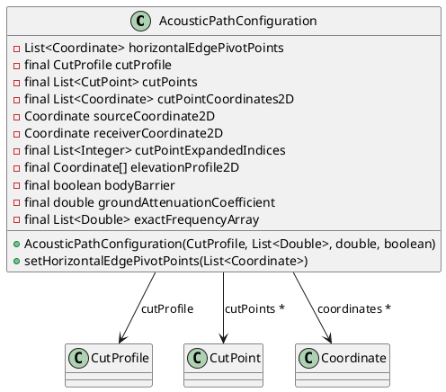

## Compute diffraction candidate pivot points

Pivot points depending on horizontal edges are computed by the `PivotPointCalculator.computeHorizontalEdgePivotPoints` method with the following steps:

1. Collect candidate coordinates (source, receiver and intermediate cut-points) that are meaningful for horizontal-edge diffraction. From the intermediate `CutPoint` list include only points that represent topographic crests (`CutPointTopography`) or wall tops (`CutPointWall`).

2. If the collected candidate list contains fewer than three points, the routine returns the list unchanged (two-point case is degenerate for convex-hull reduction).

3. Apply ConvexHull Processing

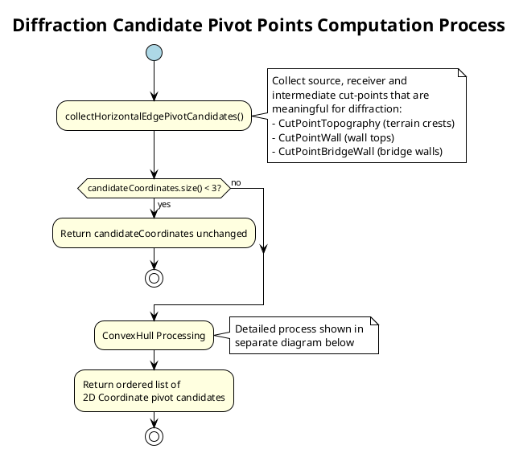

The ConvexHull Processing consists of the following steps:

1. Use JTS `ConvexHull` on the candidate coordinates to obtain a hull geometry(`extractPivotPointsUsingConvexHull()`), locate the positions of the profile's first and last transformed points inside the hull coordinate sequence, and extract the sub-array of hull coordinates that lies between them (inclusive).
2. Check for interrupting downward edges: examines if the source is bridge-related, permits downward-edge diffraction, collects any downward bridge edge, and verifies if its Z-value lies below the ConvexHull line.
3. If an interrupting downward edge is found, the path is split at that edge and Core ConvexHull Operations are recursively applied to both the segment before and after the downward edge.

This process computes the upper chain of hull coordinates and returns an ordered list of 2D `Coordinate` instances representing the horizontal pivot candidates reduced by the hull/filters.

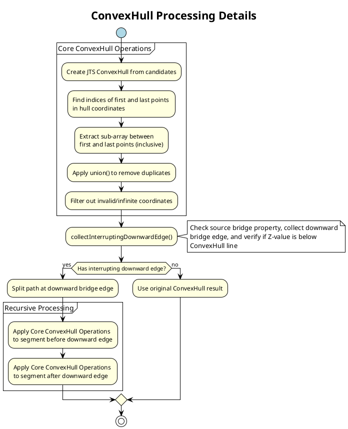

## Validate reflection points and update the configuration

The `ReflectionPointValidator.validateHorizontalEdgePivotPoints` method checks and adjusts the horizontal pivot candidates to ensure they can produce valid reflections on wall facets. This step is crucial to ensure that the proposed reflection points are geometrically feasible given the environment's walls and constraints.

The process is as follows:

1. If the path is direct or trivial the routine returns true immediately — no reflection validation is required.
2. If not, the algorithm iterates over consecutive acoustic path segments (source→first pivot, pivot→pivot, ..., last pivot→receiver). For each segment check the validity using the `validateSegmentReflectionPoints` method.

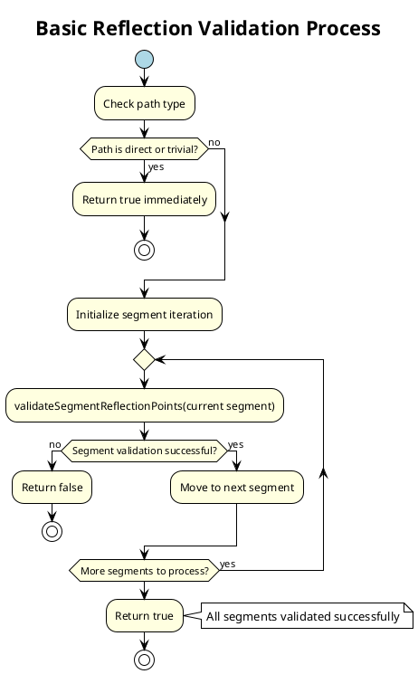

The `validateSegmentReflectionPoints` method performs the following for each segment:

1. Locates the starting and ending indices in the `cutPointCoordinates2D` array that correspond to the segment endpoints.
2. Builds an `LineSegment` representing the straight acoustic ray between those endpoints in the 2D/local-frame.
3. Iterates over intermediate cut-points that lie between these indices (these are potential reflection locations) and validates each candidate using the `validateSingleReflectionPoint` method.

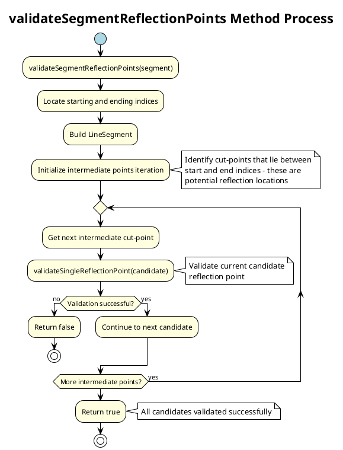

The `validateSingleReflectionPoint` method performs the following:

1. Project the candidate onto the acoustic segment and compute a closest-point position (interpolated position along the segment).
2. Query the wall geometry to obtain the wall height at the candidate location (the implementation uses vertex interpolation along the wall edge).
3. Compare the interpolated reflection height with the wall height (with a small EPSILON tolerance). If the reflection height is below or equal to the wall height the reflection is feasible; the algorithm updates the reflection point's Z (and the corresponding `cutPointCoordinates2D` Y value) to the interpolated value.
4. If the reflection point lies above the wall height the candidate is invalid and the routine aborts, returning false for the segment.

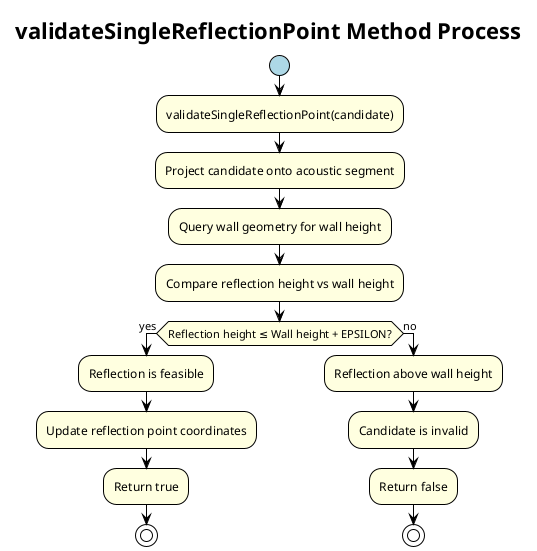

If all segments validate successfully the method returns true; if any segment fails validation the method returns false. The method mutates `CutPoint` objects and the `cutPointCoordinates2D` height values in-place for the repaired/accepted reflection points.

## Creating Acoustic Path

### Path class

The `Path` class represents an assembled acoustic propagation path derived from a vertical `CutProfile`. It holds the sequence of path points (source, receiver, diffraction and reflection points), the path segments between them, and helpers to compute CNOSSOS-specific geometric quantities used by the propagation model.

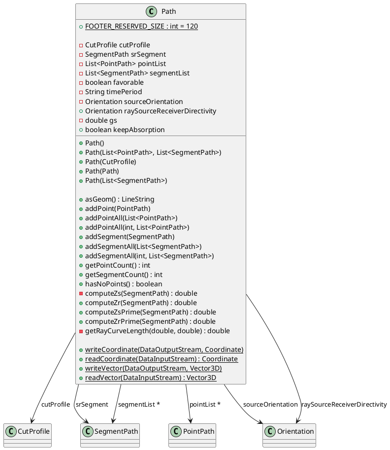

The key fields of the `Path` class include:

- `cutProfile` — the vertical `CutProfile` containing the ordered `CutPoint` list and sampled elevations used to build 3D geometry.
- `srSegment` — the primary source–receiver `SegmentPath` containing aggregated metrics for the main source–receiver segment (used in CNOSSOS computations).
- `pointList` — ordered list of `PointPath` entries (source, receiver, and any diffraction/reflection points). Each `PointPath` stores its horizontal position along the profile and the effective height (Z) used for acoustic formulas.
- `segmentList` — ordered list of `SegmentPath` objects representing acoustic segments between consecutive `PointPath`s; each segment carries length, azimuth, mean ground plane and helper values.
- `favorable` — boolean flag indicating whether the path represents "favorable" meteorological conditions (affects later processing but not geometry construction).
- `timePeriod` — optional string describing the time period (for example "day", "evening", "night") used by aggregation or reporting layers.
- `sourceOrientation` / `raySourceReceiverDirectivity` — orientation metadata used for direction-dependent source/receiver corrections.
- `gs` — ground factor for the source area (e.g., 0 for road slabs, 1 for ballasted rail), used in ground/absorption calculations.
- `keepAbsorption` — processing hint to indicate whether absorption calculations should be preserved on derived/augmented paths.

### SegmentPath class

The `SegmentPath` class represents a single acoustic segment between two consecutive points in a propagation path. It contains geometric properties, ground parameters, and acoustic calculations required for CNOSSOS propagation modeling.

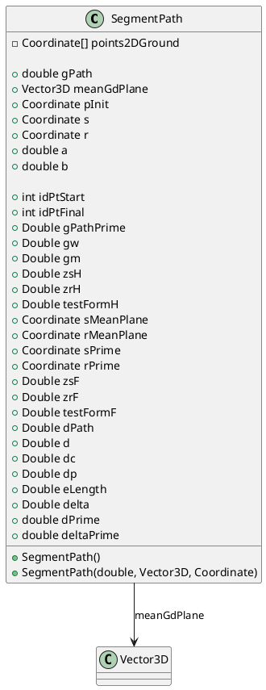

The key properties of the `SegmentPath` class include:

**Geometric Properties:**

- `s`, `r` — source and receiver coordinates for this segment
- `meanGdPlane` — mean ground plane vector for the segment
- `pInit` — initial point of the mean ground plane
- `points2DGround` — ground points used to compute mean ground plane (for debug/testing)
- `sMeanPlane`, `rMeanPlane` — projection of source and receiver points on ground
- `sPrime`, `rPrime` — mirror image points for reflection calculations

**Ground Attenuation Parameters:**

- `gPath` — G coefficient for the considered path segment (weighted ground absorption)
- `gPathPrime` — G path prime, calculated from gPath and geometry
- `gw`, `gm` — ground parameters for different frequency ranges

**Distance Calculations:**

- `d` — direct ray distance between source and receiver
- `dPath` — direct ray distance passing through diffraction and reflection points
- `dc` — direct ray distance sensitive to meteorological conditions (can be curved)
- `dp` — distance between source and receiver projected over mean ground plane
- `dPrime`, `deltaPrime` — diffraction-related distance parameters
- `eLength` — distance between first and last diffraction points

**Height Parameters:**

- `zsH`, `zrH` — equivalent source and receiver heights for homogeneous conditions
- `zsF`, `zrF` — equivalent source and receiver heights for favorable conditions
- `testFormH`, `testFormF` — test form parameters for different meteorological conditions

**Segment Indices:**

- `idPtStart`, `idPtFinal` — start and final point indices for the segment in the path

The class provides methods for setting ground parameters (`setGpath`, `setGw`, `setGm`), managing distances (`setDirectRayDistance`, `getDirectDistance`), and handling elevation profiles (`setElevationProfile2D`). It also supports serialization through `writeStream` and `readStream` methods for data persistence.

### Create Path

The `Path` instance is build using `AcousticPathBuilder.createPath()` method, which takes a fully prepared `AcousticPathConfiguration` as input and produces a `Path` object with the following steps:

1. The pivot list length is checked. If fewer than two points are provided it throws an `IllegalArgumentException`.
2. For a simple two-point (source+receiver) path it creates an `AcousticPathProcessor`, calls `updateWithSegmentIndex(1)` once, and returns the resulting `Path`.
3. For N pivot points (N>=3) the builder creates an `AcousticPathProcessor` and iterates segmentIndex from 1 to N-1, calling `updateWithSegmentIndex(segmentIndex)` for each horizontal segment between consecutive pivot coordinates.
4. After processing all segments it returns the assembled `Path` instance built incrementally by the processor.

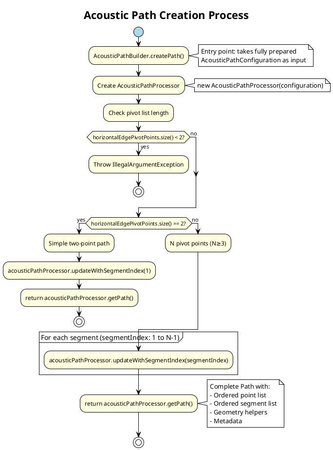

### Segment Processing Details

The `AcousticPathProcessor.updateWithSegmentIndex(segmentIndex)` method is initialized with the segment index (`setSegmentIndex`), which resolves the start/end indices in the 2D cut-point array that correspond to the current horizontal pivot endpoints, maps to expanded cut-point indices used for ground sampling, and caches `CutPoint` references for start/end. Then it performs the following:

1. If the segment is the very first processed one, the processor creates and appends a `PointPath` for the source. It computes an emission orientation by locating the first elevated reflection/diffraction target (if any) or the segment end.
2. The processor scans intermediate cut-points between start and end to
    - convert `CutPointReflection` into reflection `PointPath` entries (and record obstacle/wall altitude),
    - convert vertical-edge diffractions (`CutPointVEdgeDiffraction`) into vertical diffraction `PointPath` entries,
    - create short intermediate `SegmentPath` slices using the sampled ground points for accurate ground/absorption factors (via `CnossosSegmentComputer.createSegmentPathWithGroundFactors`).
3. When the segment end corresponds to a horizontal-edge pivot, it builds the main diffraction `SegmentPath` spanning the segment endpoints, sets CNOSSOS-specific helpers (lengths, dp, mean ground plane), and appends horizontal-edge diffraction `PointPath` entries.
4. For the last segment the processor appends the receiver `PointPath` and a final intermediate segment connecting the last pivot to the receiver as needed.
5. The processor mutates the `Path` instance in-place by appending `PointPath` and `SegmentPath` objects; it also sets path-level metadata such as `raySourceReceiverDirectivity` and `srSegment` when appropriate.

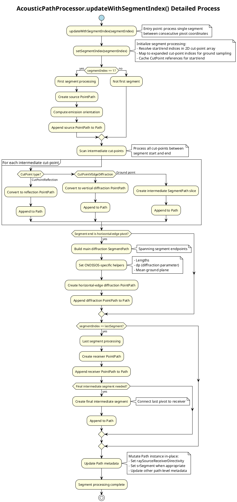

With these steps, a new `Path` instance that encapsulates the ordered point and segment lists, geometry helpers (for example `asGeom()` returning a 3D LineString) and convenience computations used by downstream processors.

## Calculate Parameters

### CnossosPath class

The `CnossosPath` class extends the base `Path` class with CNOSSOS-specific acoustic computation data. It contains all the acoustic attenuation arrays and parameters required for CNOSSOS propagation calculations.

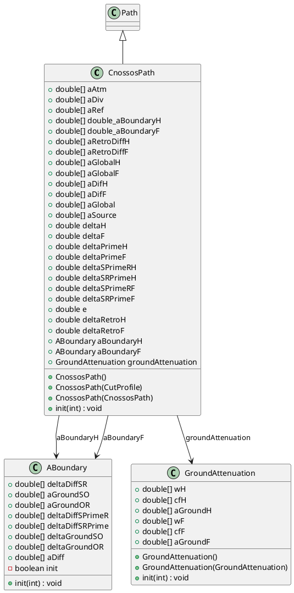

The `CnossosPathProcessor.createCnossosPath()` method converts a fully built `Path` into a `CnossosPath`, which is the final data structure used for CNOSSOS propagation calculations. This method performs the following:

### Calculate parameters

The `CnossosPathProcessor.createCnossosPath()` method converts a fully built `Path` into a `CnossosPath` through the following process:

The process includes these key steps:

1. A local mean ground plane is calculated from the provided `elevationProfile2D` coordinates.
2. SR (source→receiver) segment is built: it calls `CnossosSegmentComputer.createSegmentPathWithGroundFactors(...)` to construct a straight source–receiver `SegmentPath` including sampled ground factors and sets elevation-profile metadata and the straight-line 3D distance on the segment.
3. A `CnossosPath` is created from the `CutProfile` and `Path`, copying `pointList`, `segmentList` and `raySourceReceiverDirectivity`.
4. The assembled `PointPath` list is inspected for horizontal diffraction points (`DIFH`); if found it delegates to `setDiffractionPathParameters(...)`, otherwise to `setDirectPathParameters(...)` to compute the CNOSSOS delta parameters.
5. The CNOSSOS parameters are calculated: the delegated routines compute delta distances (deltaH, deltaF, deltaPrimeH, deltaPrimeF, etc.), mirror-image points for reflection tests, and set the SR dPrime value together with per-segment dPrime where applicable. They also detect and insert Rayleigh-style diffraction obstacle points when appropriate.

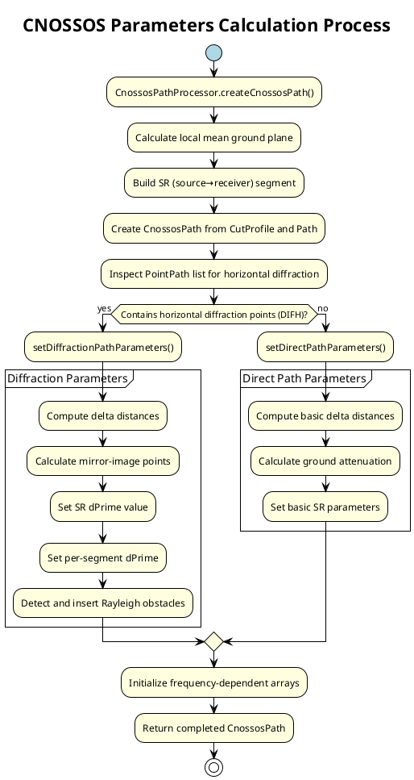

## SourcePointInfo-SourceEmission Linkage During Propagation

During propagation calculation in `AttenuationOutputSingleThread.onNewCutPlane()`, each `SourcePointInfo` sampled point is linked to its corresponding `SourceEmission` data to compute noise levels. This linkage mechanism enables emission source type discrimination based on bridge relationships and is critical for accurate sound modeling when bridge-related sources are present.

**Linkage Process:**

1. **Key Lookup:** Each `CutPointSource` (derived from `SourcePointInfo`) retains its `sourcePk` value (the primary key from the source database row in the SOURCES table)
2. **Map Query:** The implementation retrieves emissions via `SceneWithEmission.getSourceEmissionsMap().get(sourcePk)`
   - Result: `ArrayList<SourceEmission>` containing zero or more period-specific emissions registered for that source
   - Each `SourceEmission` in the list has a distinct `period` (e.g., "D", "E", "N", or combined period) and `emissionType` (ROAD or BRIDGE)
3. **Bridge-Based Filtering:** Not all emissions in the list are applicable to every sampled point—the `BridgeRelationship.RelationType` of the current `CutPointSource` acts as a filter:

| BridgeRelationship.RelationType | Applicable SourceEmission.EmissionType | Use Case |
|---|---|---|
| **SOURCE_NOT_RELATED_TO_BRIDGE** | ROAD only (exclude BRIDGE) | Standard road source; bridge-specific emissions cannot contribute |
| **ACTUAL_SOURCE_ON_BRIDGE** | ROAD only (exclude BRIDGE) | Source is on a bridge deck; only traffic emissions apply (bridge structural sound excluded) |
| **IMAGINARY_SOURCE_UNDER_BRIDGE** | BRIDGE only (exclude ROAD) | Virtual image source under bridge for reflection modeling; only bridge structural sound applies |
| **MIRROR_SOURCE** | ROAD only (exclude BRIDGE) | Reflected image of original source; inherits original source type filtering (use ROAD) |

**Attenuation Computation:**

For each filtered `SourceEmission`:
1. Compute CNOSSOS attenuation spectrum via `AttenuationCnossosExt.computeCnossosAttenuation(...)` using the specific `period` (with optional period-specific atmospheric parameters if available)
2. Convert attenuation from dB to linear (watts) via `dBToW()`
3. Multiply attenuation spectrum by the emission spectrum: `levels = attenuation × sourceEmission.getEmissionInWatts()`
4. Accumulate results in a `ReceiverNoiseLevel` object (per-period storage)
5. Use in `maximumError` distance-pruning logic (if enabled) to determine search cutoff

**Result:**

- Each `SourcePointInfo`-`SourceEmission` pair produces a period-specific noise level at the receiver
- Multiple periods (D, E, N) are accumulated separately at the receiver
- The `processNoiseLevel()` method merges accumulated levels across all applicable sources via the `TimePeriodParameters.update()` aggregation method
- Final noise levels are scheduled for export as separate period records or, if L_DEN is requested, combined using standard aggregation weights