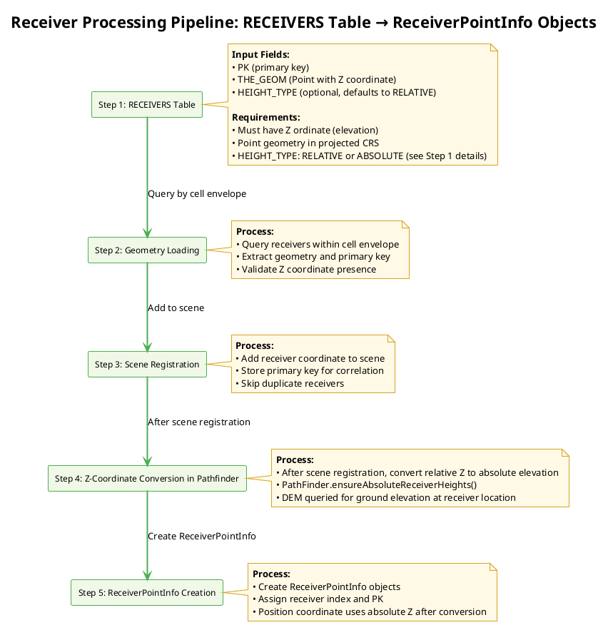
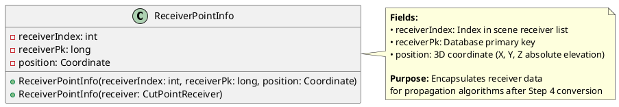

# Receiver identification algorithms

- [Receiver identification algorithms](#receiver-identification-algorithms)
  - [Concepts \& Overview — Receiver Processing](#concepts--overview--receiver-processing)
  - [Prerequisites](#prerequisites)
  - [Receiver Generation Methods](#receiver-generation-methods)
    - [DelaunayReceiversMaker](#delaunayreceiversmaker)
    - [Building\_Grid (WPS Script)](#building_grid-wps-script)
    - [Manual or External Data](#manual-or-external-data)
  - [Step 1: RECEIVERS Table Creation](#step-1-receivers-table-creation)
  - [Step 2: Geometry Loading](#step-2-geometry-loading)
  - [Step 3: Scene Registration](#step-3-scene-registration)
  - [Step 4: Z-Coordinate Conversion in Pathfinder](#step-4-z-coordinate-conversion-in-pathfinder)
  - [Step 5: ReceiverPointInfo Creation](#step-5-receiverpointinfo-creation)
  - [Integration with NoiseMapByReceiverMaker](#integration-with-noisemapbyreceivermaker)

## Concepts & Overview — Receiver Processing

The receiver processing pipeline converts receiver location data (`RECEIVERS` table) into propagation-ready receiver points encapsulated in `ReceiverPointInfo` objects. This process is summarized as follows:



## Context: Receiver Processing in the Computation Scheme

Receiver identification and processing represents **Phase 4.1 (Scene Preparation)** and **Phase 4.2 (Processing within Path Finding)** of the overall NoiseModelling computation pipeline.

For the complete computation context and how receiver processing integrates with the entire pipeline from source data through final noise level computation, see [computation_scheme.md](computation_scheme.md).

## Prerequisites

> **Important**: This document describes the receiver processing and identification algorithms that operate **after** receivers have been generated. The algorithms documented here assume that the `RECEIVERS` table has already been created with receiver points.
>
> For detailed information on **how receivers are generated** in the first place, including methods such as Delaunay triangulation, regular grid generation, and building facade placement, please refer to [Docs-dev/receiver_generation_algorithms.md](receiver_generation_algorithms.md).
>
> The generation algorithms in that document are the prerequisite step that creates the input data (`RECEIVERS` table) which this document's receiver processing pipeline operates upon.

## Receiver Generation Methods

Before processing receivers, the `RECEIVERS` table must be created. There are several methods to generate or provide receiver locations:

### DelaunayReceiversMaker

- **Purpose**: Generates receivers using Delaunay triangulation for uniform coverage
- **Class**: `org.noise_planet.noisemodelling.jdbc.DelaunayReceiversMaker`
- **Process**:
  - Performs Delaunay triangulation on the computation domain
  - Places receivers at triangle vertices
  - Considers building obstacles and source geometries
- **Parameters**: Maximum triangle area, road width, receiver height, building buffer
- **Output**: Populates `RECEIVERS` table with generated points

### Building_Grid (WPS Script)

- **Purpose**: Generates receivers around building facades at specified distances
- **Script**: `Building_Grid.groovy`
- **Process**:
  - Buffers building geometries to create receiver lines
  - Places receivers along building perimeters at regular intervals
  - Filters receivers based on height and proximity to sources
- **Parameters**: Distance from wall, receiver spacing, height, fence geometry
- **Output**: Creates `RECEIVERS` table with facade-based receiver points

### Manual or External Data

- Receivers can also be provided manually or from external sources
- Ensure the table follows the required schema (PK, THE_GEOM with Z coordinate)

## Step 1: RECEIVERS Table Creation

The `RECEIVERS` table contains receiver locations where noise levels will be computed. Each receiver is represented as a point geometry with elevation.

**Required Fields:**
- `PK`: Primary key (integer, auto-increment)
- `THE_GEOM`: Point geometry with X, Y, Z coordinates (height above ground in meters)

**Optional Fields:**
- `HEIGHT_TYPE`: Height interpretation mode (VARCHAR, default: 'RELATIVE')
  - `'RELATIVE'`: Z coordinate represents height above ground level (default if not specified)
  - `'ABSOLUTE'`: Z coordinate represents absolute elevation in the coordinate reference system

**Database Schema:**
```sql
CREATE TABLE RECEIVERS (
    PK SERIAL PRIMARY KEY,
    THE_GEOM GEOMETRY(POINTZ, [SRID]),
    HEIGHT_TYPE VARCHAR(10) DEFAULT 'RELATIVE'
);
```

**Data Requirements:**
- All receivers must have valid Z coordinates (elevation)
- Coordinates should be in the same projected coordinate reference system as sources and buildings
- No duplicate geometries (though PK ensures uniqueness)
- If `HEIGHT_TYPE` is not specified (NULL), it defaults to 'RELATIVE' during processing
- `HEIGHT_TYPE` must be either 'RELATIVE' or 'ABSOLUTE' when specified

## Step 2: Geometry Loading

During cell-based computation, receivers within each processing cell are loaded from the database.

**Process:**
1. Determine cell envelope (bounding box) for current processing cell
2. Query receivers whose geometry intersects the expanded cell envelope
3. Extract receiver primary key and geometry coordinates
4. Validate that Z coordinate is present (not NULL_ORDINATE)

**SQL Query Pattern:**
```sql
SELECT PK, THE_GEOM FROM RECEIVERS 
WHERE THE_GEOM && ST_Expand(cellEnvelope, maxPropagationDistance)
```

**Validation:**
- Throws `IllegalArgumentException` if any receiver lacks Z coordinate
- Ensures all receivers have valid 3D positioning for accurate propagation

## Step 3: Scene Registration

Loaded receivers are registered in the computation scene for propagation processing.

**Process:**
1. Extract coordinate from geometry (X, Y, Z)
2. Add receiver to scene's receiver list
3. Store primary key for database correlation
4. Skip receivers that have already been processed in overlapping cells

**Key Operations:**
- `DefaultTableLoader.fetchCellReceiver()`: Main method for loading and registering receivers
  - Parameters: `Connection`, `Envelope`, `SceneWithEmission`, `Set<Long> skipReceivers`
  - Queries RECEIVERS table using spatial index (&&) within cell envelope
  - Validates Z coordinate presence for all loaded receivers
  - Calls `scene.addReceiver()` with receiver data and HEIGHT_TYPE
  
- `scene.addReceiver(receiverPk, coordinate, resultSet)`: Adds receiver to scene's receiver list
- Maintains mapping between receiver index and database primary key
- Prevents duplicate processing in grid-based computation

## Step 4: Z-Coordinate Conversion in Pathfinder

In the pathfinder phase, receiver coordinates are prepared for accurate propagation calculations by converting relative heights to absolute elevations using Digital Elevation Model (DEM) data.

**Process:**
1. After loading receivers into the scene, convert relative heights to absolute elevations
2. Call `PathFinder.ensureAbsoluteReceiverHeights()` to perform conversion
3. For each receiver, query ground elevation from DEM data at receiver's (X, Y) location
4. Update receiver Z coordinate to absolute elevation (zGround + relativeZ)
5. Update HEIGHT_TYPE to ABSOLUTE for all receivers after conversion

**Key Classes and Methods:**
- `PathFinder.ensureAbsoluteReceiverHeights()`: Main conversion method
  - Iterates through all scene receivers
  - Queries DEM ground elevation for each receiver's XY position
  - For RELATIVE receivers: computes `absoluteZ = zGround + relativeZ`
  - For ABSOLUTE receivers: maintains current Z value as-is
  - Sets all HEIGHT_TYPE to ABSOLUTE after conversion
  
- `ProfileBuilder.getZGround(Coordinate)`: Queries DEM ground elevation at given XY coordinates
- `Scene.getReceiverHeightTypeByPk()`: Retrieves HEIGHT_TYPE (RELATIVE or ABSOLUTE)
- `CutPointReceiver.setZGround()`: Sets ground elevation reference in receiver profile

**Code Implementation:**
```java
// In PathFinder
PathFinder pathFinder = new PathFinder(scene);
pathFinder.ensureAbsoluteReceiverHeights();

// For each receiver:
// If HEIGHT_TYPE == RELATIVE: receiver.z = zGround + (original_z)
// If HEIGHT_TYPE == ABSOLUTE: receiver.z = (unchanged)
// All receivers: HEIGHT_TYPE → ABSOLUTE
```

**Integration with Propagation:**
- Conversion happens after scene registration (Step 3) and before propagation
- Ensures all receivers have absolute elevation for accurate ray tracing
- Maintains relative Z information for height-above-ground semantics
- Enables accurate modeling of receiver positions relative to terrain

## Step 5: ReceiverPointInfo Creation

Final step creates `ReceiverPointInfo` objects that encapsulate receiver data for propagation algorithms.

**ReceiverPointInfo Structure:**



**Creation Process:**
1. After Step 4 Z-coordinate conversion, receivers are in ABSOLUTE height mode
2. Iterate through scene receivers to create `ReceiverPointInfo` for each
3. Assign sequential receiver index and database primary key
4. Position coordinate includes absolute Z (sea level + receiver height)

**Where it happens:**
- The per-receiver `ReceiverPointInfo` is instantiated inside `ThreadPathFinder.call()` right before ray computation.

**Integration with Propagation:**
- Created during path finding computation
- Used by `PathFinder` to compute rays from sources to receivers
- Passed to attenuation calculation algorithms
- Enables correlation of computed results back to database records via primary key
- Receiver Z coordinate now represents absolute elevation for terrain intersection checks

## Integration with NoiseMapByReceiverMaker

For details on how `NoiseMapByReceiverMaker` orchestrates receiver processing within the cell-based computation framework, including the call chain from `run()` to `ReceiverPointInfo` creation, threading considerations, and coordinate system handling, see `noisemapbyreceivermaker_algorithms.md`.

This receiver processing pipeline integrates seamlessly with the broader noise mapping workflow, ensuring efficient and accurate acoustic computation.
