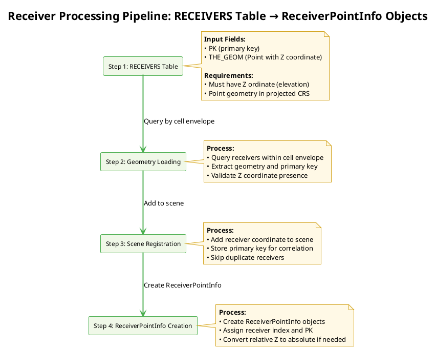
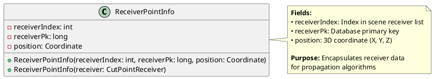
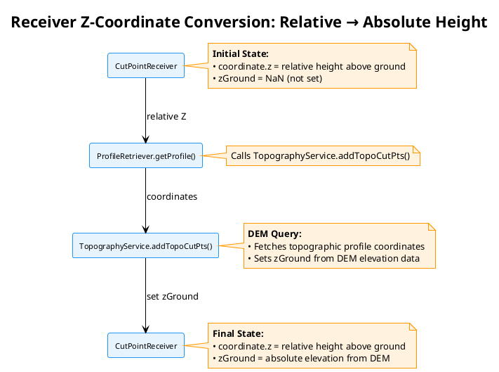
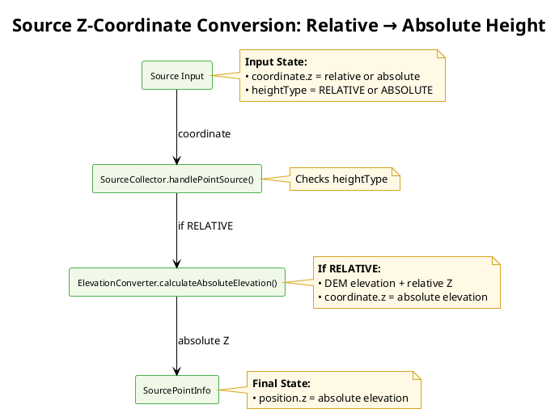

# Receiver identification algorithms

- [Receiver identification algorithms](#receiver-identification-algorithms)
  - [Concepts \& Overview — Receiver Processing](#concepts--overview--receiver-processing)
  - [Receiver Generation Methods](#receiver-generation-methods)
    - [DelaunayReceiversMaker](#delaunayreceiversmaker)
    - [Building\_Grid (WPS Script)](#building_grid-wps-script)
    - [Manual or External Data](#manual-or-external-data)
  - [Step 1: RECEIVERS Table Creation](#step-1-receivers-table-creation)
  - [Step 2: Geometry Loading](#step-2-geometry-loading)
  - [Step 3: Scene Registration](#step-3-scene-registration)
  - [Step 4: ReceiverPointInfo Creation](#step-4-receiverpointinfo-creation)
  - [Integration with NoiseMapByReceiverMaker](#integration-with-noisemapbyreceivermaker)

## Concepts & Overview — Receiver Processing

The receiver processing pipeline converts receiver location data (`RECEIVERS` table) into propagation-ready receiver points encapsulated in `ReceiverPointInfo` objects. This process is summarized as follows:



## Receiver Generation Methods

Before processing receivers, the `RECEIVERS` table must be created. There are several methods to generate or provide receiver locations:

### DelaunayReceiversMaker
- **Purpose**: Generates receivers using Delaunay triangulation for uniform coverage
- **Class**: `org.noise_planet.noisemodelling.jdbc.DelaunayReceiversMaker`
- **Process**: 
  - Performs Delaunay triangulation on the computation domain
  - Places receivers at triangle vertices
  - Considers building obstacles and source geometries
- **Parameters**: Maximum triangle area, road width, receiver height, building buffer
- **Output**: Populates `RECEIVERS` table with generated points

### Building_Grid (WPS Script)
- **Purpose**: Generates receivers around building facades at specified distances
- **Script**: `Building_Grid.groovy`
- **Process**:
  - Buffers building geometries to create receiver lines
  - Places receivers along building perimeters at regular intervals
  - Filters receivers based on height and proximity to sources
- **Parameters**: Distance from wall, receiver spacing, height, fence geometry
- **Output**: Creates `RECEIVERS` table with facade-based receiver points

### Manual or External Data
- Receivers can also be provided manually or from external sources
- Ensure the table follows the required schema (PK, THE_GEOM with Z coordinate)

## Step 1: RECEIVERS Table Creation

The `RECEIVERS` table contains receiver locations where noise levels will be computed. Each receiver is represented as a point geometry with elevation.

**Required Fields:**
- `PK`: Primary key (integer, auto-increment)
- `THE_GEOM`: Point geometry with X, Y, Z coordinates (height above ground in meters)

**Database Schema:**
```sql
CREATE TABLE RECEIVERS (
    PK SERIAL PRIMARY KEY,
    THE_GEOM GEOMETRY(POINTZ, [SRID])
);
```

**Data Requirements:**
- All receivers must have valid Z coordinates (elevation)
- Coordinates should be in the same projected coordinate reference system as sources and buildings
- No duplicate geometries (though PK ensures uniqueness)

## Step 2: Geometry Loading

During cell-based computation, receivers within each processing cell are loaded from the database.

**Process:**
1. Determine cell envelope (bounding box) for current processing cell
2. Query receivers whose geometry intersects the expanded cell envelope
3. Extract receiver primary key and geometry coordinates
4. Validate that Z coordinate is present (not NULL_ORDINATE)

**SQL Query Pattern:**
```sql
SELECT PK, THE_GEOM FROM RECEIVERS 
WHERE THE_GEOM && ST_Expand(cellEnvelope, maxPropagationDistance)
```

**Validation:**
- Throws `IllegalArgumentException` if any receiver lacks Z coordinate
- Ensures all receivers have valid 3D positioning for accurate propagation

## Step 3: Scene Registration

Loaded receivers are registered in the computation scene for propagation processing.

**Process:**
1. Extract coordinate from geometry (X, Y, Z)
2. Add receiver to scene's receiver list
3. Store primary key for database correlation
4. Skip receivers that have already been processed in overlapping cells

**Key Operations:**
- `scene.addReceiver(receiverPk, coordinate, resultSet)`
- Maintains mapping between receiver index and database primary key
- Prevents duplicate processing in grid-based computation

## Step 4: ReceiverPointInfo Creation

Final step creates `ReceiverPointInfo` objects that encapsulate receiver data for propagation algorithms.

**ReceiverPointInfo Structure:**



**Creation Process:**
1. Iterate through scene receivers during path finding
2. Create `ReceiverPointInfo` for each receiver
3. Assign sequential receiver index and database PK
4. Position coordinate includes height above ground

**Integration with Propagation:**
- Used by `PathFinder` to compute rays from sources to receivers
- Passed to attenuation calculation algorithms
- Enables correlation of results back to database records

## Integration with NoiseMapByReceiverMaker

For details on how `NoiseMapByReceiverMaker` orchestrates receiver processing within the cell-based computation framework, including the call chain from `run()` to `ReceiverPointInfo` creation, threading considerations, and coordinate system handling, see `noisemapbyreceivermaker_algorithms.md`.

This receiver processing pipeline integrates seamlessly with the broader noise mapping workflow, ensuring efficient and accurate acoustic computation.

## Z-Coordinate Handling and Absolute Height Conversion

### Relative vs. Absolute Heights

Receiver Z coordinates in NoiseModelling represent **height above ground level**, not absolute elevation. This relative height is maintained throughout the receiver processing pipeline:

- **Input (RECEIVERS table):** Z coordinate represents height above ground (e.g., 2.0 meters for a receiver 2 meters above ground)
- **ReceiverPointInfo:** Position coordinate contains relative height above ground
- **CutPointReceiver initialization:** Created with relative Z coordinate from ReceiverPointInfo

Source Z coordinates are converted to absolute elevations earlier in the process:

- **Input (SOURCES table):** Z coordinate may be relative or absolute depending on height type
- **SourceCollector processing:** Converts relative Z to absolute using DEM data via `ElevationConverter.calculateAbsoluteElevation()`
- **SourcePointInfo:** Position coordinate contains absolute elevation
- **CutPointSource initialization:** Created with absolute Z coordinate from SourcePointInfo

### Conversion to Absolute Heights in Propagation

**For Receivers:**
The conversion to absolute heights occurs during propagation calculations when topographic profiles are built. This conversion occurs in `ProfileRetriever.getProfile()`:



**For Sources:**
Sources are converted to absolute elevations during scene processing in `SourceCollector.handlePointSource()`:



**Key Code Implementation:**

**For Receivers (TopographyService.addTopoCutPts()):**
```java
CutPointReceiver cutPointReceiver = profile.getReceiver();
cutPointReceiver.setZGround(coordinates.get(coordinates.size() - 1).z);
profile.setReceiver(cutPointReceiver);
```

**For Sources (ElevationConverter.calculateAbsoluteElevation()):**
```java
// Ground elevation + original relative Z
return profileBuilder.getZGround(coord) + coord.z;
```

Where `coordinates.get(coordinates.size() - 1).z` and `profileBuilder.getZGround(coord)` are absolute elevations obtained from the Digital Elevation Model (DEM) at the respective locations.

### Why Different Approaches?

- **Sources:** Converted early because source positions are fixed and needed for receiver-source distance calculations during scene building
- **Receivers:** Converted late because topographic profiles are built per source-receiver pair, and absolute heights are only needed for terrain intersection calculations

This design allows NoiseModelling to handle sources and receivers at varying heights while accurately modeling acoustic effects of terrain and obstacles.
