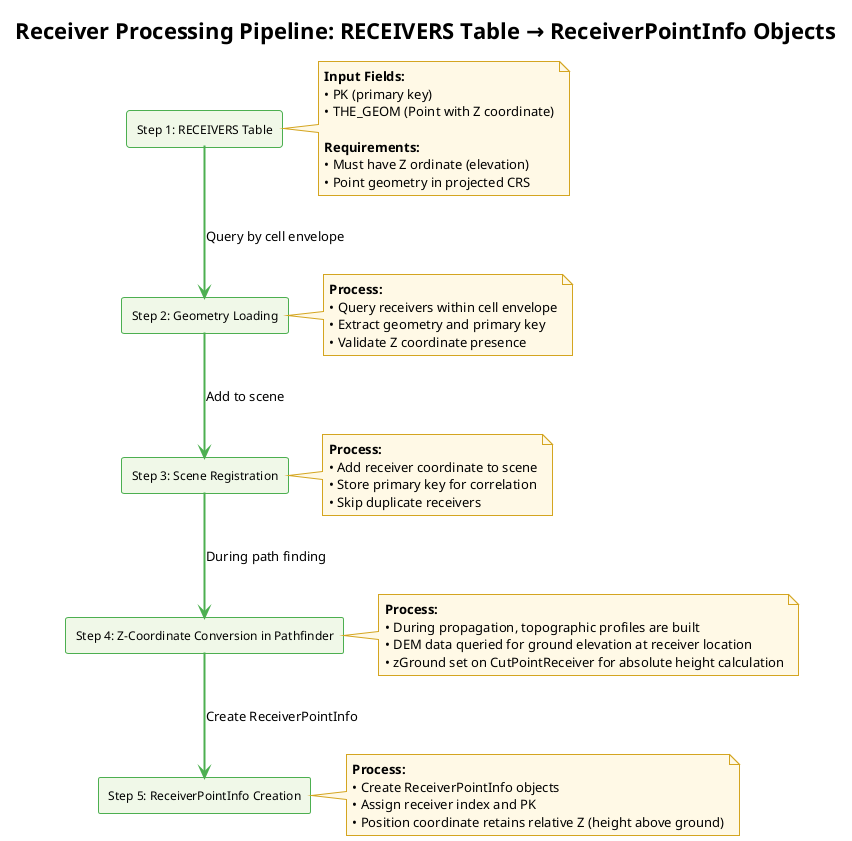
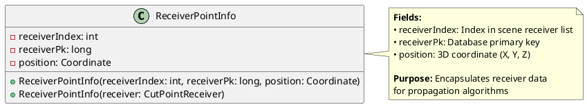

# Receiver identification algorithms

- [Receiver identification algorithms](#receiver-identification-algorithms)
  - [Concepts \& Overview — Receiver Processing](#concepts--overview--receiver-processing)
  - [Receiver Generation Methods](#receiver-generation-methods)
    - [DelaunayReceiversMaker](#delaunayreceiversmaker)
    - [Building\_Grid (WPS Script)](#building_grid-wps-script)
    - [Manual or External Data](#manual-or-external-data)
  - [Step 1: RECEIVERS Table Creation](#step-1-receivers-table-creation)
  - [Step 2: Geometry Loading](#step-2-geometry-loading)
  - [Step 3: Scene Registration](#step-3-scene-registration)
  - [Step 5: ReceiverPointInfo Creation](#step-5-receiverpointinfo-creation)
  - [Step 4: Z-Coordinate Conversion in Pathfinder](#step-4-z-coordinate-conversion-in-pathfinder)
  - [Integration with NoiseMapByReceiverMaker](#integration-with-noisemapbyreceivermaker)

## Concepts & Overview — Receiver Processing

The receiver processing pipeline converts receiver location data (`RECEIVERS` table) into propagation-ready receiver points encapsulated in `ReceiverPointInfo` objects. This process is summarized as follows:



## Receiver Generation Methods

Before processing receivers, the `RECEIVERS` table must be created. There are several methods to generate or provide receiver locations:

### DelaunayReceiversMaker

- **Purpose**: Generates receivers using Delaunay triangulation for uniform coverage
- **Class**: `org.noise_planet.noisemodelling.jdbc.DelaunayReceiversMaker`
- **Process**:
  - Performs Delaunay triangulation on the computation domain
  - Places receivers at triangle vertices
  - Considers building obstacles and source geometries
- **Parameters**: Maximum triangle area, road width, receiver height, building buffer
- **Output**: Populates `RECEIVERS` table with generated points

### Building_Grid (WPS Script)

- **Purpose**: Generates receivers around building facades at specified distances
- **Script**: `Building_Grid.groovy`
- **Process**:
  - Buffers building geometries to create receiver lines
  - Places receivers along building perimeters at regular intervals
  - Filters receivers based on height and proximity to sources
- **Parameters**: Distance from wall, receiver spacing, height, fence geometry
- **Output**: Creates `RECEIVERS` table with facade-based receiver points

### Manual or External Data

- Receivers can also be provided manually or from external sources
- Ensure the table follows the required schema (PK, THE_GEOM with Z coordinate)

## Step 1: RECEIVERS Table Creation

The `RECEIVERS` table contains receiver locations where noise levels will be computed. Each receiver is represented as a point geometry with elevation.

**Required Fields:**
- `PK`: Primary key (integer, auto-increment)
- `THE_GEOM`: Point geometry with X, Y, Z coordinates (height above ground in meters)

**Database Schema:**
```sql
CREATE TABLE RECEIVERS (
    PK SERIAL PRIMARY KEY,
    THE_GEOM GEOMETRY(POINTZ, [SRID])
);
```

**Data Requirements:**
- All receivers must have valid Z coordinates (elevation)
- Coordinates should be in the same projected coordinate reference system as sources and buildings
- No duplicate geometries (though PK ensures uniqueness)

## Step 2: Geometry Loading

During cell-based computation, receivers within each processing cell are loaded from the database.

**Process:**
1. Determine cell envelope (bounding box) for current processing cell
2. Query receivers whose geometry intersects the expanded cell envelope
3. Extract receiver primary key and geometry coordinates
4. Validate that Z coordinate is present (not NULL_ORDINATE)

**SQL Query Pattern:**
```sql
SELECT PK, THE_GEOM FROM RECEIVERS 
WHERE THE_GEOM && ST_Expand(cellEnvelope, maxPropagationDistance)
```

**Validation:**
- Throws `IllegalArgumentException` if any receiver lacks Z coordinate
- Ensures all receivers have valid 3D positioning for accurate propagation

## Step 3: Scene Registration

Loaded receivers are registered in the computation scene for propagation processing.

**Process:**
1. Extract coordinate from geometry (X, Y, Z)
2. Add receiver to scene's receiver list
3. Store primary key for database correlation
4. Skip receivers that have already been processed in overlapping cells

**Key Operations:**
- `scene.addReceiver(receiverPk, coordinate, resultSet)`
- Maintains mapping between receiver index and database primary key
- Prevents duplicate processing in grid-based computation

## Step 5: ReceiverPointInfo Creation

Final step creates `ReceiverPointInfo` objects that encapsulate receiver data for propagation algorithms.

**ReceiverPointInfo Structure:**



**Creation Process:**
1. Iterate through scene receivers during path finding
2. Create `ReceiverPointInfo` for each receiver
3. Assign sequential receiver index and database PK
4. Position coordinate includes height above ground

**Integration with Propagation:**
- Used by `PathFinder` to compute rays from sources to receivers
- Passed to attenuation calculation algorithms
- Enables correlation of results back to database records

## Step 4: Z-Coordinate Conversion in Pathfinder

In the pathfinder phase, receiver coordinates are prepared for accurate propagation calculations by converting relative heights to absolute elevations using Digital Elevation Model (DEM) data.

**Process:**
1. During ray path computation between sources and receivers, topographic profiles are constructed
2. For each receiver in the profile, the ground elevation is queried from DEM data
3. The `zGround` field of `CutPointReceiver` is set to the absolute elevation from DEM
4. This allows calculation of absolute receiver height as `zGround + relativeZ` where `relativeZ` is the height above ground

**Key Classes and Methods:**
- `ProfileRetriever.getProfile()`: Initiates profile building and calls topography services
- `TopographyService.addTopoCutPts()`: Queries DEM and sets `zGround` on receivers
- `CutPointReceiver.setZGround(double zGround)`: Sets the absolute ground elevation

**Code Implementation:**
```java
// In TopographyService.addTopoCutPts()
CutPointReceiver cutPointReceiver = profile.getReceiver();
double groundElevation = coordinates.get(coordinates.size() - 1).z; // From DEM
cutPointReceiver.setZGround(groundElevation);
profile.setReceiver(cutPointReceiver);
```

**Integration with Propagation:**
- Absolute receiver height is calculated as needed during terrain intersection checks
- Maintains relative Z coordinate for height-above-ground semantics
- Enables accurate modeling of receiver positions relative to terrain

## Integration with NoiseMapByReceiverMaker

For details on how `NoiseMapByReceiverMaker` orchestrates receiver processing within the cell-based computation framework, including the call chain from `run()` to `ReceiverPointInfo` creation, threading considerations, and coordinate system handling, see `noisemapbyreceivermaker_algorithms.md`.

This receiver processing pipeline integrates seamlessly with the broader noise mapping workflow, ensuring efficient and accurate acoustic computation.
