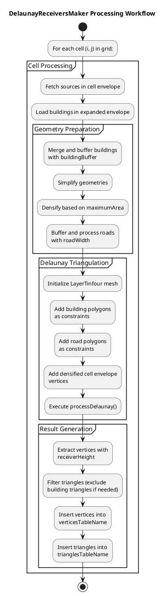
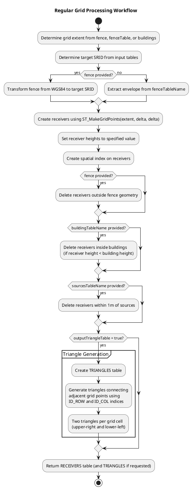
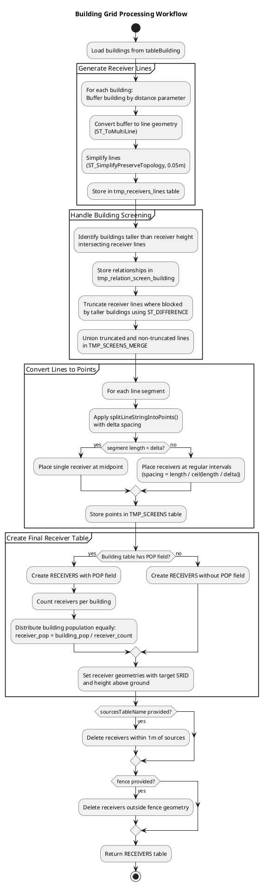

# Receiver Generation Algorithms

- [Receiver Generation Algorithms](#receiver-generation-algorithms)
  - [Overview](#overview)
  - [DelaunayReceiversMaker — Delaunay Triangulation](#delaunayreceiversmaker--delaunay-triangulation)
  - [Regular Grid — Uniform Receiver Distribution](#regular-grid--uniform-receiver-distribution)
  - [Building Grid — Facade Receiver Placement](#building-grid--facade-receiver-placement)
  - [Comparison of Approaches](#comparison-of-approaches)

## Overview

NoiseModelling provides multiple algorithms for generating receiver points where noise levels are computed. Each approach is designed for different use cases and produces different spatial distributions of receivers.

**Available Algorithms**:
1. **DelaunayReceiversMaker**: Generates receivers using constrained Delaunay triangulation, creating adaptive meshes respecting building and road geometries
2. **Regular Grid**: Creates uniform grid of receivers with constant spacing
3. **Building Grid**: Places receivers around building facades at specified distances

## DelaunayReceiversMaker — Delaunay Triangulation

`DelaunayReceiversMaker` is a specialized implementation that generates receiver points using constrained Delaunay triangulation. This approach creates a triangular mesh that respects building geometries and road constraints, producing receivers distributed according to triangle vertices and an isosurface-based placement strategy.


**Key Characteristics**:
- **Constrained Delaunay Triangulation**: Generates triangles respecting building boundaries and road centerlines as constraints
- **Mesh Quality Control**: Uses `maximumArea` parameter to control triangle size and ensure adequate receiver density
- **Building-Aware**: Places receivers outside buildings (when `isoSurfaceInBuildings=false`) or includes building interiors (when `true`)
- **Dual Output**: Generates both vertices (receiver points) and triangles (mesh structure) stored in separate database tables

**Configuration Parameters**:
- **roadWidth**: Buffer distance for road centerlines (default: 2 meters)
- **maximumArea**: Maximum allowed triangle area (controls mesh density, default: 75 m²)
- **receiverHeight**: Evaluation height for all receivers above ground (default: 1.6 meters)
- **buildingBuffer**: Exclusion buffer distance from building boundaries (default: 2 meters)
- **epsilon**: Point merging tolerance for duplicate vertices (default: 1e-6)
- **geometrySimplificationDistance**: Distance threshold for simplifying geometries before triangulation
- **isoSurfaceInBuildings**: Boolean flag controlling whether to include receivers inside building polygons

**Processing Workflow**:



**Geometry Processing Steps**:

1. **Building Preparation**:
   - Fetch buildings within expanded cell envelope
   - Merge overlapping buildings
   - Apply `buildingBuffer` to create exclusion zones
   - Simplify using `TopologyPreservingSimplifier` with `geometrySimplificationDistance`
   - Densify boundaries based on `maximumArea` for consistent triangle sizing

2. **Road Processing**:
   - Fetch road geometries (LineString or MultiLineString) from sources
   - Buffer roads by `roadWidth / 2` to create polygon constraints
   - Apply same simplification and densification steps

3. **Constraint Integration**:
   - Feed buildings and roads as polygonal constraints to `LayerTinfour`
   - Constrained Delaunay ensures triangulation edges respect building/road boundaries
   - Each constraint polygon receives a unique constraint ID for tracking

4. **Triangulation Execution**:
   - Set epsilon-based point merging tolerance
   - Add cell envelope vertices with densification if `maximumArea > 1`
   - Call `processDelaunay()` to compute constrained Delaunay triangulation
   - LayerTinfour uses Tinfour library backend for robust triangulation

5. **Result Table Generation**:
   - Extract triangle vertices, set z-coordinate to `receiverHeight`
   - Filter triangles: exclude those marked with non-zero attribute (building-interior triangles) unless `isoSurfaceInBuildings=true`
   - Create/populate receiver table with vertex points
   - Create/populate triangles table with triangle topology (3 vertex references + cell ID)

**Database Schema**:

Receiver table (`verticesTableName`):
```sql
CREATE TABLE receivers (
  PK SERIAL PRIMARY KEY,
  THE_GEOM GEOMETRY NOT NULL,
  HEIGHT_TYPE VARCHAR(10) DEFAULT 'RELATIVE'
)
```

Triangles table (`trianglesTableName`):
```sql
CREATE TABLE triangles (
  PK SERIAL PRIMARY KEY,
  THE_GEOM GEOMETRY,
  PK_1 INTEGER NOT NULL,    -- Reference to first vertex
  PK_2 INTEGER NOT NULL,    -- Reference to second vertex
  PK_3 INTEGER NOT NULL,    -- Reference to third vertex
  CELL_ID INTEGER NOT NULL, -- Grid cell identifier
  PRIMARY KEY (PK)
)
```

**Integration with NoiseMapByReceiverMaker**:

`DelaunayReceiversMaker` is often used as a preprocessing step before `NoiseMapByReceiverMaker` execution:

1. **Receiver Generation**: Generate receiver points and mesh using `DelaunayReceiversMaker.run()`
2. **Table Creation**: Vertices and triangles are stored in database tables
3. **Receiver Configuration**: Set `receiverTableName` in `NoiseMapByReceiverMaker` to point to generated vertices
4. **Noise Computation**: `NoiseMapByReceiverMaker` processes each receiver and generates noise levels
5. **Result Integration**: Noise levels can be joined with triangles table for visualization as isosurfaces or color-mapped mesh

**Advantages of Delaunay-Based Approach**:
- **Efficient Coverage**: Dense receiver distribution where needed (fine triangles near buildings/roads), coarser in open areas
- **Quality Mesh**: Delaunay property ensures well-shaped triangles for visualization
- **Constraint Handling**: Naturally respects building outlines and road centerlines without artificial grid distortion
- **Visualization-Ready**: Triangle output directly usable for 3D noise surface visualization

## Regular Grid — Uniform Receiver Distribution

The **Regular Grid** algorithm creates a uniform grid of receiver points with consistent spacing across the entire computation domain. This approach is implemented as a Groovy WPS script (`Regular_Grid.groovy`) and is ideal for systematic noise level sampling.

**Location**: `wps_scripts/src/main/groovy/org/noise_planet/noisemodelling/wps/Receivers/Regular_Grid.groovy`

**Key Features**:
- **Uniform Spacing**: Creates receivers at regular intervals in the Cartesian plane
- **Fence-Based Extent**: Grid extent based on building table, fence geometry, or specified table bounding box
- **Building/Source Filtering**: Automatically removes receivers inside buildings or near sources
- **Optional Triangle Output**: Can generate Delaunay triangles for isosurface visualization

**Input Parameters**:
- **buildingTableName**: Buildings table (receivers inside buildings removed if provided)
- **fence**: Optional polygon geometry defining grid extent (WGS84 coordinates, auto-transformed to target SRID)
- **fenceTableName**: Alternative extent definition using bounding box of specified table
- **sourcesTableName**: Optional sources table (removes receivers within 1m of sources)
- **delta**: Receiver spacing in meters (default: 10m)
- **height**: Receiver height above ground in meters (default: 4m)
- **receiverstablename**: Output table name (default: "RECEIVERS")
- **outputTriangleTable**: Boolean flag to generate triangles for isosurface creation (default: false)

**Processing Workflow**:



**Output Schema**:

Receivers table:
```sql
CREATE TABLE RECEIVERS (
  PK SERIAL PRIMARY KEY,
  THE_GEOM GEOMETRY,  -- Point geometry with Z coordinate (height)
  ID_COL INTEGER,      -- Column index in grid
  ID_ROW INTEGER       -- Row index in grid
)
```

Triangles table (if `outputTriangleTable=true`):
```sql
CREATE TABLE TRIANGLES (
  PK SERIAL PRIMARY KEY,
  THE_GEOM GEOMETRY(POLYGON Z),  -- Triangle polygon
  PK_1 INTEGER NOT NULL,          -- First vertex receiver PK
  PK_2 INTEGER NOT NULL,          -- Second vertex receiver PK
  PK_3 INTEGER NOT NULL,          -- Third vertex receiver PK
  CELL_ID INTEGER NOT NULL        -- Cell identifier (0 in this implementation)
)
```

**Use Cases**:
- **Regular Noise Mapping**: Systematic noise level assessment over large areas
- **Compliance Monitoring**: Uniform coverage for regulatory noise mapping requirements
- **Isosurface Visualization**: Triangle output enables smooth contour visualization
- **Simple Configuration**: Minimal parameters for quick noise map generation

**Advantages**:
- **Predictable Distribution**: Regular spacing ensures consistent sampling density
- **Simple Configuration**: Few parameters to configure compared to Delaunay approach
- **Computational Efficiency**: No complex geometry processing required
- **Grid-Based Analysis**: ID_ROW and ID_COL indices facilitate spatial analysis

**Limitations**:
- **Inefficient in Complex Scenarios**: May place many unnecessary receivers in open areas
- **No Adaptive Density**: Cannot concentrate receivers near areas of interest (buildings/roads)
- **Manual Spacing Selection**: Requires user to choose appropriate delta based on domain size

## Building Grid — Facade Receiver Placement

The **Building Grid** algorithm generates receivers around building facades at a specified distance from walls. This approach is implemented as a Groovy WPS script (`Building_Grid.groovy`) and is designed for assessing noise exposure at building exteriors.

**Location**: `wps_scripts/src/main/groovy/org/noise_planet/noisemodelling/wps/Receivers/Building_Grid.groovy`

**Key Features**:
- **Facade-Based Placement**: Receivers positioned at fixed distance from building walls
- **Height-Aware Screening**: Taller buildings can screen receivers on adjacent shorter buildings
- **Line Segmentation**: Converts building perimeters to receiver points with controlled spacing
- **Population Attribution**: Optional distribution of building population across receivers

**Input Parameters**:
- **tableBuilding**: Buildings table (required fields: THE_GEOM, HEIGHT; optional: POP)
- **fence**: Optional polygon geometry defining processing extent
- **fenceTableName**: Alternative extent definition using bounding box of specified table
- **sourcesTableName**: Optional sources table (removes receivers within 1m of sources)
- **delta**: Spacing between receivers along facade in meters (default: 10m)
- **height**: Receiver height above ground in meters (default: 4m)
- **distance**: Distance from building wall in meters (default: 2m)

**Processing Workflow**:



**Line Segmentation Algorithm** (`splitLineStringIntoPoints`):

The algorithm intelligently handles line segments based on their length:

1. **Short Segments** (length < delta):
   - Place single receiver at segment midpoint
   - Prevents over-sampling short facades

2. **Long Segments** (length ≥ delta):
   - Calculate optimal spacing: `targetSegmentSize = length / ceil(length / delta)`
   - Ensures uniform distribution along facade
   - Maintains receivers centered on facade segments
   
3. **Multi-Segment Lines**:
   - Process each LineString segment independently
   - Accumulate segment lengths
   - Place receivers when accumulated length reaches target spacing

**Output Schema**:

Receivers table (without population):
```sql
CREATE TABLE RECEIVERS (
  PK SERIAL PRIMARY KEY,
  THE_GEOM GEOMETRY,     -- Point geometry at specified height
  BUILD_PK INTEGER       -- Reference to building primary key
)
```

Receivers table (with population):
```sql
CREATE TABLE RECEIVERS (
  PK SERIAL PRIMARY KEY,
  THE_GEOM GEOMETRY,     -- Point geometry at specified height
  BUILD_PK INTEGER,      -- Reference to building primary key
  POP REAL               -- Population assigned to this receiver
)
```

**Taller Building Screening Logic**:

The algorithm implements a sophisticated screening mechanism:

1. **Screening Detection**: Identifies buildings taller than receiver height that intersect receiver lines
2. **Line Truncation**: Uses `ST_DIFFERENCE` to remove portions of receiver lines blocked by taller buildings
3. **Buffer Consideration**: Applies `buildingBuffer = distance` when computing blocked regions
4. **Spatial Efficiency**: Uses spatial indices for efficient screening calculations

**Use Cases**:
- **Building Facade Noise Assessment**: Evaluating noise exposure at building exteriors
- **Population Exposure Analysis**: Distributing population across facade receivers for exposure calculations
- **Urban Noise Mapping**: Focusing receiver density where people are exposed (building exteriors)
- **Compliance Verification**: Checking noise levels at building facades against regulatory limits

**Advantages**:
- **Facade-Focused**: Concentrates receivers where exposure matters most
- **Screening-Aware**: Accounts for acoustic shielding by taller buildings
- **Population Integration**: Directly supports population exposure analysis
- **Adaptive Density**: Automatically adjusts receiver count based on building perimeter length

**Limitations**:
- **Building-Dependent**: Requires accurate building geometries with height attributes
- **No Interior Receivers**: Only places receivers around exteriors (not inside buildings)
- **Computational Complexity**: Screening calculations can be expensive for dense urban areas with many tall buildings

## Comparison of Approaches

| Aspect | Delaunay Triangulation | Regular Grid | Building Grid |
|--------|----------------------|--------------|---------------|
| **Implementation** | Java class | Groovy WPS script | Groovy WPS script |
| **Receiver Distribution** | Adaptive mesh | Uniform grid | Facade-based |
| **Density Control** | maximumArea parameter | delta spacing | delta + distance |
| **Building Awareness** | Constraint polygons | Interior removal | Facade placement |
| **Output Structure** | Vertices + Triangles | Points (+ optional triangles) | Points |
| **Visualization Support** | Native triangle mesh | Optional triangulation | Point-based only |
| **Population Support** | No | No | Yes |
| **Screening Logic** | Constraint-based | Height-based removal | Taller building screening |
| **Ideal Use Case** | Isosurface visualization | Systematic mapping | Facade exposure |
| **Complexity** | High | Low | Medium |
| **Preprocessing** | Extensive geometry processing | Minimal | Line generation + truncation |

**Selection Guidelines**:

- **Use DelaunayReceiversMaker** when:
  - High-quality isosurface visualization is required
  - Adaptive receiver density is desired
  - Roads and buildings should constrain mesh structure
  - Post-processing noise surface visualization is planned

- **Use Regular Grid** when:
  - Simple uniform coverage is sufficient
  - Systematic sampling is required for compliance
  - Quick setup with minimal configuration is needed
  - Domain has relatively uniform characteristics

- **Use Building Grid** when:
  - Building facade exposure is the primary concern
  - Population exposure analysis is required
  - Focusing computational resources on buildings is desired
  - Regulatory requirements focus on building exteriors
