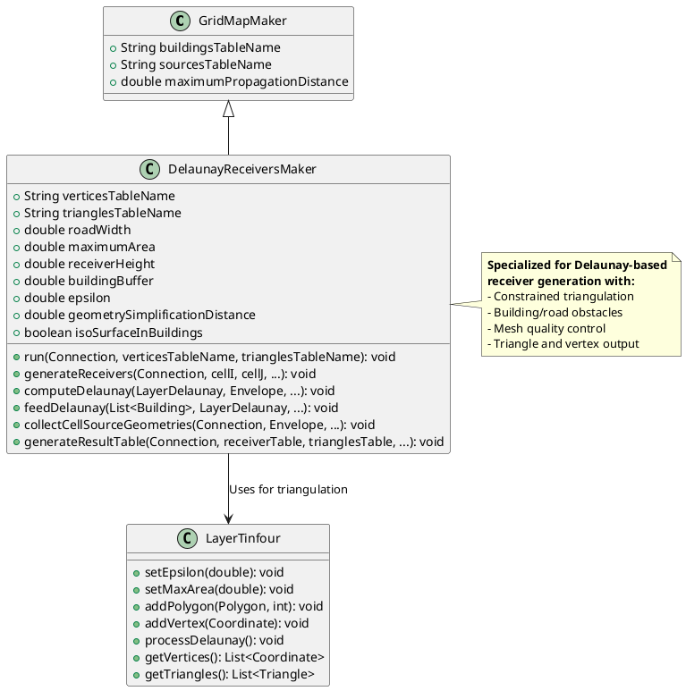
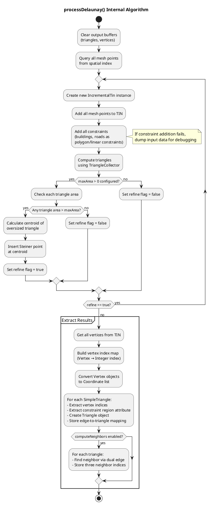
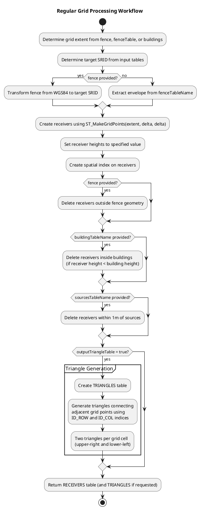
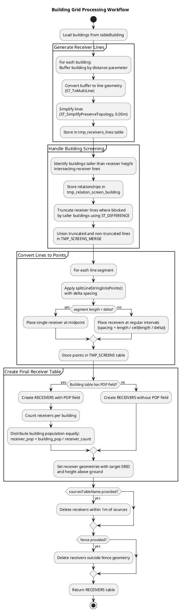

# Receiver Generation Algorithms

- [Receiver Generation Algorithms](#receiver-generation-algorithms)
  - [Overview](#overview)
    - [Implementation Architecture Note](#implementation-architecture-note)
  - [DelaunayReceiversMaker — Delaunay Triangulation](#delaunayreceiversmaker--delaunay-triangulation)
    - [processDelaunay() Internal Workflow](#processdelaunay-internal-workflow)
  - [Regular Grid — Uniform Receiver Distribution](#regular-grid--uniform-receiver-distribution)
  - [Building Grid — Facade Receiver Placement](#building-grid--facade-receiver-placement)
  - [Comparison of Approaches](#comparison-of-approaches)

## Overview

NoiseModelling provides multiple algorithms for generating receiver points where noise levels are computed. Each approach is designed for different use cases and produces different spatial distributions of receivers.

**Available Algorithms**:
1. **DelaunayReceiversMaker**: Generates receivers using constrained Delaunay triangulation, creating adaptive meshes respecting building and road geometries
2. **Regular Grid**: Creates uniform grid of receivers with constant spacing
3. **Building Grid**: Places receivers around building facades at specified distances

### Implementation Architecture Note

**Current Implementation Inconsistency**:

There is an architectural inconsistency in the receiver generation implementations:

- **DelaunayReceiversMaker**: Implemented as a Java class extending `GridMapMaker` in the core library (`noisemodelling-pathfinder` module)
- **Regular Grid & Building Grid**: Implemented as Groovy WPS scripts in `wps_scripts/src/main/groovy`

**Implications**:

| Aspect | Java Implementation (Delaunay) | Groovy WPS Scripts (Grid/Building) |
|--------|-------------------------------|-----------------------------------|
| **Reusability** | Can be imported and used programmatically | Limited to WPS/Geoserver context |
| **Testing** | Unit testable with standard Java tools | Requires Groovy/WPS environment |
| **Performance** | Direct Java execution | Interpreted Groovy + SQL overhead |
| **Maintainability** | Type-safe, IDE support | Script-based, less tooling |
| **Integration** | Native API integration | WPS REST API calls |
| **Deployment** | Compiled JAR | Script files in WPS directory |

**Background**:

The implementation differences likely stem from historical development:
- **DelaunayReceiversMaker** was designed as a core computational component requiring complex geometry processing and integration with PathFinder's cell-based architecture
- **Regular/Building Grid** scripts were created as user-facing WPS tools for quick receiver generation through the web interface

**Recommended Approach**:

For better architectural consistency, consider:

1. **Refactor Groovy scripts to Java classes**: Migrate Regular Grid and Building Grid to Java implementations in the core library
2. **Create thin WPS wrappers**: Keep Groovy scripts as lightweight adapters calling Java implementations
3. **Unified interface**: Define common receiver generation interface that all algorithms implement
4. **Consistent testing**: Apply uniform testing strategies across all implementations

**Current Best Practice**:

Until unification is completed:
- **For programmatic use**: Prefer DelaunayReceiversMaker (direct Java API)
- **For WPS/GUI workflows**: Use any algorithm via WPS scripts
- **For custom applications**: Consider extracting Groovy script logic to standalone Java classes if performance/reusability is critical

## DelaunayReceiversMaker — Delaunay Triangulation

`DelaunayReceiversMaker` is a specialized implementation that generates receiver points using constrained Delaunay triangulation. This approach creates a triangular mesh that respects building geometries and road constraints, producing receivers distributed according to triangle vertices and an isosurface-based placement strategy.

**Location**: Java class in `noisemodelling-pathfinder` module, package `org.noise_planet.noisemodelling.pathfinder.delaunay`

**Implementation Type**: Java core library class (not WPS script)



**Key Characteristics**:
- **Constrained Delaunay Triangulation**: Generates triangles respecting building boundaries and road centerlines as constraints
- **Mesh Quality Control**: Uses `maximumArea` parameter to control triangle size and ensure adequate receiver density
- **Building-Aware**: Places receivers outside buildings (when `isoSurfaceInBuildings=false`) or includes building interiors (when `true`)
- **Dual Output**: Generates both vertices (receiver points) and triangles (mesh structure) stored in separate database tables

**Configuration Parameters**:
- **roadWidth**: Buffer distance for road centerlines (default: 2 meters)
- **maximumArea**: Maximum allowed triangle area in m² (controls mesh density and is passed to `Tinfour`'s `LayerTinfour` after validation). Default: 75 m². **Important**: Mesh refinement is only active when `maximumArea > 1`. If `maximumArea <= 1`, mesh refinement is disabled and `maxArea = 0` is passed to `Tinfour`, skipping all Steiner point insertion iterations.
- **receiverHeight**: Evaluation height for all receivers above ground (default: 1.6 meters)
- **buildingBuffer**: Exclusion buffer distance from building boundaries (default: 2 meters)
- **epsilon**: Point merging tolerance for duplicate vertices (default: 1e-6)
- **geometrySimplificationDistance**: Distance threshold for simplifying geometries before triangulation
- **isoSurfaceInBuildings**: Boolean flag controlling whether to include receivers inside building polygons

**Processing Workflow**:

```plantuml
@startuml
title DelaunayReceiversMaker Processing Workflow

start

:For each cell (i, j) in grid;;

partition "Cell Processing" {
  :Fetch sources in cell envelope;
  
  :Load buildings in expanded envelope;
  
  partition "Geometry Preparation" {
    :Merge and buffer buildings
with buildingBuffer;
    
    :Simplify geometries;
    
    :Densify based on maximumArea;
    
    :Buffer and process roads
with roadWidth;
  }
  
  partition "Delaunay Triangulation" {
    :Initialize LayerTinfour mesh;
    
    :Add building polygons
as constraints;
    
    :Add road polygons
as constraints;
    
    :Add densified cell envelope
vertices;
    
    :Execute processDelaunay();
  }
  
  partition "Result Generation" {
    :Extract vertices with
receiverHeight;
    
    :Filter triangles (exclude
building triangles if needed);
    
    :Insert vertices into
verticesTableName;
    
    :Insert triangles into
trianglesTableName;
    
    > **Note (bridges):** Receiver points that fall on bridge decks or directly underneath bridges need bridge-aware handling—verify deck-relative heights and consider flagging or excluding such points for bridge-specific processing.
  }
}

stop

@enduml
```

**Geometry Processing Steps**:

1. **Building Preparation**:
   - Fetch buildings within expanded cell envelope
   - Merge overlapping buildings (union operation with buffer)
   - Apply `buildingBuffer` to create exclusion zones (buildings expanded outward)
   - Simplify using `TopologyPreservingSimplifier` with `geometrySimplificationDistance` (reduces vertices while maintaining topology)
   - **Densify boundaries** based on `maximumArea` for consistent triangle sizing:
     - Ensures constraint edges have adequate vertex spacing
     - Prevents constraint edges from being too long (would create large adjacent triangles)
     - Calculated as: `triangleSide = (2 * sqrt(maximumArea)) / (3^0.25)` → densify at this distance interval
   - Merge building polygons into single geometry
   - Intersect with cell envelope to remove out-of-bounds portions

2. **Road Processing**:
   - Fetch road geometries (LineString or MultiLineString) from sources
   - Buffer roads by `minRecDist / 2` to create polygon constraints (road centerline ± buffer radius)
   - Apply same simplification and densification steps as buildings
   - Merge road polygons into single geometry
   - Combine with building polygons

3. **Combined Constraint Preparation**:
   - Merge all building and road polygons together
   - Intersect final merged geometry with cell envelope
   - Explode into individual polygons (handle GeometryCollections)
   - Add each polygon as constraint to LayerTinfour via `cellMesh.addPolygon(polygon, constraintId)`
   - Each polygon receives a unique constraint ID (for tracking/attribution)

**How Constraints Act on TIN Formation**:

Constraints fundamentally reshape the triangulation by enforcing specific edge patterns:

- **Polygon Constraints (Buildings)**:
  - Each building geometry is converted to a `PolygonConstraint` (closed vertex loop with CCW exterior, CW holes)
  - `Tinfour`'s `IncrementalTin` engine enforces these as **hard constraints** on triangle edges
  - **Edge Enforcement**: No triangle edge can cross a constraint edge; all constraint boundaries become exact triangle edge sequences
  - **Region Marking**: Triangles completely inside polygon constraints are marked with the constraint's ID (building ID), enabling post-processing filtering
  - **Effect on Mesh**: Buildings effectively "block" the Delaunay triangulation, forcing triangles to flow around building perimeters rather than cutting through
  - **Dual Property**: Interior triangles inherit the building ID attribute; exterior triangles have attribute = 0

- **Linear Constraints (Roads)**:
  - Road centerlines are either:
    a) Buffered into polygon constraints (in `feedDelaunay()`: buffer by `minRecDist / 2`, then merged with building polygons)
    b) Added directly as `LinearConstraint` (open vertex sequences via `addLineString()` method)
  - **Edge Enforcement**: Buffered roads→polygons behave like building constraints; linear roads ensure centerline edges appear in triangulation
  - **No Interior Marking**: Unlike polygons, linear constraints do NOT mark interior triangles (roads are 1D, not 2D regions)
  - **Effect on Mesh**: Road geometry guides triangle edge directions, ensuring receivers don't straddle road centerlines inappropriately

**Constraint Processing Mechanism** (`tin.addConstraints(constraints, false)`):

When `tin.addConstraints()` is called during `processDelaunay()`:

1. **Constraint Validation**: Tinfour validates all constraints:
   - Checks polygon orientation (exterior CCW, holes CW)
   - Detects self-intersecting edges
   - Validates constraint edge intersections (must share vertices if they cross)
   - Throws `IllegalStateException` if invalid (caught and dumped as debug data)

2. **Triangulation Modification**:
   - Tinfour incrementally inserts point vertices and constraint edges
   - Uses Bowyer-Watson algorithm with constraint enforcement:
     - After each point insertion, "flips" triangle edges if they violate constraints
     - Ensures all constraint edges remain in the final triangulation
     - Prevents any edge from crossing a constraint boundary

3. **Region Attribute Assignment** (for polygon constraints only):
   - After triangulation, Tinfour classifies each triangle:
     - Queries containing region via `SimpleTriangle.getContainingRegion()`
     - If triangle center is inside a `PolygonConstraint`, assigns that constraint's ID
     - Stores ID in `Triangle.getAttribute()` for later filtering

**Example: How a Building Constraint Reshapes TIN**:

```
Without Constraint:
  Points: {A, B, C, D} (4 corners of domain)
  Unrestricted Delaunay → 2 triangles: ABC, ACD (simple Delaunay)

With Polygon Constraint (building boundary):
  Points: {A, B, C, D, E(bldg_corner_1), F(bldg_corner_2), G(bldg_corner_3), H(bldg_corner_4)}
  Constraint edges: E-F, F-G, G-H, H-E (building boundary)
  
  Constrained Delaunay:
    ├─ E-F-G-H form a quad inside domain
    ├─ Must NOT have any triangle edge crossing E-F, F-G, G-H, H-E
    ├─ Result: Building interior remains uncut
    │  - Triangles with centroid inside polygon marked with building_id
    │  - Triangles outside marked with building_id = 0
    ├─ Exterior triangles fan out from building boundary to domain boundary
    └─ Output: Refined mesh respecting building geometry
```

**Constraint Interaction with Mesh Refinement**:

When `maxArea > 0` (mesh refinement enabled):

1. **Steiner Point Insertion**: New points added to oversized triangles
2. **Constraint Re-enforcement**: Each `processDelaunay()` iteration re-validates all constraints
3. **Convergence**: Refinement stops when all triangles satisfy `area ≤ maxArea`, **while still respecting all constraints**
4. **Smart Densification**: Constraint boundaries are pre-densified based on `maximumArea` to ensure adequate constraint edge resolution

4. **Triangulation Execution**:
   - Set epsilon-based point merging tolerance
   - Add cell envelope vertices with densification if `maximumArea > 1`
   - **Validate maximumArea**: Only values `> 1` enable mesh refinement. If `maximumArea <= 1`, pass `0` to Tinfour to completely bypass refinement
   - Call `processDelaunay()` to compute constrained Delaunay triangulation (see detailed workflow below)
   - LayerTinfour uses Tinfour library backend for robust triangulation

### processDelaunay() Internal Workflow

The `processDelaunay()` method in `LayerTinfour` class orchestrates the core triangulation computation with optional mesh refinement. The implementation uses the Tinfour library (IncrementalTin) as the backend triangulation engine.



**Key Processing Steps**:

1. **Initialization**:
   - Clears previous triangulation results
   - Queries all mesh points from internal Quadtree spatial index
   - Prepares for iterative refinement loop

2. **TIN Construction** (per iteration):
   - Creates fresh `IncrementalTin` instance from `Tinfour` library
   - Adds all accumulated mesh points (including any points from previous iterations)
   - Adds all constraints (polygon/linear) representing buildings and roads

3. **Constraint Integration**:
   - Constraints are added using `tin.addConstraints(constraints, false)`
   - If constraint addition fails (e.g., self-intersecting geometry), error is caught
   - Input data is dumped to `dumpFolder` for debugging if error occurs

4. **Triangle Computation**:
   - Uses `TriangleCollector.visitSimpleTriangles()` to extract triangles from TIN
   - Returns list of `SimpleTriangle` objects with vertex references

5. **Mesh Refinement** (if `maxArea > 0`, which requires `maximumArea > 1`):
   - **Quality Check**: Iterates through all triangles checking area constraint
   - **Steiner Point Insertion**: For oversized triangles (area > maxArea):
     - Calculates triangle centroid: `(va + vb + vc) / 3`
     - Inserts new Steiner point at centroid into mesh point list
     - Sets refinement flag to trigger re-triangulation with new point
   - **Iterative Process**: Continues until no triangles exceed area threshold or no oversized triangles remain
   - **Purpose**: Ensures adequate receiver density by preventing excessively large triangles
   - **Skipped When**: `maxArea <= 0` (which occurs when `maximumArea <= 1`), producing unrefined initial triangulation

6. **Result Extraction**:
   - **Vertex Processing**:
     - Retrieves all vertices from final TIN
     - Creates vertex-to-index mapping for triangle construction
     - Converts Tinfour `Vertex` objects to JTS `Coordinate` objects
   - **Triangle Processing**:
     - For each `SimpleTriangle`:
       - Looks up vertex indices (A, B, C) using index mapping
       - Extracts constraint region attribute (0 for unconstrained, building ID for constrained)
       - Creates `Triangle` object with vertex indices and attribute
       - Stores edge-to-triangle mapping for neighbor resolution

7. **Neighbor Computation** (optional):
   - Only executed if `computeNeighbors` flag is enabled
   - For each triangle:
     - Accesses dual edge for each of three edges (A, B, C)
     - Looks up neighbor triangle index via edge mapping
     - Stores three neighbor indices (-1 if no neighbor exists on boundary)
   - Neighbor order: neighbor opposite vertex A, B, C respectively

**Neighbor Computation Mechanism**:

Tinfour represents triangulation using half-edge data structure:
- Each triangle edge has a **dual edge** (edge of adjacent triangle sharing same vertices)
- Dual edges provide direct access to neighboring triangles

```
Triangle T1 (edges: eA, eB, eC)
    ↓
For each edge (e.g., eA):
    e.getDual() → dual edge in neighboring triangle
    dual.getIndex() → edge index
    edgeIndexToTriangleIndex[edgeIndex] → neighbor triangle index

Result: Three neighbor indices stored in neighbors list
```

**Neighbor Index Semantics**:
- `neighbors[i].A`: Triangle index opposite to vertex A of triangle i
- `neighbors[i].B`: Triangle index opposite to vertex B of triangle i  
- `neighbors[i].C`: Triangle index opposite to vertex C of triangle i
- `-1`: No neighbor (boundary edge)

**Use Cases for Neighbor Information**:
- **Mesh Traversal**: Navigate from triangle to adjacent triangles
- **Smoothing Operations**: Apply filters across neighboring triangles
- **Gradient Computation**: Calculate noise level gradients
- **Quality Analysis**: Detect mesh irregularities

**Data Structures Used**:

```java
// Input
List<Vertex> meshPoints;              // All points to triangulate
List<IConstraint> constraints;        // Polygon/linear constraints
List<Integer> constraintIndex;       // Building IDs for constraints

// Tinfour Backend
IncrementalTin tin;                   // Core triangulation engine
List<SimpleTriangle> simpleTriangles; // Raw triangle output

// Output
List<Coordinate> vertices;            // Final vertex coordinates
List<Triangle> triangles;             // Final triangles (vertex indices + attribute)
List<Triangle> neighbors;             // Optional neighbor indices
Map<Vertex, Integer> vertIndex;      // Vertex to index mapping
Map<Integer, Integer> edgeIndexToTriangleIndex; // Edge to triangle mapping
```

**Error Handling**:

- **Constraint Addition Failure**: If `tin.addConstraints()` throws `IllegalStateException`:
  - Catches exception and wraps in `LayerDelaunayError`
  - If `dumpFolder` is configured, writes debug data to CSV file
  - Debug file contains all points, linear constraints, and polygon constraints in WKT format

**Debug Data Dump Mechanism** (`dumpData()` method):

When triangulation fails, LayerTinfour can export all input data for analysis:

```
dumpFolder/tinfour_dump.csv:
  POINT Z (x1 y1 z1)              ← All mesh points
  POINT Z (x2 y2 z2)
  ...
  LINESTRING Z (...)              ← Linear constraints (roads)
  POLYGON Z ((x1 y1 z1, ...))     ← Polygon constraints (buildings)
  ...
```

**Typical Failure Causes**:
1. **Self-Intersecting Constraints**: Polygon edges cross themselves
2. **Invalid Polygon Orientation**: Exterior not CCW or holes not CW
3. **Degenerate Geometries**: Collapsed polygons (< 3 distinct vertices)
4. **Constraint Edge Crossings**: Two constraint edges intersect (not at shared vertex)
5. **Numerical Precision Issues**: Points too close but not merged (epsilon too small)

**Debug Workflow**:
```
Try: processDelaunay()
  ↓ (Exception thrown)
Catch: IllegalStateException
  ↓
Check: dumpFolder configured?
  ↓ (yes)
Execute: dumpData() → Write tinfour_dump.csv
  ↓
Throw: LayerDelaunayError (with original exception)
  ↓
Developer: Load CSV in GIS, inspect problematic geometry
```

**Configuration for Debugging**:
```java
LayerTinfour layerTinfour = new LayerTinfour();
layerTinfour.setDumpFolder("/path/to/debug/folder");
// ... add geometry ...
layerTinfour.processDelaunay(); // Will dump data on error
```

**Performance Characteristics**:

- **Single Iteration**: O(n log n) for Delaunay triangulation (Tinfour's incremental algorithm)
- **Refinement Iterations**: Number of iterations depends on initial triangle sizes and maxArea threshold
- **Worst Case**: Each oversized triangle spawns one Steiner point, potentially logarithmic iterations
- **Typical Case**: 1-3 iterations for well-configured maxArea parameter

**Integration with DelaunayReceiversMaker**:

The `processDelaunay()` method is called once per grid cell in `DelaunayReceiversMaker.generateReceivers()`:
1. Cell geometry (buildings, roads, envelope) is fed into `LayerTinfour` instance
2. `processDelaunay()` executes to produce triangulated mesh
3. Resulting vertices become receiver points
4. Triangles are stored for isosurface visualization

**Tinfour Library Backend**:

NoiseModelling uses the [Tinfour library](https://github.com/gwlucastrig/Tinfour) for actual triangulation computation:
- **IncrementalTin**: Core class implementing Bowyer-Watson incremental algorithm
- **Advantages**: Robust handling of large point sets, support for constrained edges and regions
- **Key Features**: 
  - Incremental point insertion with O(n log n) expected time
  - Constraint edge enforcement (prevents triangle edges crossing constraints)
  - Region attribute tracking (identifies triangles inside constraint polygons)
  - Topological consistency guarantees

**Epsilon-Based Point Merging**:

Before triangulation, LayerTinfour performs point deduplication using `epsilon` tolerance:
- Maintains Quadtree spatial index of vertices
- For each new coordinate, queries existing vertices within epsilon distance
- If match found (distance < epsilon), reuses existing vertex
- Prevents numerical instability from near-duplicate points
- Default epsilon: 0.001 meters (1mm)

**Point Merging Algorithm** (`addCoordinate` method):
```java
// For each new coordinate:
1. Create envelope around coordinate (±epsilon)
2. Query Quadtree for existing vertices in envelope
3. For each candidate vertex:
   - Compute Euclidean distance
   - If distance < epsilon: return existing vertex (merge)
4. If no match found:
   - Create new Vertex instance
   - Insert into Quadtree
   - Return new vertex
```

**Benefits**:
- **Numerical Stability**: Eliminates near-duplicate points that cause triangulation failure
- **Constraint Consistency**: Ensures constraint edges share exact vertex instances
- **Performance**: Quadtree spatial query is O(log n) average case
- **Memory Efficiency**: Reduces vertex count by merging duplicates

**Mesh Refinement Algorithm Details**:

The iterative refinement process ensures uniform mesh quality. Refinement is **only enabled** when `maximumArea > 1` (which passes a positive `maxArea` value to Tinfour's `setMaxArea()`):

```
// Example: maximumArea = 75 (> 1, so refinement is ENABLED)
Iteration 1:
  Input: Original points + constraints
  → Triangulate
  → Triangle areas: [50, 120, 30, 200, ...]
  → maxArea threshold: 75 m²
  → Find oversized: [120, 200, ...]
  → Insert Steiner points at centroids
  → Refine = true

Iteration 2:
  Input: Original + Steiner points + constraints
  → Re-triangulate
  → Triangle areas: [50, 60, 30, 70, 80, ...]
  → All triangles ≤ maxArea
  → Refine = false
  → Stop

Output: Refined mesh with consistent density

// Example: maximumArea = 0.5 (≤ 1, so refinement is DISABLED)
Input: maximumArea = 0.5 → DelaunayReceiversMaker.java line 511:
  cellMesh.setMaxArea(maximumArea > 1 ? maximumArea : 0);
  // evaluates to: cellMesh.setMaxArea(0)
Result:
  → maxArea = 0 in LayerTinfour
  → if(maxArea > 0) check fails, refinement loop skipped
  → Output: Unrefined initial triangulation (single pass)
```

**Steiner Point Insertion Strategy**:
- **Activation Condition**: Only when `maximumArea > 1` (determined by condition at DelaunayReceiversMaker line 511)
- **Location**: Centroid of oversized triangle (arithmetic mean of three vertices)
- **Z-coordinate**: Average of three vertex heights
- **Effect**: Forces triangle subdivision in next iteration
- **Guarantee**: Triangle area reduces by approximately factor of 4 (splits into ~4 smaller triangles)
- **Convergence**: Typically 1-3 iterations sufficient for well-configured maximumArea values
- **Disabling Refinement**: Set `maximumArea <= 1` to skip all iterations and use unrefined initial triangulation

**Constrained Triangulation Mechanism**:

Constraints (buildings, roads) are enforced during triangulation to control mesh structure:

| Constraint Type | Implementation | Purpose | Triangle Marking |
|----------------|----------------|---------|------------------|
| **PolygonConstraint** | Closed vertex loop (CCW exterior, CW holes) | Building boundaries | Interior triangles marked with building ID |
| **LinearConstraint** | Open vertex sequence | Road centerlines | No interior marking (edge constraint only) |

**Constraint Enforcement Mechanism**:

The actual constraint enforcement in Tinfour's IncrementalTin uses Bowyer-Watson algorithm with constraint modifications:

```
For each new point P to insert:
  1. Find all triangles whose circumcircles contain P
  2. Delete these triangles (creates a "cavity")
  3. Triangulate the cavity with P as new vertex
  4. CHECK CONSTRAINTS:
     - For each new edge created:
       - Does it cross any constraint edge?
       - If YES: flip the edge to satisfy constraint
       - If NO: keep the edge
  5. Repeat until no more flips needed
  6. Insert P into triangulation
```

Result: All constraint edges guarantee to appear in the final triangulation.

**Region Attributes** (for Polygon Constraints only):
- Triangles inside `PolygonConstraint` inherit constraint's building ID  
- Triangles outside have attribute = 0
- Filtering: Receiver generation can exclude triangles with non-zero attributes (building interiors)

**Validation and Orientation Rules** (enforced by LayerTinfour and Tinfour):
- **Polygon Exterior**: Must be Counter-Clockwise (CCW) in screen coordinates
- **Polygon Holes**: Must be Clockwise (CW) in screen coordinates  
- **Linear Constraints**: No orientation requirement (open line segments)
- **Validation Failure**: If constraints are invalid (self-intersecting, wrong orientation, etc.), `tin.addConstraints()` throws `IllegalStateException` which is caught and debug data is dumped

**Triangle Attribute Propagation**:
```
constraint.getConstraintIndex() → constraintIndex[i] → buildingID
                                                            ↓
SimpleTriangle.getContainingRegion() → PolygonConstraint → buildingID
                                                            ↓
Triangle.getAttribute() → buildingID (stored in output)
```

This enables post-processing to distinguish:
- **Attribute = 0**: Open area triangles (receivers generated)
- **Attribute > 0**: Building interior triangles (receivers excluded unless `isoSurfaceInBuildings=true`)

5. **Result Table Generation**:
   - Extract triangle vertices, set z-coordinate to `receiverHeight`
   - Filter triangles: exclude those marked with non-zero attribute (building-interior triangles) unless `isoSurfaceInBuildings=true`
   - Create/populate receiver table with vertex points
   - Create/populate triangles table with triangle topology (3 vertex references + cell ID)

**Database Schema**:

Receiver table (`verticesTableName`):
```sql
CREATE TABLE receivers (
  PK SERIAL PRIMARY KEY,
  THE_GEOM GEOMETRY NOT NULL,
  HEIGHT_TYPE VARCHAR(10) DEFAULT 'RELATIVE'
)
```

Triangles table (`trianglesTableName`):
```sql
CREATE TABLE triangles (
  PK SERIAL PRIMARY KEY,
  THE_GEOM GEOMETRY,
  PK_1 INTEGER NOT NULL,    -- Reference to first vertex
  PK_2 INTEGER NOT NULL,    -- Reference to second vertex
  PK_3 INTEGER NOT NULL,    -- Reference to third vertex
  CELL_ID INTEGER NOT NULL, -- Grid cell identifier
  PRIMARY KEY (PK)
)
```

**Integration with NoiseMapByReceiverMaker**:

`DelaunayReceiversMaker` is often used as a preprocessing step before `NoiseMapByReceiverMaker` execution:

1. **Receiver Generation**: Generate receiver points and mesh using `DelaunayReceiversMaker.run()`
2. **Table Creation**: Vertices and triangles are stored in database tables
3. **Receiver Configuration**: Set `receiverTableName` in `NoiseMapByReceiverMaker` to point to generated vertices
4. **Noise Computation**: `NoiseMapByReceiverMaker` processes each receiver and generates noise levels
5. **Result Integration**: Noise levels can be joined with triangles table for visualization as isosurfaces or color-mapped mesh

**Advantages of Delaunay-Based Approach**:
- **Efficient Coverage**: Dense receiver distribution where needed (fine triangles near buildings/roads), coarser in open areas
- **Quality Mesh**: Delaunay property ensures well-shaped triangles for visualization
- **Constraint Handling**: Naturally respects building outlines and road centerlines without artificial grid distortion
- **Visualization-Ready**: Triangle output directly usable for 3D noise surface visualization

## Regular Grid — Uniform Receiver Distribution

The **Regular Grid** algorithm creates a uniform grid of receiver points with consistent spacing across the entire computation domain. This approach is implemented as a Groovy WPS script (`Regular_Grid.groovy`) and is ideal for systematic noise level sampling.

**Location**: `wps_scripts/src/main/groovy/org/noise_planet/noisemodelling/wps/Receivers/Regular_Grid.groovy`

**Implementation Type**: Groovy WPS script (database-driven)

**Key Features**:
- **Uniform Spacing**: Creates receivers at regular intervals in the Cartesian plane
- **Fence-Based Extent**: Grid extent based on building table, fence geometry, or specified table bounding box
- **Building/Source Filtering**: Automatically removes receivers inside buildings or near sources
- **Optional Triangle Output**: Can generate Delaunay triangles for isosurface visualization

**Input Parameters**:
- **buildingTableName**: Buildings table (receivers inside buildings removed if provided)
- **fence**: Optional polygon geometry defining grid extent (WGS84 coordinates, auto-transformed to target SRID)
- **fenceTableName**: Alternative extent definition using bounding box of specified table
- **sourcesTableName**: Optional sources table (removes receivers within 1m of sources)
- **delta**: Receiver spacing in meters (default: 10m)
- **height**: Receiver height above ground in meters (default: 4m)
- **receiverstablename**: Output table name (default: "RECEIVERS")
- **outputTriangleTable**: Boolean flag to generate triangles for isosurface creation (default: false)

**Processing Workflow**:



**Output Schema**:

Receivers table:
```sql
CREATE TABLE RECEIVERS (
  PK SERIAL PRIMARY KEY,
  THE_GEOM GEOMETRY,  -- Point geometry with Z coordinate (height)
  ID_COL INTEGER,      -- Column index in grid
  ID_ROW INTEGER       -- Row index in grid
)
```

Triangles table (if `outputTriangleTable=true`):
```sql
CREATE TABLE TRIANGLES (
  PK SERIAL PRIMARY KEY,
  THE_GEOM GEOMETRY(POLYGON Z),  -- Triangle polygon
  PK_1 INTEGER NOT NULL,          -- First vertex receiver PK
  PK_2 INTEGER NOT NULL,          -- Second vertex receiver PK
  PK_3 INTEGER NOT NULL,          -- Third vertex receiver PK
  CELL_ID INTEGER NOT NULL        -- Cell identifier (0 in this implementation)
)
```

**Use Cases**:
- **Regular Noise Mapping**: Systematic noise level assessment over large areas
- **Compliance Monitoring**: Uniform coverage for regulatory noise mapping requirements
- **Isosurface Visualization**: Triangle output enables smooth contour visualization
- **Simple Configuration**: Minimal parameters for quick noise map generation

**Advantages**:
- **Predictable Distribution**: Regular spacing ensures consistent sampling density
- **Simple Configuration**: Few parameters to configure compared to Delaunay approach
- **Computational Efficiency**: No complex geometry processing required
- **Grid-Based Analysis**: ID_ROW and ID_COL indices facilitate spatial analysis

**Limitations**:
- **Inefficient in Complex Scenarios**: May place many unnecessary receivers in open areas
- **No Adaptive Density**: Cannot concentrate receivers near areas of interest (buildings/roads)
- **Manual Spacing Selection**: Requires user to choose appropriate delta based on domain size

## Building Grid — Facade Receiver Placement

The **Building Grid** algorithm generates receivers around building facades at a specified distance from walls. This approach is implemented as a Groovy WPS script (`Building_Grid.groovy`) and is designed for assessing noise exposure at building exteriors.

**Location**: `wps_scripts/src/main/groovy/org/noise_planet/noisemodelling/wps/Receivers/Building_Grid.groovy`

**Implementation Type**: Groovy WPS script (database-driven)

**Key Features**:
- **Facade-Based Placement**: Receivers positioned at fixed distance from building walls
- **Height-Aware Screening**: Taller buildings can screen receivers on adjacent shorter buildings
- **Line Segmentation**: Converts building perimeters to receiver points with controlled spacing
- **Population Attribution**: Optional distribution of building population across receivers

**Input Parameters**:
- **tableBuilding**: Buildings table (required fields: THE_GEOM, HEIGHT; optional: POP)
- **fence**: Optional polygon geometry defining processing extent
- **fenceTableName**: Alternative extent definition using bounding box of specified table
- **sourcesTableName**: Optional sources table (removes receivers within 1m of sources)
- **delta**: Spacing between receivers along facade in meters (default: 10m)
- **height**: Receiver height above ground in meters (default: 4m)
- **distance**: Distance from building wall in meters (default: 2m)

**Processing Workflow**:



**Line Segmentation Algorithm** (`splitLineStringIntoPoints`):

The algorithm intelligently handles line segments based on their length:

1. **Short Segments** (length < delta):
   - Place single receiver at segment midpoint
   - Prevents over-sampling short facades

2. **Long Segments** (length ≥ delta):
   - Calculate optimal spacing: `targetSegmentSize = length / ceil(length / delta)`
   - Ensures uniform distribution along facade
   - Maintains receivers centered on facade segments
   
3. **Multi-Segment Lines**:
   - Process each LineString segment independently
   - Accumulate segment lengths
   - Place receivers when accumulated length reaches target spacing

**Output Schema**:

Receivers table (without population):
```sql
CREATE TABLE RECEIVERS (
  PK SERIAL PRIMARY KEY,
  THE_GEOM GEOMETRY,     -- Point geometry at specified height
  BUILD_PK INTEGER       -- Reference to building primary key
)
```

Receivers table (with population):
```sql
CREATE TABLE RECEIVERS (
  PK SERIAL PRIMARY KEY,
  THE_GEOM GEOMETRY,     -- Point geometry at specified height
  BUILD_PK INTEGER,      -- Reference to building primary key
  POP REAL               -- Population assigned to this receiver
)
```

**Taller Building Screening Logic**:

The algorithm implements a sophisticated screening mechanism:

1. **Screening Detection**: Identifies buildings taller than receiver height that intersect receiver lines
2. **Line Truncation**: Uses `ST_DIFFERENCE` to remove portions of receiver lines blocked by taller buildings
3. **Buffer Consideration**: Applies `buildingBuffer = distance` when computing blocked regions
4. **Spatial Efficiency**: Uses spatial indices for efficient screening calculations

**Use Cases**:
- **Building Facade Noise Assessment**: Evaluating noise exposure at building exteriors
- **Population Exposure Analysis**: Distributing population across facade receivers for exposure calculations
- **Urban Noise Mapping**: Focusing receiver density where people are exposed (building exteriors)
- **Compliance Verification**: Checking noise levels at building facades against regulatory limits

**Advantages**:
- **Facade-Focused**: Concentrates receivers where exposure matters most
- **Screening-Aware**: Accounts for acoustic shielding by taller buildings
- **Population Integration**: Directly supports population exposure analysis
- **Adaptive Density**: Automatically adjusts receiver count based on building perimeter length

**Limitations**:
- **Building-Dependent**: Requires accurate building geometries with height attributes
- **No Interior Receivers**: Only places receivers around exteriors (not inside buildings)
- **Computational Complexity**: Screening calculations can be expensive for dense urban areas with many tall buildings

## Comparison of Approaches

| Aspect | Delaunay Triangulation | Regular Grid | Building Grid |
|--------|----------------------|--------------|---------------|
| **Implementation** | Java class | Groovy WPS script | Groovy WPS script |
| **Module Location** | noisemodelling-pathfinder | wps_scripts | wps_scripts |
| **Programmatic Access** | Direct API | WPS REST only | WPS REST only |
| **Receiver Distribution** | Adaptive mesh | Uniform grid | Facade-based |
| **Density Control** | maximumArea parameter | delta spacing | delta + distance |
| **Building Awareness** | Constraint polygons | Interior removal | Facade placement |
| **Output Structure** | Vertices + Triangles | Points (+ optional triangles) | Points |
| **Visualization Support** | Native triangle mesh | Optional triangulation | Point-based only |
| **Population Support** | No | No | Yes |
| **Screening Logic** | Constraint-based | Height-based removal | Taller building screening |
| **Ideal Use Case** | Isosurface visualization | Systematic mapping | Facade exposure |
| **Complexity** | High | Low | Medium |
| **Preprocessing** | Extensive geometry processing | Minimal | Line generation + truncation |
| **Performance** | Compiled Java | Interpreted Groovy + SQL | Interpreted Groovy + SQL |

**Selection Guidelines**:

- **Use DelaunayReceiversMaker** when:
  - High-quality isosurface visualization is required
  - Adaptive receiver density is desired
  - Roads and buildings should constrain mesh structure
  - Post-processing noise surface visualization is planned
  - **Programmatic Java API access is needed** (not available for Groovy scripts)

- **Use Regular Grid** when:
  - Simple uniform coverage is sufficient
  - Systematic sampling is required for compliance
  - Quick setup with minimal configuration is needed
  - Domain has relatively uniform characteristics
  - **WPS/web interface usage is primary workflow**

- **Use Building Grid** when:
  - Building facade exposure is the primary concern
  - Population exposure analysis is required
  - Focusing computational resources on buildings is desired
  - Regulatory requirements focus on building exteriors
  - **WPS/web interface usage is primary workflow**

**Implementation Consideration**:

When choosing between algorithms, also consider the implementation architecture:
- **Java-based (Delaunay)**: Better for programmatic integration, batch processing, and custom applications
- **Groovy WPS scripts (Regular/Building Grid)**: Better for interactive web-based workflows and quick prototyping

For production systems requiring high performance and maintainability, consider refactoring Groovy scripts to Java implementations following the DelaunayReceiversMaker pattern.
