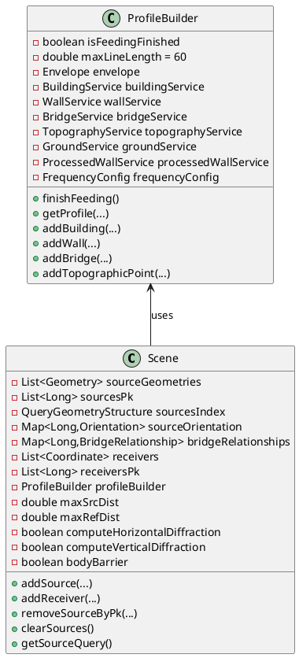
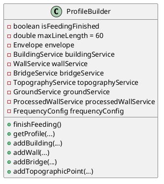
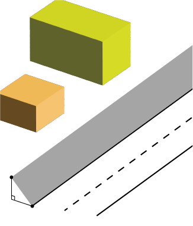
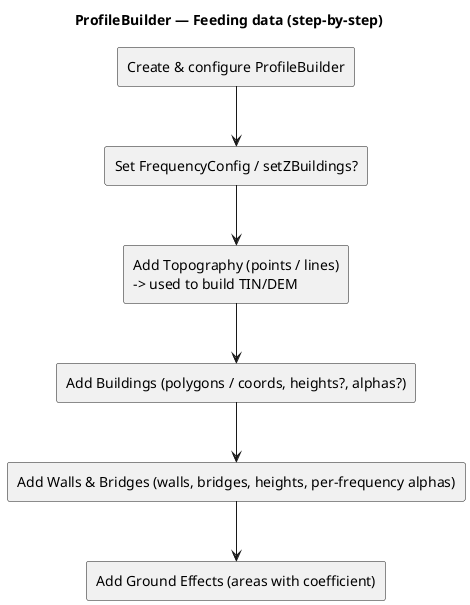
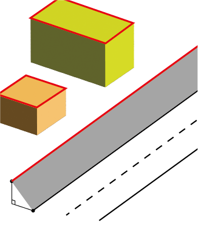
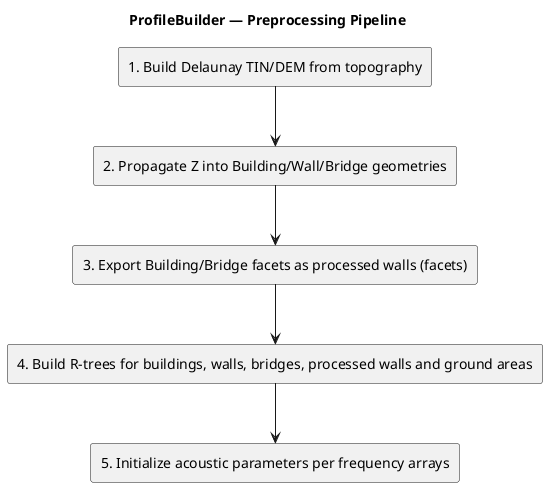
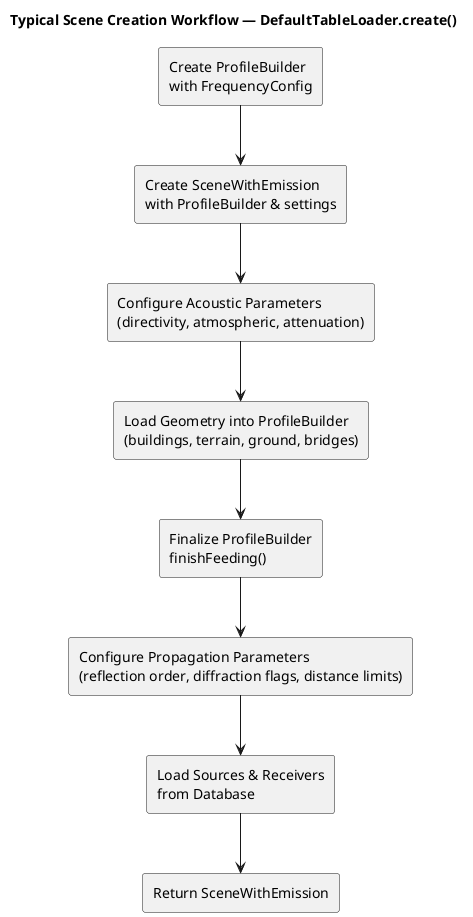

# Scene in NoiseModelling

- [Scene in NoiseModelling](#scene-in-noisemodelling)
  - [Overview](#overview)
  - [Class Structure](#class-structure)
  - [ProfileBuilder](#profilebuilder)
    - [Feeding Data into ProfileBuilder](#feeding-data-into-profilebuilder)
      - [Step-by-step procedure to feed data](#step-by-step-procedure-to-feed-data)
    - [Preprocessing ProfileBuilder](#preprocessing-profilebuilder)
      - [Preprocessing Pipeline](#preprocessing-pipeline)
      - [Role of Processed Walls](#role-of-processed-walls)
  - [Typical workflow of creating Scene](#typical-workflow-of-creating-scene)
  - [Related Classes](#related-classes)
  - [Related Documents](#related-documents)

## Overview

`Scene` is the runtime container used by propagation algorithms. It stores sources, receivers, and per-source metadata for the current cell, and it holds a reference to a finalized `ProfileBuilder` so that `PathFinder` can perform profile and path searches.

Key points:

- Register and store sources and receivers for the cell.
- Maintain the source spatial index.
- Hold propagation configuration values (distance limits, diffraction flags, and related settings).

## Class Structure

- **Sources**: Loaded for the current cell; emission levels live in `SceneWithEmission`.
  - `SourceGeometries`: Geometries of sources.
  - `SourcesPk`: Primary keys of sources.
  - `SourcesIndex`: Spatial index for source geometries.
  - `SourceOrientation`: Orientation metadata per source.
  - `BridgeRelationships`: Bridge and virtual source metadata per source.
  - `SourceHeightType`: Height interpretation (RELATIVE/ABSOLUTE) per source.
- **Receivers**: Loaded within the cell envelope.
  - `Receivers`: Receiver coordinates.
  - `ReceiversPk`: Receiver primary keys.
  - `ReceiverHeightType`: Height interpretation (RELATIVE/ABSOLUTE) per receiver.
- **Parameters**: Propagation settings and flags stored on `Scene` (reflection order, distance limits, diffraction flags, default ground attenuation).
  - `ReflexionOrder`: Maximum number of reflections.
  - `DefaultGroundAttenuation`: Fallback ground attenuation coefficient.
  - `MaxSrcDist`, `MaxRefDist`: Source collection and reflection distance limits.
  - `ComputeHorizontalDiffraction`, `ComputeVerticalDiffraction`, `BodyBarrier`: Diffraction and barrier flags.
- **ProfileBuilder**: Cell-loaded obstacles and terrain, finalized via `finishFeeding()`.
  - **Buildings**: Building polygons for obstruction/reflection (`BuildingService`).
  - **Walls**: Wall geometries used for reflection/diffraction(`WallService`).
  - **Bridges**: Bridge geometries (used in profile construction) (`BridgeService`).
  - **Terrain**: DEM/topography for ground interaction (`TopographyService`).
  - **Ground Areas**: Ground absorption properties (`GroundService`).

## ProfileBuilder

`ProfileBuilder` is an orchestrator over geometry services and spatial indexes. It ingests per-cell obstacles and terrain, builds DEM/TIN and processed facets in `finishFeeding()`, and then serves `getProfile(...)` / `CutProfile` queries.

Core internal services:

- `BuildingService`: building footprints, height propagation, building facet indexes.
- `WallService`: wall geometry, processed wall facets, wall indexes.
- `BridgeService`: bridge geometry and facet/index preparation.
- `TopographyService`: DEM/TIN creation and ground elevation queries.
- `GroundService`: ground absorption areas and queries.
- `ProcessedWallService`: spatial index for processed wall facets used in reflection/diffraction.
- `FrequencyConfig`: per-band frequency configuration used during preprocessing and queries.

The `ProfileBuilder` instance is typically created once per cell, populated with geometry and topography, then finalized by calling `finishFeeding()`. After finalization, the builder is usually treated as read-only and referenced by a `Scene` instance that holds sources and receivers.

### Feeding Data into ProfileBuilder

Obstacle geometries (buildings, walls, bridges, ground effects) and topography are ingested into a `ProfileBuilder` instance using its `addBuilding(...)`, `addWall(...)`, `addBridge(...)`, `addGroundEffect(...)`, `addTopographicPoint(...)` and `addTopographicLine(...)` methods.

Figure: Example of data feeding. Neither sources nor receivers are included at this moment.

#### Step-by-step procedure to feed data

- Create and configure a `ProfileBuilder` instance. `FrequencyConfig` is typically set at this point.
- Optionally set frequency arrays and `setZBuildings(true)` if building vertex z-values are meaningful.
- Add topography if available using `addTopographicPoint(...)` and/or `addTopographicLine(...)`. Topography is required for accurate elevation computations and for generating a TIN.
- Add buildings via `addBuilding(Geometry|Coordinate[], height?, alphas?, id?)`. Use the overloads that match your available data (polygon geometry, coordinate arrays, with or without heights and absorption coefficients).
- Add walls via `addWall(...)` and bridges via `addBridge(...)`. For walls you can provide per-frequency absorption lists and explicit heights. Bridges are treated similarly to walls for intersection purposes.
- Add ground absorption areas using `addGroundEffect(Geometry, coefficient)`.

### Preprocessing ProfileBuilder

Finalizing the `ProfileBuilder` by calling `finishFeeding()` executes a multi-step preprocessing pipeline that builds a TIN/DEM from topographic points, propagates elevations into buildings/walls/bridges, exports building and wall facets to spatial indexes, and constructs processed wall facets used for reflection and diffraction calculations.
The `ProfileBuilder` instance is effectively read-only after `finishFeeding()`.

Figure: Example of the ProfileBuilder preprocess. The processed walls (red lines) are constructed.

#### Preprocessing Pipeline

1. Delaunay triangulation (TIN/DEM) is constructed from topographic points/lines.
2. Geometries (Building, wall and bridge) get z-elevations computed from the DEM when needed.
3. Facets of Building and bridge are exported as "processed wall" having spatial indexes. The processed wall include the vertical faces used for reflection and diffraction calculations.
4. R-trees are built for geometries of buildings, walls, bridges, processed walls and ground areas.
5. Acoustic parameters (such as absorption coefficients) are initialized per frequency arrays.

#### Role of Processed Walls

- Processed walls representing vertical faces will be used by `PathFinder` and `ProfileRetriever` to detect reflections and edge diffractions.
- When computing reflections the algorithm queries the processed wall index to find candidate facets intersecting the reflection plane; for diffraction the precomputed wide-angle/diffraction points and processed wall edges are used to build diffraction planes.

## Typical workflow of creating Scene

A typical workflow for creating a `Scene` object in the JDBC module is implemented in `DefaultTableLoader.create()`. The method orchestrates the construction of a complete `SceneWithEmission` object for a given computation cell.

**Key Steps**:

1. **Initialize ProfileBuilder**  
   Create a `ProfileBuilder` instance with frequency configuration for the computation band (octave or third-octave).

2. **Create SceneWithEmission**  
   Instantiate `SceneWithEmission` with the `ProfileBuilder` and input settings. This extended Scene class adds emission spectra and virtual source management.

3. **Configure Acoustic Parameters**  
   - Set direction attributes (omnidirectional or train-specific directivity spheres)
   - Load and apply atmospheric attenuation parameters per time period (day/evening/night)
   - Apply frequency arrays to all parameters

4. **Load Geometry**  
   Fetch and add geometry from database tables:
   - **Buildings**: Load building polygons and heights within an expanded cell envelope
   - **Terrain (DEM)**: Load topographic points for ground elevation computation
   - **Ground Areas**: Load soil/ground absorption coefficients
   - **Bridges**: Load bridge geometries and metadata

5. **Finalize ProfileBuilder**  
   Call `finishFeeding()` to trigger the [preprocessing pipeline](scene.md#preprocessing-pipeline): TIN/DEM construction, elevation propagation, facet generation, and spatial index creation.

6. **Configure Propagation Parameters**  
   Set on the `Scene`:
   - Reflection order (number of ray bounces)
   - Diffraction computation flags (horizontal, vertical)
   - Distance limits (source propagation and reflection)
   - Body barrier flag

7. **Load Sources and Receivers**  
   - **Sources**: Fetch from emissions table within expanded envelope; add to scene with geometry, primary key, and orientation
   - **Receivers**: Fetch from receivers table within cell envelope; skip those already processed in other cells

For detailed information about scene preparation within the computation framework, see [Scene Preparation in NoiseMapByReceiverMaker](../Docs-dev/noisemapbyreceivermaker_algorithms.md#scene-preparation).

## Related Classes

- `SceneWithAttenuation`: Adds attenuation-related attributes (ground factor, directivity id, etc.).
- `SceneWithEmission`: JDBC module extension that integrates emission spectra and virtual sources.
- `SceneBuilder`: Test-friendly builder for concise scene setup.

## Related Documents

- Pathfinder flow: [Docs-dev/pathfinder_algorithms.md](pathfinder_algorithms.md)
- Computation framework: [Docs-dev/computation_scheme.md](computation_scheme.md)
