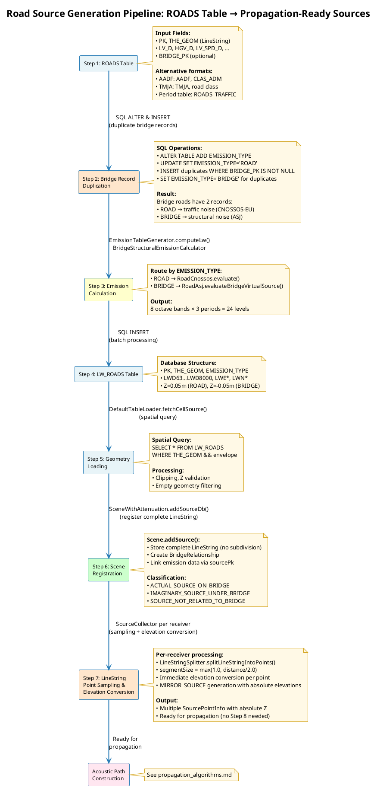

# Source identification algorithms

- [Source identification algorithms](#source-identification-algorithms)
  - [Concepts \& Overview — Road Emission Processing](#concepts--overview--road-emission-processing)
  - [Step 1: ROADS Table Creation](#step-1-roads-table-creation)
  - [Step 2: Bridge Record Duplication and Classification](#step-2-bridge-record-duplication-and-classification)
  - [Step 3: Emission Calculation](#step-3-emission-calculation)
    - [Route 1: Road Traffic Noise (SOURCE\_TYPE='ROAD')](#route-1-road-traffic-noise-source_typeroad)
    - [Route 2: Bridge Structural Noise (SOURCE\_TYPE='BRIDGE')](#route-2-bridge-structural-noise-source_typebridge)
  - [Step 4: LW\_ROADS Table Creation](#step-4-lw_roads-table-creation)
  - [Step 5: Geometry Loading](#step-5-geometry-loading)
  - [Step 6: Scene Registration](#step-6-scene-registration)
  - [Step 7: LineString Point Sampling and Elevation Conversion](#step-7-linestring-point-sampling-and-elevation-conversion)
  - [Integration with NoiseMapByReceiverMaker](#integration-with-noisemapbyreceivermaker)

## Concepts & Overview — Road Emission Processing

The road emission processing pipeline converts traffic data (`ROADS` table) into acoustic emission data (`LW_ROADS` table) and subsequently into propagation-ready source points. This process is summarized as follows:



## Step 1: ROADS Table Creation

The `ROADS` table creation process provides the input traffic data required for emission calculation. This user-defined table serves as the database prerequisite for the entire road emission processing pipeline.

**Data Preparation Process:**

The `ROADS` table is prepared through the following workflow:

1. **Format Selection** — User selects appropriate data format based on available traffic data (detailed period-specific, annual average flow, French TMJA, or period table)
2. **Table Creation** — User creates `ROADS` table with required fields according to selected format (see Data Structure section below)
3. **Data Population** — User populates table with traffic, geometry, and environmental data from available sources
4. **Format Conversion (if needed)** — For simplified formats (AADF/TMJA), WPS script applies standard hourly distribution patterns (Berengier et al., 2019) to convert daily flow to period-specific emissions during processing

**Data Structure:**

The `ROADS` table supports the following data format options:

1. **Standard Format (Detailed Traffic):**
   - **Required:** `THE_GEOM` (LineString with optional Z), `PK` (primary key), traffic flow per period (`LV_D`, `MV_D`, `HGV_D`, `WAV_D`, `WBV_D` in vehicles/hour), speed per period (`LV_SPD_D`, `MV_SPD_D`, `HGV_SPD_D`, `WAV_SPD_D`, `WBV_SPD_D` in km/h)
   - **Optional:** Environmental parameters (`PVMT`, `TEMP_D/E/N`, `TS_STUD`, `PM_STUD`), geometry parameters (`JUNC_DIST`, `JUNC_TYPE`, `WAY`, `SLOPE`), source height specification (`HEIGHT_TYPE`: 'ABSOLUTE' (default when Z coordinate exists) for absolute elevation, 'RELATIVE' (default when Z coordinate is absent) for height above ground), legacy fields (`TV_D`, `HV_D` for backward compatibility)
2. **AADF Format (Annual Average Flow):**
   - **Required:** `THE_GEOM` (LineString), `PK`, `AADF` (vehicles/day), `CLAS_ADM` (road category: 1=Motorway, 2=National, 3+=Local)
3. **TMJA Format (French Standard):**
   - **Required:** `THE_GEOM` (LineString), `PK`, `TMJA` (annual average daily flow), road classification
4. **Period Table Format:**
   - **Required:** Main `ROADS` table (`THE_GEOM`, `PK`) linked to separate `ROADS_TRAFFIC` table containing detailed period-specific traffic parameters, enabling flexible traffic scenario management

**Related WPS Scripts:**
- `Road_Emission_from_Traffic.groovy` — reads standard format (detailed period-specific traffic)
- `Road_Emission_From_AADF.groovy` — reads AADF format (annual average daily flow)
- `Road_Emission_From_TMJA.groovy` — reads TMJA format (French standard)
- `Noise_level_from_traffic.groovy` — reads traffic with direct propagation calculation

**Output:**
`ROADS` table with traffic and geometry data ready for source type classification (Step 2)

## Step 2: Bridge Record Duplication and Classification

The bridge record duplication and classification process prepares separate emission calculation records for road traffic noise and bridge structural noise. This step creates the necessary data structure to compute both emission types for roads located on bridges.

**SQL Processing:**

The record duplication workflow consists of the following SQL operations:

1. **Add EMISSION_TYPE Column** — `ALTER TABLE ROADS ADD COLUMN EMISSION_TYPE VARCHAR(20)` adds source type classification field
2. **Initialize All Records** — `UPDATE ROADS SET EMISSION_TYPE='ROAD'` marks all records as road traffic noise sources
3. **Duplicate Bridge Records** — `INSERT INTO ROADS (PK, THE_GEOM, ..., EMISSION_TYPE, BRIDGE_PK) SELECT ..., 'BRIDGE', BRIDGE_PK FROM ROADS WHERE BRIDGE_PK IS NOT NULL` creates duplicate records for roads on bridges
4. **PK Reassignment** — New primary keys are generated for duplicated records to maintain referential integrity

**Processing Logic:**

*Bridge Detection:*
- Records with `BRIDGE_PK IS NOT NULL` indicate roads located on bridge structures
- These records require dual emission calculation: traffic noise + structural noise

*Record Types After Duplication:*
- **EMISSION_TYPE='ROAD'** — Original records for all roads, calculated using CNOSSOS-EU methodology for tire/engine noise, preserves original `HEIGHT_TYPE`
- **EMISSION_TYPE='BRIDGE'** — Duplicated records for bridge roads only, calculated using ASJ methodology for structural vibration noise, `HEIGHT_TYPE` is set to 'RELATIVE' (bridge structural sources use relative height from bridge deck)

**Data Flow Example:**

```sql
-- Before duplication (Step 1 output):
PK=1, GEOM=LineString(...), LV_D=100, BRIDGE_PK=NULL, EMISSION_TYPE='ROAD'
PK=2, GEOM=LineString(...), LV_D=200, BRIDGE_PK=5, EMISSION_TYPE='ROAD'

-- After duplication (Step 2 output):
PK=1, GEOM=LineString(...), LV_D=100, BRIDGE_PK=NULL, EMISSION_TYPE='ROAD'
PK=2, GEOM=LineString(...), LV_D=200, BRIDGE_PK=5, EMISSION_TYPE='ROAD'
PK=3, GEOM=LineString(...), LV_D=200, BRIDGE_PK=5, EMISSION_TYPE='BRIDGE'  ← Duplicate
```

**Output:**
`ROADS` table with `EMISSION_TYPE` classification ready for emission calculation (Step 3)

## Step 3: Emission Calculation

The emission generation process transforms road segment data with traffic parameters into sound power level tables. The calculation method is determined by `EMISSION_TYPE` field: CNOSSOS-EU for road traffic noise (`EMISSION_TYPE='ROAD'`) and ASJ for bridge structural noise (`EMISSION_TYPE='BRIDGE'`).

**Calculation Process:**

The emission calculation workflow routes to different calculation engines based on `EMISSION_TYPE`:

### Route 1: Road Traffic Noise (EMISSION_TYPE='ROAD')

The calculation process is implemented on `org.noise_planet.noisemodelling.emission.jdbc.EmissionTableGenerator` class and the  `computeLw()` method orchestrates the entire emission calculation workflow by coordinating parameter extraction, period-wise processing, and frequency band iteration.

1. **Parameter Extraction** — `cmptEmissionFromTrafficDb()` extracts period-specific traffic flow (LV/MV/HGV/WAV/WBV), speeds, environmental conditions (pavement, temperature, studs), and road geometry (junction, slope, way) from database using cached field indices (`sourceFieldsCache`) for performance. Also supports legacy format with TV (total vehicles) and HV (heavy vehicles) columns for backward compatibility
2. **Period-wise Calculation** — `computeLw()` calls `cmptEmissionFromTrafficDb()` three times (suffixes "_D", "_E", "_N") to compute sound power levels independently for:
   - **Day (D)** — typically 06:00-18:00
   - **Evening (E)** — typically 18:00-22:00  
   - **Night (N)** — typically 22:00-06:00
3. **Frequency Band Iteration** — for each period, emissions are calculated across 8 octave bands:
   - **63, 125, 250, 500, 1000, 2000, 4000, 8000 Hz**
4. **CNOSSOS-EU Evaluation** — `RoadCnossos.evaluate()` is called once per frequency band, applying CNOSSOS-EU model formulas with empirically-derived coefficients (version 1=2015 or version 2=2020). It processes traffic parameters (vehicle counts, speeds, pavement type, temperature, slope, junction, etc.) and calculates vehicle-type-specific rolling/propulsion noise, then combines them into a single sound power level (dB) for that frequency
5. **Unit Conversion** — `computeLw()` converts results to watts using `dBToW()`, then WPS script converts back to dB using `wToDb()` for database storage

### Route 2: Bridge Structural Noise (EMISSION_TYPE='BRIDGE')

The calculation process is implemented on `org.noise_planet.noisemodelling.jdbc.BridgeStructuralEmissionCalculator` class and the `computeStructuralLw()` method orchestrates the bridge structural noise calculation workflow by coordinating bridge metadata retrieval, parameter extraction, period-wise processing, and frequency band iteration.

1. **Bridge Metadata Retrieval** — Retrieves bridge structure information (girder type, slab type) from Bridge database using `BRIDGE_PK` field
2. **Parameter Extraction** — `getStructuralEmissionFromTrafficTable()` extracts MV and HGV traffic flow and speeds (`LV`/`WAV`/`WBV` are ignored as light vehicles do not significantly contribute to structural vibration)
3. **Period-wise Calculation** — `computeStructuralLw()` calls `getStructuralEmissionFromTrafficTable()` three times for Day/Evening/Night periods
4. **Frequency Band Iteration** — for each period, structural emissions are calculated across 8 octave bands:
   - **63, 125, 250, 500, 1000, 2000, 4000, 8000 Hz**
5. **ASJ Evaluation** — `RoadAsj.evaluateBridgeVirtualSource()` applies ASJ 2023 methodology with bridge-specific coefficients. Formula: `LW = a(f) + b(f) × log10(V)` where coefficients `a(f)` and `b(f)` depend on bridge structure type (girder + slab combination) and frequency
6. **Unit Conversion** — Traffic flow correction is applied using `Vperhour2NoiseLevel()` similar to CNOSSOS-EU pattern, converting vehicle counts to sound power level contributions

**Output:**
- **Dimensions:** [3 periods] × [8 frequencies] = 24 emission values per road segment
- **Units:** Sound power level in dB (decibels)
- **Format:** Ready for insertion into LW_ROADS table columns (LWD63...LWD8000, LWE63...LWE8000, LWN63...LWN8000)
- **EMISSION_TYPE Field:** Preserved from input to distinguish calculation methodology in downstream processing

## Step 4: LW_ROADS Table Creation

The calculated emission data is stored in the `LW_ROADS` table, which serves as the emission database for propagation calculations.

**Database Operations and Structure:**

*Table Definition:*
- **27 columns:** `PK` (integer), `THE_GEOM` (geometry), `EMISSION_TYPE` (varchar), `BRIDGE_PK` (integer, nullable), 24 emission levels (double precision)
- **Storage:** Relational database with spatial indexing (PostgreSQL/H2GIS)
- **Fields:** `LWD63...LWD8000` (Day), `LWE63...LWE8000` (Evening), `LWN63...LWN8000` (Night) — 8 octave bands per period
- **EMISSION_TYPE Values:** 'ROAD' for traffic noise, 'BRIDGE' for structural noise

*SQL Workflow:*
1. `CREATE TABLE LW_ROADS (...)` — defines table structure with 27 columns including EMISSION_TYPE and BRIDGE_PK
2. `INSERT INTO LW_ROADS (...) VALUES (...)` — batch inserts emission records (100 records/batch for performance), preserving EMISSION_TYPE from ROADS table
3. `UPDATE LW_ROADS SET THE_GEOM = ST_UPDATEZ(The_geom, 0.05) WHERE EMISSION_TYPE = 'ROAD'` — assigns Z=0.05m to road traffic noise sources
4. `UPDATE LW_ROADS SET THE_GEOM = ST_UPDATEZ(The_geom, -0.05) WHERE EMISSION_TYPE = 'BRIDGE'` — assigns Z=-0.05m to bridge structural noise sources (below deck)
5. `UPDATE LW_ROADS SET HEIGHT_TYPE = 'RELATIVE'` — marks all Z values as relative heights (ground-relative for ROAD, deck-relative for BRIDGE)
6. `ALTER TABLE LW_ROADS ADD PRIMARY KEY (PK)` — sets primary key constraint for referential integrity

*Height Convention:*
- **Road sources (EMISSION_TYPE='ROAD'):** Z=0.05m represents acoustic source height above road surface (bridge deck if on bridge), `HEIGHT_TYPE='RELATIVE'`
- **Bridge sources (EMISSION_TYPE='BRIDGE'):** Z=-0.05m represents structural vibration source below deck surface, modeling sound radiation from bridge structure itself, `HEIGHT_TYPE='RELATIVE'`
- These values undergo coordinate transformation during propagation (Step 7) to convert relative heights to absolute elevations based on actual terrain or bridge deck surfaces

*Bridge Source Handling:*
- **EMISSION_TYPE='ROAD'**: Normal propagation from road surface (bridge deck if on bridge)
- **EMISSION_TYPE='BRIDGE'**: Creates IMAGINARY_SOURCE_UNDER_BRIDGE during Step 7 sampling for structural noise modeling with negative Z offset

**Output:**
LW_ROADS table with 27 columns containing emission data (24 sound power levels), geometry with Z coordinates, and EMISSION_TYPE classification, ready for geometry loading (Step 5)

## Step 5: Geometry Loading

The geometry loading process, implemented in `org.noise_planet.noisemodelling.jdbc.utils.DefaultTableLoader` class, queries the LW_ROADS table within a spatial calculation area (envelope) and prepares geometries for Scene registration (Step 6).

**Loading Process:**

The `fetchCellSource()` method orchestrates the geometry loading workflow through the following operations:

1. **Metadata Retrieval** — `getGeometryColumnNames()` locates the geometry column name, and `getIntegerPrimaryKeyNameAndIndex()` retrieves primary key field information for linking emission data
2. **Spatial Query** — Executes `SELECT * FROM LW_ROADS WHERE THE_GEOM && envelope` using spatial operator `&&` to trigger bounding box intersection test with automatic spatial index usage. Query uses fetch size and forward-only cursor to minimize memory consumption
3. **Field Loading** — For each record, loads `EMISSION_TYPE`, `BRIDGE_PK`, and `HEIGHT_TYPE` fields to determine source classification and height interpretation. 
4. **Geometry Processing** — For each loaded geometry, applies optional clipping to envelope boundary using JTS `intersection()`, filters empty geometries via `isEmpty()`, and validates that all vertices have valid Z coordinates (missing Z triggers immediate error)
5. **Result Streaming** — Processes large result sets incrementally through streaming, enabling envelope-based filtering to load only sources within calculation area and performing early validation before propagation

**Output:**
Validated LineString geometries with Z coordinates, primary keys, and metadata, ready for Scene registration (Step 6)

## Step 6: Scene Registration

The Scene registration process, implemented in `org.noise_planet.noisemodelling.propagation.SceneWithAttenuation` class, registers database geometries into Scene with their attributes. **This step does NOT decompose LineStrings** — geometries are stored as-is for later processing during propagation (Step 7).

**Registration Process:**

The `addSourceDb()` / `doAddSourceDb()` method orchestrates the Scene registration workflow through the following operations:

1. **Metadata Extraction (First Call Only):**
   - Reads ResultSet metadata to build column name → index map
   - Identifies optional columns: 
     - `YAW`, `PITCH`, `ROLL`: orientation angles
     - `HEIGHT_TYPE`: height interpretation type (RELATIVE: height above ground/deck, ABSOLUTE: absolute elevation in DEM coordinate system)
     - `DIR_ID`: directivity identifier for emission pattern
     - `GS`: ground factor for surface absorption
     - `BRIDGE_PK`: bridge primary key
     - `EMISSION_TYPE`: source type classification

2. **BridgeRelationship Creation:**
   - **No bridges in ProfileBuilder:** Default BridgeRelationship (`SOURCE_NOT_RELATED_TO_BRIDGE`)
   - **BRIDGE_PK is NULL or -1:** Default BridgeRelationship (`SOURCE_NOT_RELATED_TO_BRIDGE`)
   - **BRIDGE_PK ≥ 0:** Create BridgeRelationship based on `EMISSION_TYPE`:
     - `EMISSION_TYPE='ROAD'` → `ACTUAL_SOURCE_ON_BRIDGE(bridgePkOn=BRIDGE_PK, bridgePkAbove=-1)`
     - `EMISSION_TYPE='BRIDGE'` → `IMAGINARY_SOURCE_UNDER_BRIDGE(bridgePkOn=-1, bridgePkAbove=BRIDGE_PK)`
     - Unknown EMISSION_TYPE → Throw IllegalArgumentException

3. **Scene Registration:**
   - Calls `Scene.addSource(pk, geom, orientation, heightType, bridgeRelationship)`
   - **Bridge footprint validation:** If bridgePkOn ≥ 0, verifies geometry is within bridge footprint
   - Stores complete LineString geometry without subdivision
   - Registers orientation (if present), height type (if present, default RELATIVE), and bridge properties (if applicable)
   - Assigns unique `sourceIndex` for spatial queries and stores `sourcePk` (database primary key) for emission data lookup

4. **Emission Data Linkage:**
   - Associates registered source with emission data from LW_ROADS table via `sourcePk`
   - Each source references 24 sound power levels (3 periods × 8 frequency bands)

**Data Storage in Scene:**

After registration, each source has the following attributes stored in Scene maps (indexed by sourcePk):
- **Geometry:** `scene.sourceGeometries` — LineString or Point geometry
- **Orientation:** `scene.sourceOrientation` — Yaw/pitch/roll angles for directivity
- **Bridge properties:** `scene.bridgeRelationships` — Source type (bridge relationship: `ACTUAL_SOURCE_ON_BRIDGE`, `IMAGINARY_SOURCE_UNDER_BRIDGE`, or `SOURCE_NOT_RELATED_TO_BRIDGE`) and primary keys of the bridge.
- **Height type:** `scene.sourceHeightType` — How to interpret Z coordinates (`RELATIVE` or `ABSOLUTE`)
- **Ground factor:** `SceneWithAttenuation.sourceGs` — Surface absorption coefficient
- **Directivity:** `SceneWithAttenuation.sourceEmissionAttenuation` — Emission pattern reference

**Key Behavior:**

- **No Geometric Decomposition:** LineString geometries stored as complete objects in Scene
- **One-to-One Mapping:** Each LW_ROADS record → one Scene source
- **Attribute Preservation:** All database attributes (orientation, GS, bridge properties) stored with geometry
- **Deferred Point Sampling:** LineString decomposition into discrete points occurs later during sampling and height transformation (Steps 7-8)

**Output:**
Scene populated with source geometries, attributes, and emission data, ready for LineString point sampling and elevation conversion (Step 7)

## Step 7: LineString Point Sampling and Elevation Conversion

This step samples Scene-registered LineString geometries into discrete point sources with absolute elevations for propagation calculations. The implementation uses `LineStringSplitter.splitLineStringIntoPoints()` and `SourceCollector.calculateAbsoluteElevation()` to convert LineString geometries into discrete point samples with correct absolute elevations in a single integrated process. During propagation calculation, this process is performed for each receiver based on receiver-source distance.

**Algorithm:**

1. **Input:**
   - Scene-registered LineString geometries (complete road segments from Step 6)
   - Source attributes: `sourcePk`, `bridgeRelationship`, orientation
   - Receiver position for distance-based sampling calculation

2. **Segment Size Determination:**
   - `segmentSizeConstraint = max(1.0, receiverDistance / 2.0)`
   - Ensures point density adapts to receiver proximity
   - Closer receivers → higher sampling density for accuracy

3. **Short Geometry Handling** (length < segmentSizeConstraint):
   - Single midpoint at `length / 2.0` position
   - Entire segment treated as one point source

4. **Long Geometry Handling** (length ≥ segmentSizeConstraint):
   - `numSegments = ceil(length / segmentSizeConstraint)`
   - `actualSegmentSize = length / numSegments`
   - Points placed at regular intervals along LineString

5. **Elevation Conversion:**
   - **For each sampled point**, retrieve `HEIGHT_TYPE` from Scene via `scene.getSourceHeightTypeByPk(sourcePk)`
   - **If HEIGHT_TYPE = RELATIVE (default):**
     - Call `calculateAbsoluteElevation()` to convert relative Z to absolute elevation based on `BridgeRelationship`:
       - **SOURCE_NOT_RELATED_TO_BRIDGE:** `absoluteZ = DEM_ground_elevation + coord.z` (typically DEM + 0.05m)
       - **ACTUAL_SOURCE_ON_BRIDGE:** `absoluteZ = bridge_deck_height + coord.z` (typically deck + 0.05m)
       - **IMAGINARY_SOURCE_UNDER_BRIDGE:** `absoluteZ = (bridge_deck_height - deck_thickness) + coord.z` (typically bridge_bottom - 0.05m)
   - **If HEIGHT_TYPE = ABSOLUTE:**
     - Skip elevation conversion — `coord.z` already contains absolute elevation in DEM coordinate system
     - Use Z coordinate as-is (no transformation needed)
   - **Result:** After this step, `coord.z` always contains absolute elevation regardless of original `HEIGHT_TYPE`

6. **SourcePointInfo Creation:**
   - Each sampled point becomes a `SourcePointInfo` object **with absolute elevation**
   - All points share the same `sourcePk` for emission data lookup
   - Position (with absolute Z), segment length (`li`), orientation, and `bridgeRelationship` assigned to each point
   - **Note:** This step is executed for all sources regardless of `HEIGHT_TYPE`

7. **MIRROR_SOURCE Generation (Bridge Reflection):**
   - `addMirrorSourceIfNeeded()` checks if each sampled point (with absolute elevation) is within any bridge footprint (2D projection)
   - **Conditions for MIRROR_SOURCE creation:**
     - Source point must be within bridge footprint (`bridge.isPointWithinBridgeFootprint()`)
     - Original source type must NOT be `IMAGINARY_SOURCE_UNDER_BRIDGE` (skip virtual sources)
     - If original source is `ACTUAL_SOURCE_ON_BRIDGE`, skip the bridge it's on (only create MIRROR_SOURCE for other bridges above)
     - Bridge bottom (`deckHeight - deckThickness`) must be above source Z elevation (absolute)
     - Among multiple qualifying bridges, select the one with minimum bridge bottom height
   - **MIRROR_SOURCE properties:**
     - `RelationType = MIRROR_SOURCE`
     - `bridgePkAbove` = bridge causing reflection (minimum bridge bottom above source)
     - `bridgePkOn` = inherited from original if `ACTUAL_SOURCE_ON_BRIDGE`, otherwise `-1`
     - Same `sourcePk`, orientation as original (shares emission data)
     - **Absolute elevation:** Calculated using reflection formula: `originalZ + 2 × (bridgeBottom - originalZ)`
   - **Physical meaning:** Represents sound reflection from bridge underside, modeling secondary sound path from bridge structure

**Output:**
- Multiple `SourcePointInfo` objects with **absolute elevations** (discrete point sources sampled from LineString)
- Additional `MIRROR_SOURCE` objects for sources under bridge footprints (bridge reflection modeling) with **absolute elevations**
- Each point retains: position coordinates with **absolute Z**, segment length (`li`), `sourcePk` (for emission data lookup), `bridgeRelationship`, orientation
- **Ready for propagation:** Source processing complete with absolute elevations. Receiver elevation conversion and acoustic path construction are handled in propagation phase (see [propagation_algorithms.md](propagation_algorithms.md))

**Key Design Principles:**

- **Integrated Processing:** Sampling and elevation conversion performed in single pass, eliminating redundant coordinate transformation
- **Receiver-Dependent:** Sampling density varies per receiver based on distance
- **Absolute Coordinates:** All output coordinates use absolute elevations (sea level reference), ready for direct propagation calculation
- **Post-Scene Processing:** Operates on geometries already registered in Scene (Step 6)
- **Per-Calculation Execution:** Performed repeatedly for each receiver during propagation
- **Shared Emission Data:** All sampled points from same LineString reference same emission data via `sourcePk`
- **Bridge Reflection:** MIRROR_SOURCE generation uses absolute elevations for accurate reflection modeling

## Integration with NoiseMapByReceiverMaker

The complete source processing pipeline (Steps 1-7) is orchestrated within the cell-based computation framework by `NoiseMapByReceiverMaker`. This orchestration is hierarchically structured:

**Pipeline Orchestration:**
- **Steps 1-4:** Pre-computation phase (typically executed once during initialization)
  - Steps 1-3 occur outside the cell iteration loop, transforming `ROADS` table → `LW_ROADS` table with emissions
  - Step 4 stores the emission table in the database
  - These steps are independent of cell boundaries and receiver locations

- **Steps 5-7:** Per-cell computation phase (executed for each calculation cell and receiver)
  - Step 5 loads source geometries within the current cell envelope
  - Step 6 registers loaded geometries in the computation Scene
  - Step 7 samples geometries into discrete point sources during propagation (per receiver)
  - These steps are cell-aware and receiver-dependent, integrated into the spatial partitioning strategy

**Cell-Based Computation Structure:**

`NoiseMapByReceiverMaker` decomposes the computation domain into grid cells and processes each cell independently. Within each cell:

1. Sources are loaded from `LW_ROADS` (Step 5) based on cell spatial envelope
2. Loaded sources are registered in Scene (Step 6) with metadata and bridge properties
3. For each receiver in that cell, LineString sources are sampled into discrete points (Step 7) with receiver-dependent sampling density
4. Acoustic propagation is computed between sampled source points and receivers

For comprehensive details on how `NoiseMapByReceiverMaker` orchestrates the entire computation pipeline including both source and receiver processing, cell-based decomposition, threading model, and coordinate system handling, see `noisemapbyreceivermaker_algorithms.md`.

This source processing pipeline integrates seamlessly with the receiver processing pipeline (see [receiver_algorithms.md](receiver_algorithms.md)), ensuring that both sources and receivers are prepared with absolute elevations and ready for accurate acoustic propagation computation within each calculation cell.