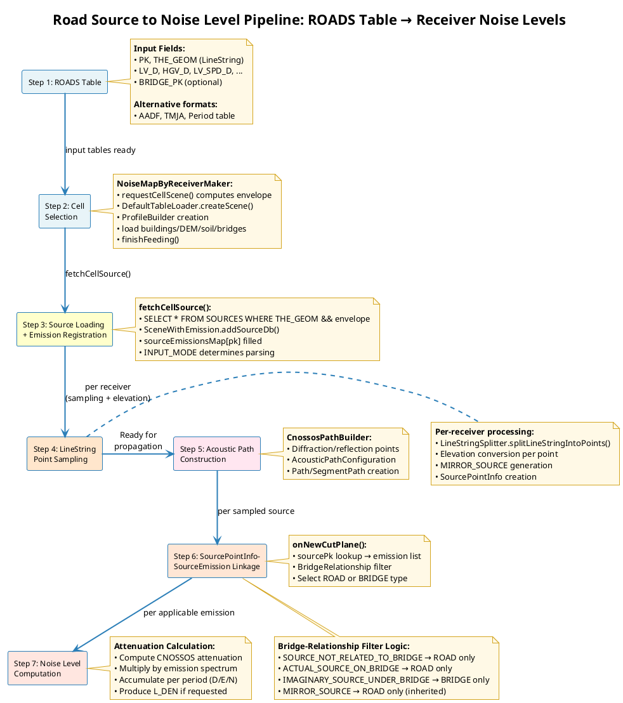

# Source identification algorithms

- [Source identification algorithms](#source-identification-algorithms)
  - [Concepts \& Overview — Road Emission Processing](#concepts--overview--road-emission-processing)
  - [Step 1: ROADS Table Creation](#step-1-roads-table-creation)
  - [Step 2: Cell Selection and Scene Context Preparation](#step-2-cell-selection-and-scene-context-preparation)
  - [Step 3: Source Loading, Emission Calculation, and Scene Registration](#step-3-source-loading-emission-calculation-and-scene-registration)
  - [Step 4: LineString Point Sampling and Elevation Conversion](#step-4-linestring-point-sampling-and-elevation-conversion)

## Concepts & Overview — Road Emission Processing

The source identification and propagation pipeline converts traffic data (`ROADS` table) into per-source geometry and emission data, then into propagation-ready source points, and finally computes noise levels at receivers by linking sources to their emissions. The entire process is decomposed into two main phases:

**Phase 1: Source Processing (Steps 1-4)** — Prepare source geometries and emissions for propagation
- Step 1: User creates `ROADS` table with traffic data
- Step 2: Cell selection and scene context preparation
- Step 3: Source geometry and emission registration into Scene
- Step 4: LineString sampling and SourcePointInfo creation (for each receiver)

**Phase 2: Propagation Calculation** — Link sampled sources to emissions and compute noise levels
- Acoustic path construction (see [propagation_algorithms.md](propagation_algorithms.md))
- **SourcePointInfo-SourceEmission linkage:** Each sampled point is dynamically linked to its emission data via `sourcePk` lookup and bridge-relationship filtering (see [propagation_algorithms.md#sourcepointinfo-sourceemission-linkage-during-propagation](propagation_algorithms.md#sourcepointinfo-sourceemission-linkage-during-propagation))
- Attenuation computation and noise level accumulation at receiver

**Key Concepts:**

- **Source Geometry:** LineString representation of road segment stored in `Scene` (Step 3) with attributes including `sourcePk`, height type, orientation, and bridge relationship; provides spatial foundation for sampled points
- **SourceEmission:** Period-specific emission spectrum (D/E/N) stored in `sourceEmissionsMap` indexed by `sourcePk` (Step 3); contains `emissionInWatts` and `emissionType` (ROAD or BRIDGE) for dual-source scenarios
- **SourcePointInfo:** Discrete point sampled from a LineString road segment (Step 4) with absolute elevation, segment length, and `sourcePk` linking back to both source geometry and emission data
- **BridgeRelationship:** Classification of each sampled point's relationship to bridge infrastructure; determines filtering of applicable emissions during propagation (ROAD-only, BRIDGE-only, or dual)
- **EmissionType:** Label indicating emission source (ROAD for traffic, BRIDGE for structural/impact sound); enables dual-source representation allowing single geometry to carry both traffic and bridge noise contributions
- **Period-Specific Calculation:** D, E, N periods handled separately throughout; combined into L_DEN using standardized weights if requested

**Data Flow Summary:**

Traffic data (`ROADS`) → [Step 3: Register in Scene] → Source Geometry + Emission Spectra → [Step 4: Sample per receiver] → `SourcePointInfo` (linked to both via `sourcePk`) → [Propagation: Build paths] → [Apply bridge-based filtering] → Compute attenuation × filtered spectrum → Accumulate at receiver

**Orchestration by NoiseMapByReceiverMaker:**

The entire pipeline is orchestrated within a cell-based computation framework:
- `NoiseMapByReceiverMaker` decomposes the computation domain into grid cells and processes each cell independently
- **Per-cell workflow:**
  1. Cell envelope is selected and expanded (Step 2)
  2. ProfileBuilder is created and populated with buildings, DEM, soil areas, and bridges (Step 2)
  3. ProfileBuilder is finalized (`finishFeeding()`) to build spatial indices (Step 2)
  4. Sources are loaded with geometries and emissions registered in Scene (Step 3)
  5. For each receiver in the cell, source geometries are sampled into discrete points (Step 4) with receiver-dependent density
  6. Acoustic paths are constructed and sampled points are linked to their emissions via `sourcePk` (see [propagation_algorithms.md](propagation_algorithms.md#sourcepointinfo-sourceemission-linkage-during-propagation))
- **Key efficiency:** Geometry data (buildings, bridges) and source emission data are registered once per cell but used independently for each receiver, enabling efficient multi-receiver processing
- **Spatial data timing:** Buildings, DEM, soil, and bridges are loaded in Step 2 **before** sources (Step 3), ensuring all geometry context is available for source elevation conversion
- See [noisemapbyreceivermaker_algorithms.md](noisemapbyreceivermaker_algorithms.md) for comprehensive orchestration details including receiver processing, cell-based decomposition, and threading model

## Step 1: ROADS Table Creation

Step 1 performs preprocessing of traffic input to prepare the database tables required by `fetchCell()`.

This includes validating and normalizing input formats (detailed, AADF, TMJA), populating the `ROADS` table with geometry and period-specific traffic fields, ensuring a primary key and spatial indices exist, and applying optional conversions or defaults (e.g., period distribution from AADF/TMJA). The prepared tables (and any derived tables) are then ready to be consumed by `DefaultTableLoader.fetchCellSource()` during cell processing.

The `ROADS` table creation process provides the input traffic data required for emission calculation. This user-defined table serves as the database prerequisite for the entire road emission processing pipeline.

**Data Preparation Process:**

The `ROADS` table is prepared through the following workflow:

1. **Format Selection** — User selects appropriate data format based on available traffic data (detailed period-specific, annual average flow, French TMJA, or period table)
2. **Table Creation** — User creates `ROADS` table with required fields according to selected format (see Data Structure section below)
3. **Data Population** — User populates table with traffic, geometry, and environmental data from available sources
4. **Format Conversion (if needed)** — For simplified formats (AADF/TMJA), WPS script applies standard hourly distribution patterns (Berengier et al., 2019) to convert daily flow to period-specific emissions during processing

**Data Structure:**

The `ROADS` table supports the following data format options:

1. **Standard Format (Detailed Traffic):**
   - **Required:** `THE_GEOM` (LineString with optional Z), `PK` (primary key), traffic flow per period (`LV_D`, `MV_D`, `HGV_D`, `WAV_D`, `WBV_D` in vehicles/hour), speed per period (`LV_SPD_D`, `MV_SPD_D`, `HGV_SPD_D`, `WAV_SPD_D`, `WBV_SPD_D` in km/h)
   - **Optional:** Environmental parameters (`PVMT`, `TEMP_D/E/N`, `TS_STUD`, `PM_STUD`), geometry parameters (`JUNC_DIST`, `JUNC_TYPE`, `WAY`, `SLOPE`), source height specification (`HEIGHT_TYPE`: 'ABSOLUTE' (default when Z coordinate exists) for absolute elevation, 'RELATIVE' (default when Z coordinate is absent) for height above ground), bridge linking (`BRIDGE_PK` to reference bridge in `BRIDGE_POINTS` table for elevation conversion and reflection modeling), legacy fields (`TV_D`, `HV_D` for backward compatibility)
2. **AADF Format (Annual Average Flow):**
   - **Required:** `THE_GEOM` (LineString), `PK`, `AADF` (vehicles/day), `CLAS_ADM` (road category: 1=Motorway, 2=National, 3+=Local)
3. **TMJA Format (French Standard):**
   - **Required:** `THE_GEOM` (LineString), `PK`, `TMJA` (annual average daily flow), road classification
4. **Period Table Format:**
   - **Required:** Main `ROADS` table (`THE_GEOM`, `PK`) linked to separate `ROADS_TRAFFIC` table containing detailed period-specific traffic parameters, enabling flexible traffic scenario management

**Related WPS Scripts:**
- `Road_Emission_from_Traffic.groovy` — reads standard format (detailed period-specific traffic)
- `Road_Emission_From_AADF.groovy` — reads AADF format (annual average daily flow)
- `Road_Emission_From_TMJA.groovy` — reads TMJA format (French standard)
- `Noise_level_from_traffic.groovy` — reads traffic with direct propagation calculation

**Related Input Tables:**
- `ROADS` — Main traffic data table (required)
- `BRIDGE_POINTS` — Bridge geometry and structural properties (optional, referenced by `BRIDGE_PK` in ROADS table)
  - **Required fields:** `PK`, `THE_GEOM` (Point), `BRIDGE_PK`, `POSITION` (CENTER/LEFT/RIGHT), structural properties (deck height, width, thickness, barrier heights, girder type, slab type)
  - Loaded in Step 2 by `fetchCellBridge()` for bridge reflection modeling and elevation conversion

**Output:**
`ROADS` table (and optional `BRIDGE_POINTS` table) with traffic and geometry data ready for cell selection (Step 2)

## Step 2: Cell Selection and Scene Context Preparation

Cell selection and scene context preparation happen before any source loading or emission calculation. This step establishes the spatial extent and loads all geometry data needed for propagation path construction.

**Implementation in `DefaultTableLoader.createScene()`:**

1. **Cell Envelope Computation:**
   - `cellEnvelope = noiseMapByReceiverMaker.getCellEnv(cellIndex)`
   - `expandedCellEnvelop = cellEnvelope.expandBy(maximumPropagationDistance + 2 * maximumReflectionDistance)`
   - Expanded envelope ensures continuity between subdomains by including propagation and reflection distances

2. **ProfileBuilder Creation:**
   - `profileBuilder = new ProfileBuilder(frequencyConfig)` ← **Created at this stage**
   - `scene = new SceneWithEmission(profileBuilder, emissionInputSettings)`
   - ProfileBuilder is initialized before any geometry data loading

3. **Geometry Data Loading into ProfileBuilder:**
   - **Buildings:** `fetchCellBuilding(connection, expandedCellEnvelop, profileBuilder, geometryFactory)`
     - Loads building footprints with height and absorption coefficients
     - Includes walls extracted from LineString geometries
   - **DEM (Digital Elevation Model):** `fetchCellTerrain(connection, expandedCellEnvelop, profileBuilder)`
     - Loads topographic points for ground elevation interpolation
   - **Soil Areas:** `fetchCellGround(connection, expandedCellEnvelop, profileBuilder)`
     - Loads ground surface properties (absorption coefficient G)
     - Splits large polygons into smaller cells for efficient processing
   - **Bridges:** `fetchCellBridge(connection, expandedCellEnvelop, profileBuilder, geometryFactory)`
     - Loads BRIDGE_POINTS table, groups by BRIDGE_PK, creates Bridge objects
     - Adds bridge geometry for reflection and diffraction modeling

4. **ProfileBuilder Finalization:**
   - `profileBuilder.finishFeeding()` ← **Critical step**
   - Builds spatial indices (STRtree) for buildings, walls, bridges
   - Exports bridge facets to processed walls for profile intersection
   - Prepares topography triangulation for elevation queries
   - **After this point, no new geometry can be added to ProfileBuilder**

5. **Scene Configuration:**
   - Set reflection order, body barrier, diffraction options
   - Set maximum propagation/reflection distances
   - Scene is now ready for source loading

**Key Points:**
- All geometry data (buildings, DEM, soil, **bridges**) is loaded using **expandedCellEnvelop**
- ProfileBuilder must be finalized (`finishFeeding()`) **before** source loading (Step 3)
- Bridges are now part of the scene context preparation, loaded from BRIDGE_POINTS table
- This spatial context remains fixed for all receivers in the cell

**Output:**
Scene with ProfileBuilder containing all geometry data, spatial indices built, ready for source loading (Step 3)

## Step 3: Source Loading, Emission Calculation, and Scene Registration

Geometry loading and emission calculation occur together while sources are added to the Scene. `DefaultTableLoader.fetchCellSource()` iterates source rows within the cell envelope and calls `SceneWithEmission.addSourceDb()`; this registers the geometry and, depending on input mode, parses and registers emissions from the same row.

**What `INPUT_MODE` means:**
`INPUT_MODE` is a `EmissionInputSettings` value that tells the loader how to interpret source/emission fields in the database.
- `INPUT_MODE_TRAFFIC_FLOW_DEN` / `INPUT_MODE_LW_DEN`: emission data is embedded in the sources table (DEN periods in one row)
- `INPUT_MODE_TRAFFIC_FLOW` / `INPUT_MODE_LW`: emission data is stored in a separate emission table (one row per period)
- `INPUT_MODE_ATTENUATION`: no emission parsing (attenuation-only inputs)
- `INPUT_MODE_GUESS`: auto-detected from available columns during `DefaultTableLoader.initialize(...)`

**Lifecycle note (current implementation):**
- `NoiseMapByReceiverMaker` exposes `EmissionInputSettings` through read-only contexts.
- `DefaultTableLoader.initialize(...)` copies that view into an internal mutable `EmissionInputSettings` snapshot.
- If the mode is `INPUT_MODE_GUESS`, the guessed mode is resolved once and stored in that snapshot.
- `createScene(...)` and `fetchCellSource(...)` then use the resolved snapshot, not the original unresolved view.

**What `addSourceDb()` does:**
`SceneWithEmission.addSourceDb()` extends `SceneWithAttenuation.addSourceDb()` and combines registration with emission parsing.
- Registers geometry and metadata in the Scene (height type, orientation, bridge relationship)
- For `*_DEN` modes, builds spectra from the current row (`RoadEmissionBuilder` or `SourceEmissionBuilder`)
- Stores per-period spectra into `sourceEmissionsMap` under the source primary key

**Scene class responsibilities:**
- `Scene` (pathfinder): holds geometry, height types, and bridge relationships used by the propagation engine
- `SceneWithAttenuation`: extends `Scene` with attenuation settings (period parameters, directivity, ground factors)
- `SceneWithEmission`: extends `SceneWithAttenuation` with `sourceEmissionsMap` and emission parsing/registration

**Combined Flow in `fetchCellSource()`:**

1. **Geometry Loading** — Executes `SELECT * FROM SOURCES WHERE THE_GEOM && envelope`, clips by cell envelope, and validates Z coordinates
2. **Scene Registration** — `SceneWithEmission.addSourceDb()` registers the LineString and bridge relationship metadata
3. **Emission Calculation/Registration (same pass):**
   - `INPUT_MODE_TRAFFIC_FLOW_DEN`: `RoadEmissionBuilder` computes spectra from traffic fields and registers them
   - `INPUT_MODE_LW_DEN`: `SourceEmissionBuilder` parses LW fields and registers them
4. **Emission Registration (separate table, same step):**
   - For `INPUT_MODE_TRAFFIC_FLOW` or `INPUT_MODE_LW`, a join query on the emission table runs after geometry loading and calls `registerSourceEmissionFromDb()` for each row

**Internal Representation:**
- `sourceEmissionsMap: Map<Long, ArrayList<SourceEmission>>`
- `SourceEmission` stores `period`, `emissionInWatts` (converted from dB), and `emissionType`

**Output:**
Scene populated with source geometries, attributes, and emission spectra, ready for sampling (Step 4)

## Step 4: LineString Point Sampling and Elevation Conversion

This step samples Scene-registered LineString geometries into discrete point sources with absolute elevations for propagation calculations. The implementation uses `LineStringSplitter.splitLineStringIntoPoints()` and `SourceCollector.calculateAbsoluteElevation()` to convert LineString geometries into discrete point samples with correct absolute elevations in a single integrated process. During propagation calculation, this process is performed for each receiver based on receiver-source distance.

**Algorithm:**

1. **Input:**
  - Scene-registered LineString geometries (complete road segments from Step 3)
  - Source attributes: `sourcePk`, `bridgeRelationship`, orientation
  - Receiver position for distance-based sampling calculation

2. **Segment Size Determination:**
   - `segmentSizeConstraint = max(1.0, receiverDistance / 2.0)`
   - Ensures point density adapts to receiver proximity
   - Closer receivers → higher sampling density for accuracy

3. **Short Geometry Handling** (length < segmentSizeConstraint):
   - Single midpoint at `length / 2.0` position
   - Entire segment treated as one point source

4. **Long Geometry Handling** (length ≥ segmentSizeConstraint):
   - `numSegments = ceil(length / segmentSizeConstraint)`
   - `actualSegmentSize = length / numSegments`
   - Points placed at regular intervals along LineString

5. **Elevation Conversion:**
   - **For each sampled point**, retrieve `HEIGHT_TYPE` from Scene via `scene.getSourceHeightTypeByPk(sourcePk)`
   - **If HEIGHT_TYPE = RELATIVE (default):**
     - Call `calculateAbsoluteElevation()` to convert relative Z to absolute elevation based on `BridgeRelationship`:
       - **SOURCE_NOT_RELATED_TO_BRIDGE:** `absoluteZ = DEM_ground_elevation + coord.z` (typically DEM + 0.05m)
       - **ACTUAL_SOURCE_ON_BRIDGE:** `absoluteZ = bridge_deck_height + coord.z` (typically deck + 0.05m)
       - **IMAGINARY_SOURCE_UNDER_BRIDGE:** `absoluteZ = (bridge_deck_height - deck_thickness) + coord.z` (typically bridge_bottom - 0.05m)
   - **If HEIGHT_TYPE = ABSOLUTE:**
     - Skip elevation conversion — `coord.z` already contains absolute elevation in DEM coordinate system
     - Use Z coordinate as-is (no transformation needed)
   - **Result:** After this step, `coord.z` always contains absolute elevation regardless of original `HEIGHT_TYPE`

6. **SourcePointInfo Creation:**
   - Each sampled point becomes a `SourcePointInfo` object **with absolute elevation**
   - All points share the same `sourcePk` for emission data lookup
   - Position (with absolute Z), segment length (`li`), orientation, and `bridgeRelationship` assigned to each point
   - **Note:** This step is executed for all sources regardless of `HEIGHT_TYPE`

7. **MIRROR_SOURCE Generation (Bridge Reflection):**
   - `addMirrorSourceIfNeeded()` checks if each sampled point (with absolute elevation) is within any bridge footprint (2D projection)
   - **Conditions for MIRROR_SOURCE creation:**
     - Source point must be within bridge footprint (`bridge.isPointWithinBridgeFootprint()`)
     - Original source type must NOT be `IMAGINARY_SOURCE_UNDER_BRIDGE` (skip virtual sources)
     - If original source is `ACTUAL_SOURCE_ON_BRIDGE`, skip the bridge it's on (only create MIRROR_SOURCE for other bridges above)
     - Bridge bottom (`deckHeight - deckThickness`) must be above source Z elevation (absolute)
     - Among multiple qualifying bridges, select the one with minimum bridge bottom height
   - **MIRROR_SOURCE properties:**
     - `RelationType = MIRROR_SOURCE`
     - `bridgePkAbove` = bridge causing reflection (minimum bridge bottom above source)
     - `bridgePkOn` = inherited from original if `ACTUAL_SOURCE_ON_BRIDGE`, otherwise `-1`
     - Same `sourcePk`, orientation as original (shares emission data)
     - **Absolute elevation:** Calculated using reflection formula: `originalZ + 2 × (bridgeBottom - originalZ)`
   - **Physical meaning:** Represents sound reflection from bridge underside, modeling secondary sound path from bridge structure

**Output:**
- Multiple `SourcePointInfo` objects with **absolute elevations** (discrete point sources sampled from LineString)
- Additional `MIRROR_SOURCE` objects for sources under bridge footprints (bridge reflection modeling) with **absolute elevations**
- Each point retains: position coordinates with **absolute Z**, segment length (`li`), `sourcePk` (for emission data lookup), `bridgeRelationship`, orientation
- **Ready for propagation:** Source processing complete with absolute elevations. Receiver elevation conversion and acoustic path construction are handled in propagation phase (see [propagation_algorithms.md](propagation_algorithms.md))

**Key Design Principles:**

- **Integrated Processing:** Sampling and elevation conversion performed in single pass, eliminating redundant coordinate transformation
- **Receiver-Dependent:** Sampling density varies per receiver based on distance
- **Absolute Coordinates:** All output coordinates use absolute elevations (sea level reference), ready for direct propagation calculation
- **Post-Scene Processing:** Operates on geometries already registered in Scene (Step 3)
- **Per-Calculation Execution:** Performed repeatedly for each receiver during propagation
- **Shared Emission Data:** All sampled points from same LineString reference same emission data via `sourcePk`
- **Bridge Reflection:** MIRROR_SOURCE generation uses absolute elevations for accurate reflection modeling